# ĐẶC TẢ YÊU CẦU PHẦN MỀM

## Hệ thống quản lý và kinh doanh thời trang Holiday

| Thuộc tính     | Nội dung                                                      |
| ---------------- | -------------------------------------------------------------- |
| Tài liệu       | Software Requirements Specification (SRS)                      |
| Phiên bản      | 2.0                                                            |
| Ngày cập nhật | 29/07/2026                                                     |
| Trạng thái     | Baseline theo mã nguồn hiện tại                            |
| Phạm vi         | React Client, Spring Boot Server và các dịch vụ tích hợp |

> Tài liệu mô tả các ý tưởng và chức năng đang thể hiện trong code. Theo yêu cầu dự án, các lỗi kỹ thuật và cấu hình khởi tạo dữ liệu tạm thời không giới hạn phạm vi nghiệp vụ của SRS. Phần B2B dùng dữ liệu mock được ghi rõ là prototype.

---

# 1. GIỚI THIỆU

## 1.1. Mục đích

Tài liệu giúp chủ cửa hàng, người dùng, đội vận hành, lập trình viên và kiểm thử viên hiểu thống nhất hệ thống Holiday Fashion. Đây là căn cứ để thiết kế, phát triển, viết test case, nghiệm thu và mở rộng sản phẩm.

## 1.2. Bài toán

Holiday Fashion cần một nền tảng thống nhất để bán hàng B2C, tiếp nhận đại lý B2B, quản lý sản phẩm–tồn kho, xử lý đơn COD/PayOS, cấp voucher, phân quyền nhân viên, chat realtime, gửi email và theo dõi dashboard.

## 1.3. Phạm vi

- Cổng B2C cho khách hàng cá nhân.
- Cổng B2B cho đại lý.
- Cổng Admin/Staff cho vận hành nội bộ.
- Authentication, User/RBAC, Product, Order, Payment, Promotion, Chat, Notification, Dashboard, Media và Email.

## 1.4. Ngoài phạm vi hiện tại

- POS tại cửa hàng; kế toán tổng; nhập hàng/nhà cung cấp chuyên sâu.
- Tích hợp hãng vận chuyển và hoàn tiền tự động.
- Ứng dụng mobile native, đa ngôn ngữ, đa tiền tệ.
- Review sản phẩm hoàn chỉnh.

## 1.5. Thuật ngữ

| Thuật ngữ  | Ý nghĩa                                      |
| ------------ | ---------------------------------------------- |
| Customer/B2C | Khách hàng mua lẻ                           |
| Agent/B2B    | Đại lý hoặc đối tác phân phối         |
| Staff/Admin  | Nhân viên có quyền động/quản trị viên |
| Variant      | Tổ hợp size và màu của sản phẩm         |
| RBAC         | Phân quyền theo role và permission          |
| COD/PayOS    | Thanh toán khi nhận hàng/trực tuyến       |
| Webhook      | Thông báo server-to-server từ PayOS         |
| STOMP        | Giao thức nhắn tin trên WebSocket           |
| Soft delete  | Xóa mềm bằng`deleted_at`                  |

---

# 2. TỔNG QUAN HỆ THỐNG

## 2.1. Sơ đồ bối cảnh

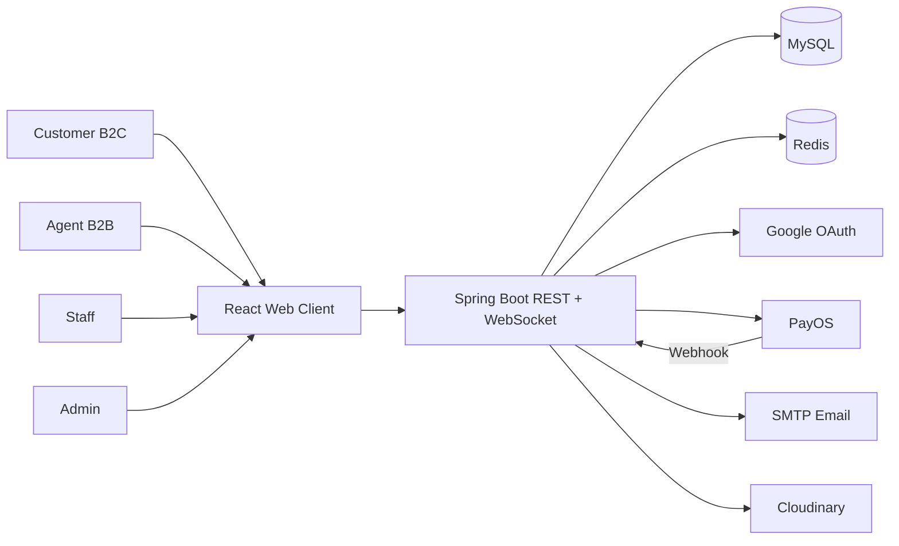

## 2.2. Kiến trúc logic

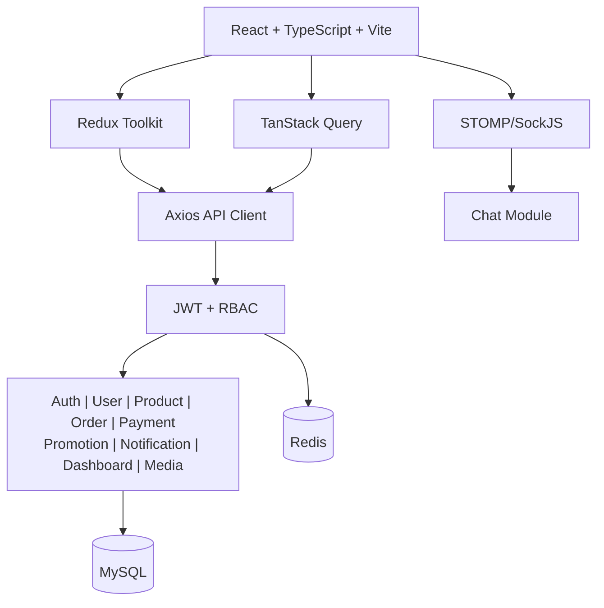

## 2.3. Công nghệ

| Lớp       | Công nghệ                                    |
| ---------- | ---------------------------------------------- |
| Client     | React 18, TypeScript, Vite, Tailwind, Radix UI |
| State      | Redux Toolkit, Redux Persist, TanStack Query   |
| Server     | Java 21, Spring Boot 4                         |
| Data       | MySQL, Spring Data JPA, Redis                  |
| Realtime   | WebSocket, STOMP, SockJS                       |
| Tích hợp | Google OAuth, PayOS, Cloudinary, SMTP          |

---

# 3. ACTOR VÀ PHÂN QUYỀN

## 3.1. Actor

| Actor                         | Mục tiêu                                                  |
| ----------------------------- | ----------------------------------------------------------- |
| Khách chưa đăng nhập     | Xem trang công khai, đăng ký, đăng nhập              |
| Customer                      | Mua hàng, thanh toán, xem/hủy đơn, dùng voucher, chat |
| Agent                         | Dùng cổng B2B, theo dõi tier, ưu đãi và lịch sử    |
| Staff                         | Vận hành theo permission được cấp                     |
| Admin                         | Toàn quyền quản trị                                     |
| PayOS/Google/Email/Cloudinary | Dịch vụ ngoài hệ thống                                 |

## 3.2. Sơ đồ use case

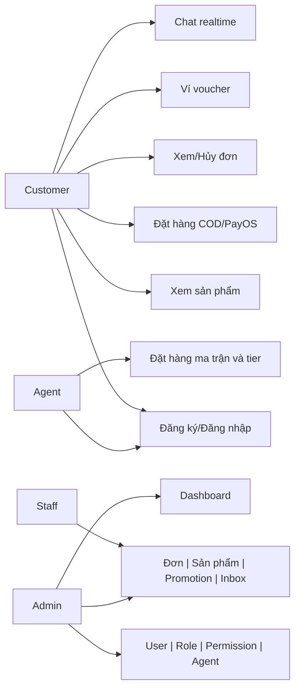

## 3.3. Ma trận quyền cấp cao

| Chức năng                      | Customer |     Agent     |    Staff    |   Admin   |
| -------------------------------- | :------: | :-----------: | :---------: | :--------: |
| Cổng B2C/B2B                    |   B2C   |      B2B      |   Không   |   Không   |
| Đơn cá nhân/voucher/chat     |   Có   | Có/prototype |   Không   | Giám sát |
| Sản phẩm/đơn/promotion/inbox |  Không  |    Không    | Theo quyền |    Có    |
| User/role/permission             |  Không  |    Không    |   Không   |    Có    |
| Agent/dashboard                  |  Không  |    Không    | Theo quyền |    Có    |

---

# 4. YÊU CẦU CHỨC NĂNG

## 4.1. Authentication

### FR-AUTH-01 – Đăng ký Customer

- Nhập họ tên, email, số điện thoại, mật khẩu và xác nhận.
- Kiểm tra định dạng, độ mạnh mật khẩu và email trùng.
- Tạo user vai trò Customer; trả access token và refresh cookie.

### FR-AUTH-02 – Đăng ký Agent

- Nhập tên, điện thoại, email, mật khẩu, doanh nghiệp, mã số thuế, địa chỉ.
- Hồ sơ mới có trạng thái `PENDING`; Admin duyệt, từ chối hoặc tạm ngưng.

### FR-AUTH-03 – Đăng nhập theo cổng

- `/login` dành cho Customer/Agent; `/admin-login` dành cho Admin/Staff.
- Backend kiểm tra portal, trạng thái tài khoản và quyền.
- Access token lưu trong state; refresh token trong HTTP-only cookie.

### FR-AUTH-04 – Google Login

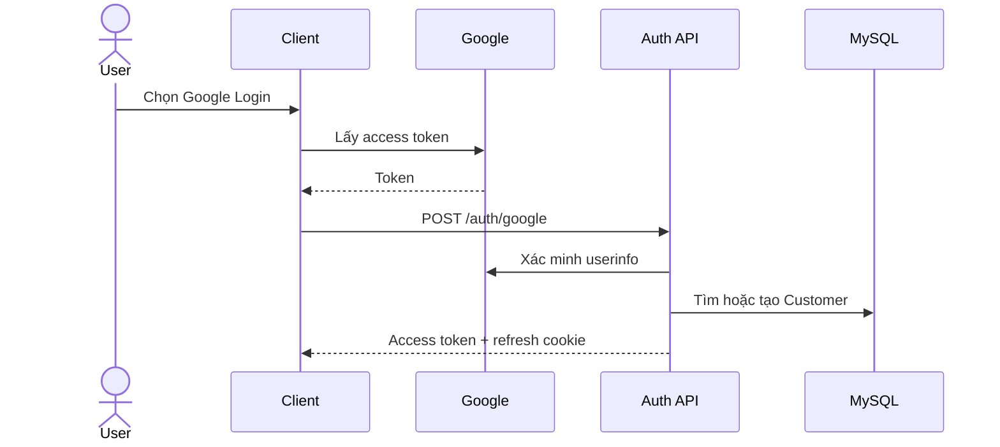

- Tài khoản mới tự tạo với provider `GOOGLE`.
- Không hiển thị đổi/quên mật khẩu cục bộ cho tài khoản Google.

### FR-AUTH-05 – Quản lý phiên

- Client tự refresh khi tải lại hoặc gặp 401; chỉ một refresh chạy đồng thời.
- Request chờ được chạy lại sau khi refresh thành công.
- Logout thu hồi token, xóa cookie và state.
- Đổi mật khẩu làm token cũ mất hiệu lực.

### FR-AUTH-06 – Khôi phục mật khẩu và 2FA

- Gửi OTP qua email, có thời hạn và giới hạn gửi lại.
- Xác minh OTP trước khi cấp phiên hoặc đặt mật khẩu mới.

## 4.2. Hồ sơ và media

- Xem/sửa họ tên, điện thoại, địa chỉ; email không sửa.
- Upload avatar PNG/JPG/JPEG tối đa 5 MB.
- Redux cập nhật ngay sau API thành công.
- Đổi mật khẩu yêu cầu mật khẩu cũ, mật khẩu mới và xác nhận.

## 4.3. Sản phẩm và tồn kho

- B2C xem sản phẩm đang bán: tên, danh mục, giá, ảnh, chất liệu, badge, rating.
- Sản phẩm có tập màu, size và tồn kho theo khóa `size-color`.
- Customer chọn biến thể và số lượng hợp lệ trước khi thêm giỏ.
- Staff/Admin có permission được xem, tạo, sửa, xóa mềm sản phẩm.
- Tạo/sửa gồm thông tin chính, trạng thái, màu, size và stock.
- Khi tạo đơn, server giảm tồn kho theo lô; khi hủy đơn, hoàn tồn kho.

## 4.4. Giỏ hàng, voucher và checkout

- Thêm, tăng/giảm, xóa dòng hàng; không cho số lượng bằng 0 hoặc âm.
- Tự điền điện thoại/địa chỉ từ hồ sơ.
- Giá được lấy từ server, không tin dữ liệu giá phía client.
- Voucher phải thuộc user, còn hạn, còn lượt, đúng đối tượng và đạt min order.
- Hỗ trợ giảm phần trăm hoặc số tiền; tổng sau giảm không dưới 0.

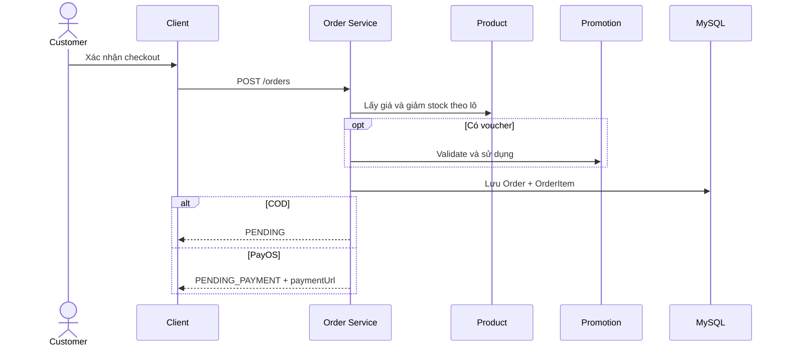

## 4.5. Thanh toán

### COD

- Đơn bắt đầu `PENDING`.
- Email xác nhận gửi sau transaction; lỗi email được lưu để retry.

### PayOS

- Đơn bắt đầu `PENDING_PAYMENT`; server tạo payment link.
- Return URL không được dùng làm bằng chứng thanh toán.
- Webhook phải parse JSON, verify chữ ký và kiểm tra order code.
- Một order chỉ có một invoice; webhook lặp phải idempotent.
- Lỗi request trả 400; lỗi xử lý nội bộ trả 500 để có thể retry.

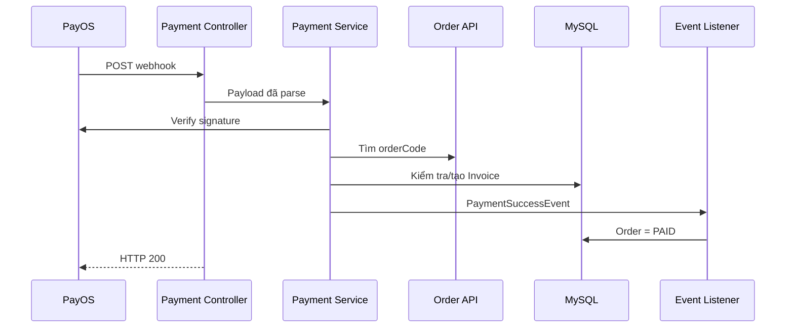

### Trang kết quả

- Đọc `orderCode`, kiểm tra đơn của user và thử lại tối đa ba lần.
- Chỉ báo thành công khi order `PAID`.
- Nhận diện hủy bằng `CANCELLED` hoặc cancel URL.
- Nếu chưa xác nhận, hiển thị `pending`, không báo thành công giả.

## 4.6. Đơn hàng

- Customer xem danh sách và chi tiết đơn của chính mình.
- Chỉ chủ đơn được hủy; chỉ `PENDING` được hủy.
- Hủy chuyển `CANCELLED`, hoàn stock và tạo notification cho nội bộ.
- Staff có `VIEW_ORDERS` xem toàn bộ; có `UPDATE_ORDERS` mới được sửa.
- Không lùi trạng thái, không sửa đơn `COMPLETED/CANCELLED`.
- Admin gửi lại email lỗi theo đơn hoặc toàn bộ.

## 4.7. Promotion và ví voucher

- Promotion có code duy nhất, loại `PERCENT/FIXED`, giá trị tối thiểu, hạn dùng, lượt dùng, target và status.
- Target gồm Customer, Agent, email cụ thể hoặc tất cả.
- Staff có quyền được tạo, sửa, bật/tắt, xóa.
- Customer/Agent xem và xóa voucher của mình.
- Voucher wallet có `AVAILABLE/USED`; không dùng voucher của tài khoản khác.

## 4.8. Chat realtime

- User tạo/lấy hội thoại; Staff/Admin có quyền Inbox xem tất cả.
- Message có `SENT`, `DELIVERED`, `READ`.
- Client optimistic update nhưng loại tin trùng và đồng bộ sau reconnect.
- Lịch sử dùng cursor pagination.
- Có typing indicator, read receipt, online/offline và last active.
- Có bot/FAQ reply dành cho người có quyền.

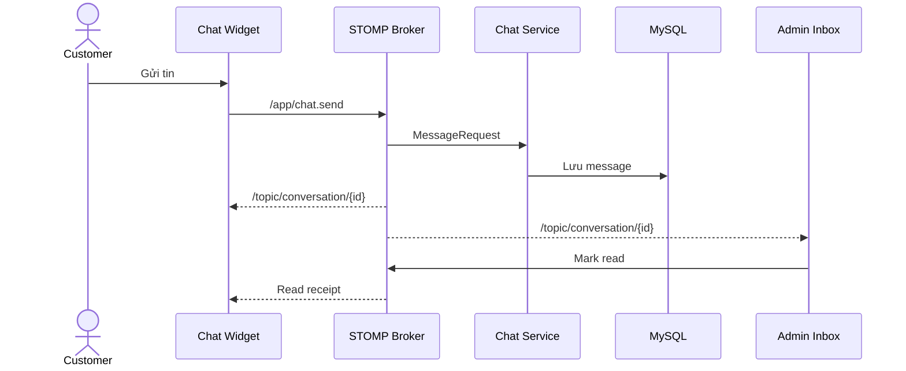

## 4.9. Notification và Dashboard

- Notification có type, severity, title, message, target, action URL và metadata.
- Customer xem thông báo cá nhân; nội bộ xem theo role/permission.
- Cho phép đánh dấu nhiều thông báo đã đọc.
- Dashboard hiển thị doanh thu, đơn theo trạng thái, đơn gần đây, Customer và tồn kho thấp.

## 4.10. User, Agent và RBAC

- Admin tạo Staff, gửi email tài khoản, khóa/mở và cấp permission.
- Admin xem Customer, số đơn và đổi trạng thái.
- Admin duyệt/từ chối Agent, cập nhật hạn mức và gửi email.
- Role chứa permission dạng `ACTION_RESOURCE`.
- Frontend ẩn menu/hiển thị 403; backend dùng URL security và `@PreAuthorize`.

## 4.11. B2B prototype

- Ma trận size × màu để nhập nhanh số lượng.
- Tính tổng theo dòng/cột, tier và chiết khấu.
- UI hỗ trợ ý tưởng thanh toán ngay/công nợ, hạn mức và lịch sử.
- `PRODUCTS`, `PRICING_TIERS`, `AGENT_ORDERS` hiện là mock; giai đoạn tiếp theo cần API order B2B, sổ nợ và transaction hạn mức.

## 4.12. Đặc tả use case trọng yếu

Phần này diễn giải các chức năng quan trọng ở mức đủ chi tiết để người dùng nghiệp vụ hiểu, đội phát triển triển khai và QA xây dựng test case.

### UC-01 – Đăng nhập và khôi phục phiên

| Thuộc tính                   | Nội dung                                                                              |
| ------------------------------ | -------------------------------------------------------------------------------------- |
| Actor chính                   | Customer, Agent, Staff, Admin                                                          |
| Mục tiêu                     | Truy cập đúng cổng và duy trì phiên đăng nhập an toàn                       |
| Kích hoạt                    | Người dùng gửi form đăng nhập hoặc tải lại trang khi đã có refresh cookie |
| Tiền điều kiện             | Tài khoản tồn tại, chưa bị khóa; Agent đã được duyệt nếu truy cập B2B   |
| Hậu điều kiện thành công | Client có access token, thông tin user/role và refresh cookie hợp lệ              |
| Hậu điều kiện thất bại   | Không tạo phiên; hiển thị thông báo phù hợp                                   |

**Dữ liệu đầu vào**

- Email.
- Mật khẩu.
- Cổng đăng nhập: `customer` hoặc `admin`.
- Refresh token từ HTTP-only cookie khi khôi phục phiên.

**Luồng đăng nhập chính**

1. Người dùng mở đúng cổng đăng nhập.
2. Client kiểm tra email và mật khẩu không rỗng.
3. Client gửi `POST /api/v1/auth/login`.
4. Server tìm tài khoản theo email và kiểm tra trạng thái.
5. Server xác minh mật khẩu BCrypt.
6. Server kiểm tra role có phù hợp với cổng đăng nhập.
7. Nếu tài khoản yêu cầu 2FA, server yêu cầu người dùng nhập OTP.
8. Khi xác thực hoàn tất, server phát access token và refresh token.
9. Refresh token được đặt trong HTTP-only cookie.
10. Client lưu user, role và access token vào Redux.
11. Client điều hướng Customer tới B2C, Agent tới B2B, Admin/Staff tới dashboard.

**Luồng khôi phục phiên**

1. Người dùng tải lại trang.
2. `AuthInit` gọi `/auth/refresh` bằng cookie.
3. Nếu React StrictMode kích hoạt effect hai lần, client tái sử dụng cùng một Promise.
4. Server kiểm tra refresh token, trạng thái thu hồi và reuse.
5. Server xoay vòng refresh token và trả access token mới.
6. Client khôi phục Redux trước khi render route riêng tư.

**Luồng ngoại lệ**

| Trường hợp                       | Xử lý mong đợi                                       |
| ----------------------------------- | -------------------------------------------------------- |
| Sai email/mật khẩu                | Trả 401, không tiết lộ chính xác trường nào sai |
| Tài khoản bị khóa               | Từ chối và thông báo liên hệ quản trị           |
| Agent chưa duyệt                  | Từ chối truy cập cổng B2B                            |
| Sai cổng                           | Từ chối Customer tại Admin và ngược lại           |
| Refresh token hết hạn             | Xóa phiên client và về trang đăng nhập            |
| Phát hiện token reuse             | Thu hồi token family để bảo vệ tài khoản          |
| Tài khoản Google dùng mật khẩu | Từ chối và hướng dẫn đăng nhập Google           |

**Tiêu chí nghiệm thu**

- Không thể truy cập route riêng tư trước khi hoàn tất xác minh phiên.
- Hai request refresh đồng thời không làm người dùng bị đăng xuất sai.
- Staff đăng nhập thành công nhưng chỉ thấy menu theo permission.
- Access token cũ không dùng được sau khi đổi mật khẩu.

### UC-02 – Tạo đơn hàng B2C

| Thuộc tính            | Nội dung                                                             |
| ----------------------- | --------------------------------------------------------------------- |
| Actor chính            | Customer                                                              |
| Actor hỗ trợ          | Product Module, Promotion Module, Email Module                        |
| Mục tiêu              | Tạo đơn từ giỏ hàng với giá, voucher và tồn kho chính xác |
| Tiền điều kiện      | Customer đã đăng nhập; giỏ có ít nhất một dòng hàng       |
| Hậu điều kiện COD   | Order`PENDING`, tồn kho đã giảm, email được lên lịch gửi  |
| Hậu điều kiện PayOS | Order`PENDING_PAYMENT`, tồn kho đã giảm, có payment URL        |

**Dữ liệu đầu vào**

| Trường            |   Bắt buộc   | Quy tắc                                |
| ------------------- | :-------------: | --------------------------------------- |
| `shippingAddress` |       Có       | Không rỗng; đủ chi tiết giao hàng |
| `phoneNumber`     |       Có       | Đúng định dạng điện thoại       |
| `paymentMethod`   |       Có       | `COD` hoặc `PAYOS`                 |
| `items`           |       Có       | Danh sách không rỗng                 |
| `productId`       |       Có       | Sản phẩm tồn tại                    |
| `quantity`        |       Có       | Số nguyên dương                     |
| `selectedColor`   | Theo sản phẩm | Phải thuộc tập màu                  |
| `selectedSize`    | Theo sản phẩm | Phải thuộc tập size                  |
| `voucherCode`     |     Không     | Voucher hợp lệ và thuộc user        |

**Luồng chính**

1. Customer kiểm tra giỏ hàng và mở checkout.
2. Client tự điền thông tin liên hệ từ hồ sơ.
3. Customer chọn phương thức thanh toán và có thể nhập voucher.
4. Client chỉ gửi ID sản phẩm, biến thể, số lượng và thông tin giao hàng.
5. Server lấy user theo email từ JWT.
6. Server tải toàn bộ sản phẩm theo danh sách ID bằng một batch query/API.
7. Server kiểm tra sản phẩm, số lượng và tồn kho từng biến thể.
8. Server lấy giá hiện hành từ database và tính tổng.
9. Nếu có voucher, server kiểm tra quyền sở hữu, thời hạn, lượt dùng, min order và target.
10. Server tính giảm giá; tổng cuối không nhỏ hơn 0.
11. Server giảm tồn kho theo lô.
12. Server sinh `orderCode` duy nhất và lưu Order.
13. Server lưu các OrderItem với snapshot tên, ảnh, giá, size và màu.
14. Server đánh dấu voucher đã dùng nếu có.
15. Nếu COD, phát sự kiện gửi email sau commit.
16. Nếu PayOS, tạo payment link và trả về client.
17. Client xóa giỏ COD hoặc chuyển hướng PayOS.

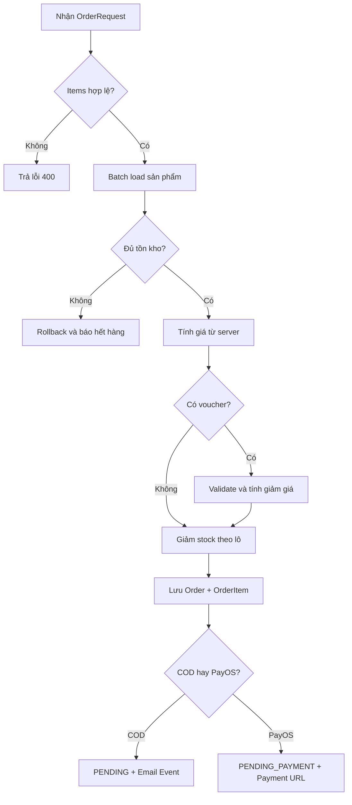

**Ranh giới transaction**

- Giảm tồn kho, sử dụng voucher, lưu Order và OrderItem thuộc cùng transaction.
- Lỗi tại một bước phải rollback toàn bộ thay đổi database.
- Email chạy sau commit nên lỗi email không làm mất đơn.
- Việc gọi PayOS cần có chiến lược xử lý khi order đã lưu nhưng đối tác không tạo được link.

**Luồng ngoại lệ**

- Product không tồn tại: trả lỗi dữ liệu.
- Quantity bằng 0 hoặc âm: trả 400.
- Variant không tồn tại hoặc thiếu stock: từ chối tạo đơn.
- Voucher không hợp lệ: không tự bỏ qua; báo rõ cho người dùng.
- Trùng order code: thử sinh lại trong giới hạn.
- PayOS lỗi: rollback hoặc đưa đơn về trạng thái cần xử lý theo thiết kế transaction.

### UC-03 – Xác nhận thanh toán PayOS

| Thuộc tính       | Nội dung                                                       |
| ------------------ | --------------------------------------------------------------- |
| Actor chính       | PayOS                                                           |
| Actor hưởng lợi | Customer, Admin                                                 |
| Mục tiêu         | Xác nhận giao dịch an toàn, đúng một lần                |
| Tiền điều kiện | Đơn PayOS tồn tại ở`PENDING_PAYMENT`                     |
| Hậu điều kiện  | Invoice`PAID`, Order `PAID`, email thanh toán được gửi |

**Luồng chính**

1. PayOS gửi JSON tới `/api/v1/payment/webhook`.
2. Controller parse chuỗi thành `ObjectNode`.
3. Payment Service dùng PayOS SDK verify chữ ký.
4. Service chỉ xử lý dữ liệu có mã thành công `00`.
5. Service tìm Order theo `orderCode`.
6. Service kiểm tra invoice của Order đã tồn tại hay chưa.
7. Nếu đã tồn tại, kết thúc thành công mà không tạo lại.
8. Nếu chưa, tạo invoice với số hóa đơn duy nhất, số tiền và reference.
9. Service phát `PaymentSuccessEvent`.
10. Listener cập nhật Order thành `PAID`.
11. Listener gửi email thanh toán thành công sau transaction.
12. Controller trả HTTP 200 cho PayOS.

**Phân loại lỗi**

| Nhóm lỗi                | Ví dụ                         | HTTP | Ý nghĩa                              |
| ------------------------- | ------------------------------- | :--: | -------------------------------------- |
| Request không hợp lệ   | JSON sai, chữ ký sai          | 400 | Không nên retry cùng payload        |
| Dữ liệu nghiệp vụ sai | Không tìm thấy order code    | 400 | Giao dịch không ánh xạ được     |
| Lỗi tạm thời           | Database timeout, lỗi nội bộ | 500 | PayOS có thể retry                   |
| Webhook trùng            | Invoice đã tồn tại          | 200 | Idempotent, không tạo dữ liệu mới |

**Kiểm soát an toàn**

- Không lấy trạng thái success từ return URL.
- Không tin amount hoặc order code khi chưa verify chữ ký.
- Unique constraint trên `invoice.order_id`.
- Event chỉ phát sau khi invoice lưu thành công.
- Log phải có order code/reference nhưng không chứa secret.

**Đồng bộ giao diện**

1. PayOS chuyển người dùng về `/payment/success?orderCode=...`.
2. Trang kết quả tải đơn của chính user.
3. Nếu chưa `PAID`, client chờ 2 giây và thử lại, tối đa ba lần.
4. Chỉ `PAID` hiển thị thành công.
5. `CANCELLED` hoặc cancel URL hiển thị hủy.
6. Trạng thái còn lại hoặc lỗi mạng hiển thị đang chờ xác nhận.

### UC-04 – Quản lý vòng đời đơn hàng

| Vai trò                   | Thao tác                                                 |
| -------------------------- | --------------------------------------------------------- |
| Customer                   | Xem đơn cá nhân, xem chi tiết, hủy đơn`PENDING` |
| Staff có`VIEW_ORDERS`   | Xem toàn bộ đơn                                       |
| Staff có`UPDATE_ORDERS` | Cập nhật order/shipping status                          |
| Admin                      | Toàn quyền và gửi lại email                          |

**Quy trình Customer hủy đơn**

1. Customer chọn đơn trong lịch sử.
2. Client chỉ hiển thị nút hủy khi trạng thái cho phép.
3. Customer xác nhận trong dialog.
4. Server kiểm tra chủ sở hữu bằng user ID.
5. Server kiểm tra trạng thái hiện tại là `PENDING`.
6. Server chuyển `CANCELLED`.
7. Server hoàn tồn kho từng variant.
8. Server tạo notification nội bộ.
9. Client tải lại danh sách và hiển thị toast.

**Quy trình Staff cập nhật**

- Không cho sửa đơn `COMPLETED` hoặc `CANCELLED`.
- Không cho lùi `OrderStatus`, ngoại trừ chuyển sang `CANCELLED`.
- `ShippingStatus` đi theo `NOT_SHIPPED → SHIPPING → DELIVERED`.
- Khi Admin hủy, tồn kho chỉ được hoàn một lần.
- Mọi cập nhật cần lưu audit user và thời gian.

**Bảng chuyển trạng thái**

| Từ                 | Đến hợp lệ | Tác nhân     | Tác động                   |
| ------------------- | -------------- | -------------- | ----------------------------- |
| `PENDING_PAYMENT` | `PAID`       | Webhook        | Tạo invoice                  |
| `PENDING_PAYMENT` | `CANCELLED`  | Luồng hủy    | Hoàn stock theo chính sách |
| `PENDING`         | `CANCELLED`  | Customer/Admin | Hoàn stock, notification     |
| `PENDING`         | `COMPLETED`  | Staff/Admin    | Khóa chỉnh sửa tiếp       |
| `PAID`            | `COMPLETED`  | Staff/Admin    | Hoàn tất nghiệp vụ        |

### UC-05 – Chat hỗ trợ realtime

| Thuộc tính | Nội dung                                                             |
| ------------ | --------------------------------------------------------------------- |
| Actor        | Customer/Agent và Staff/Admin                                        |
| Mục tiêu   | Trao đổi hỗ trợ tức thời, giữ lịch sử và trạng thái đọc |
| Kênh        | REST để tải dữ liệu; STOMP để realtime                         |
| Dữ liệu    | Conversation, Message, typing, read receipt, presence                 |

**Khởi tạo**

1. User đăng nhập mở ChatWidget.
2. Client gọi `/chat/my-conversations`.
3. Nếu chưa có hội thoại, gọi `/chat/start`.
4. Client tải 20 tin gần nhất và subscribe topic hội thoại.
5. Admin Inbox tải danh sách hội thoại và presence ban đầu.

**Gửi tin**

1. Client tạo optimistic message với ID tạm.
2. Gửi `MessageRequest` tới `/app/chat.send`.
3. Server xác định sender từ principal, không tin sender ID client.
4. Server lưu message và phát DTO tới topic hội thoại.
5. Client đối chiếu message server với optimistic message để tránh duplicate.
6. Nếu recipient đang xem, client gọi mark-as-read có debounce.

**Reconnect và phân trang**

- Khi mất kết nối, UI báo trạng thái và STOMP tự reconnect.
- Sau reconnect, client tải các message có thể bị bỏ lỡ.
- Khi cuộn lên, dùng cursor `createdAt/id` thay vì offset.
- Server giới hạn `limit` để tránh tải quá nhiều dữ liệu.

**Typing và presence**

- Typing event không lưu database.
- Client debounce để tránh gửi dày.
- Presence được tải qua REST khi mở Inbox và cập nhật liên tục qua topic.
- Khi offline, UI hiển thị thời gian hoạt động gần nhất.

**Bảo mật bắt buộc**

- Chỉ thành viên hội thoại hoặc Staff có quyền Inbox được đọc message.
- Endpoint danh sách toàn bộ hội thoại yêu cầu `VIEW_INBOX`.
- Bot reply yêu cầu `CREATE_INBOX`.
- File chat phải đi qua Media service và kiểm tra file.

### UC-06 – Quản trị RBAC động

| Thuộc tính | Nội dung                                               |
| ------------ | ------------------------------------------------------- |
| Actor chính | Admin                                                   |
| Mục tiêu   | Cấp đúng quyền cho Staff mà không phải sửa code |
| Thành phần | User, Role, Permission, route guard và method security |

**Luồng tạo Staff**

1. Admin mở màn hình nhân viên.
2. Nhập thông tin tài khoản và chọn preset/quyền.
3. Server kiểm tra dữ liệu và email trùng.
4. Server tạo user Staff, mã hóa mật khẩu và gán role/permission.
5. Hệ thống gửi email thông tin tài khoản.
6. Staff đăng nhập cổng Admin và chỉ thấy chức năng được cấp.

**Luồng thay đổi quyền**

1. Admin mở Permission Matrix của Staff.
2. Chọn quyền theo nhóm Product, Order, Agent, Promotion, Report, Inbox.
3. Client gửi tập permission mới.
4. Server cập nhật role/permission.
5. Lần xác thực tiếp theo, JWT principal chứa authorities mới.
6. Sidebar và route guard phản ánh quyền; backend vẫn là lớp quyết định cuối.

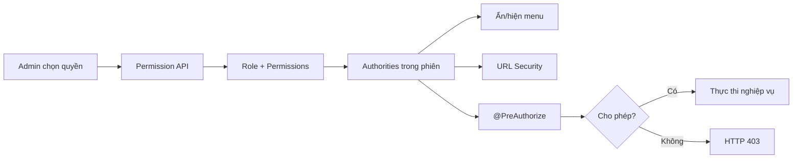

**Nguyên tắc**

- Frontend ẩn nút không thay thế kiểm tra backend.
- Admin có toàn quyền.
- Staff cần cả role phù hợp và permission cho method.
- Khóa user phải chặn đăng nhập ngay cả khi role còn tồn tại.
- Thay đổi quyền cần có audit.

### UC-07 – Đăng ký và phê duyệt Agent

**Luồng chính**

1. Đại lý nhập thông tin cá nhân/doanh nghiệp.
2. Server tạo User role Agent và AgentProfile `PENDING`.
3. Tài khoản chưa được cấp quyền giao dịch đầy đủ.
4. Admin xem danh sách chờ duyệt.
5. Admin kiểm tra hồ sơ, đặt hạn mức và chọn duyệt/từ chối.
6. Server cập nhật `APPROVED` hoặc `REJECTED`.
7. Hệ thống gửi email kết quả.
8. Agent được duyệt có thể đăng nhập cổng B2B.

**Ngoại lệ**

- Email/điện thoại trùng: từ chối đăng ký.
- Thiếu thông tin bắt buộc: trả validation error.
- Email gửi lỗi: lưu log/trạng thái nhưng không làm sai trạng thái phê duyệt.
- Agent bị `SUSPENDED`: không được tạo giao dịch mới.

### UC-08 – Đặt hàng B2B dạng ma trận (prototype mục tiêu)

| Thuộc tính | Nội dung                                                         |
| ------------ | ----------------------------------------------------------------- |
| Actor        | Agent đã`APPROVED`                                            |
| Mục tiêu   | Nhập số lượng nhiều variant nhanh và nhận đúng tier giá |
| Trạng thái | UI/ý tưởng đã có; cần API và persistence hoàn chỉnh     |

**Luồng mục tiêu**

1. Agent chọn sản phẩm.
2. Hệ thống hiển thị ma trận hàng là size, cột là màu.
3. Agent nhập số lượng từng ô.
4. UI tính tổng theo size, màu và toàn đơn.
5. Hệ thống xác định tier theo tổng quantity.
6. Đơn giá/chiết khấu cập nhật tức thời.
7. Server kiểm tra stock toàn bộ variant theo lô.
8. Agent chọn thanh toán ngay hoặc công nợ.
9. Với công nợ, server kiểm tra `usedCredit + orderTotal <= creditLimit`.
10. Server lưu Order B2B cùng snapshot tier và chính sách giá.

**Yêu cầu dữ liệu cần bổ sung khi production hóa**

- PricingTier có min quantity, max quantity, discount và thời gian hiệu lực.
- Order lưu channel `B2B`, tier ID, discount snapshot và debt amount.
- Ledger lưu phát sinh nợ, thanh toán, hạn trả và số dư.
- Mọi kiểm tra hạn mức và tạo nợ phải nằm trong một transaction có khóa phù hợp.

---

# 5. QUY TẮC NGHIỆP VỤ

| Mã   | Quy tắc                                                         |
| ----- | ---------------------------------------------------------------- |
| BR-01 | Email là định danh duy nhất của user đang hoạt động     |
| BR-02 | Google và mật khẩu là hai luồng xác thực tách biệt      |
| BR-03 | Agent phải được duyệt mới hoạt động đầy đủ          |
| BR-04 | Giá đơn được tính từ server                              |
| BR-05 | Số lượng phải lớn hơn 0 và không vượt stock            |
| BR-06 | Voucher phải thuộc user, hợp lệ và dùng tối đa một lần |
| BR-07 | COD bắt đầu`PENDING`; PayOS bắt đầu `PENDING_PAYMENT`  |
| BR-08 | Chỉ webhook hợp lệ tạo invoice và đánh dấu`PAID`       |
| BR-09 | Một order có tối đa một invoice                             |
| BR-10 | Chỉ chủ đơn được hủy đơn`PENDING`                    |
| BR-11 | Hủy đơn phải hoàn stock                                     |
| BR-12 | Không lùi trạng thái, trừ chuyển sang`CANCELLED`         |
| BR-13 | Staff chỉ thao tác theo permission                             |
| BR-14 | Tiền tệ dùng`BigDecimal`; lịch sử dùng snapshot          |

---

# 6. MÔ HÌNH TRẠNG THÁI

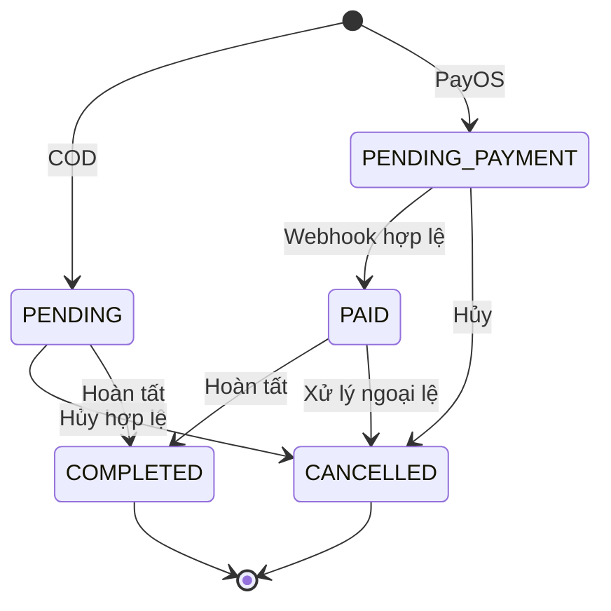

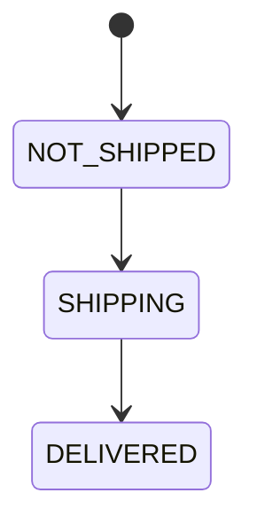

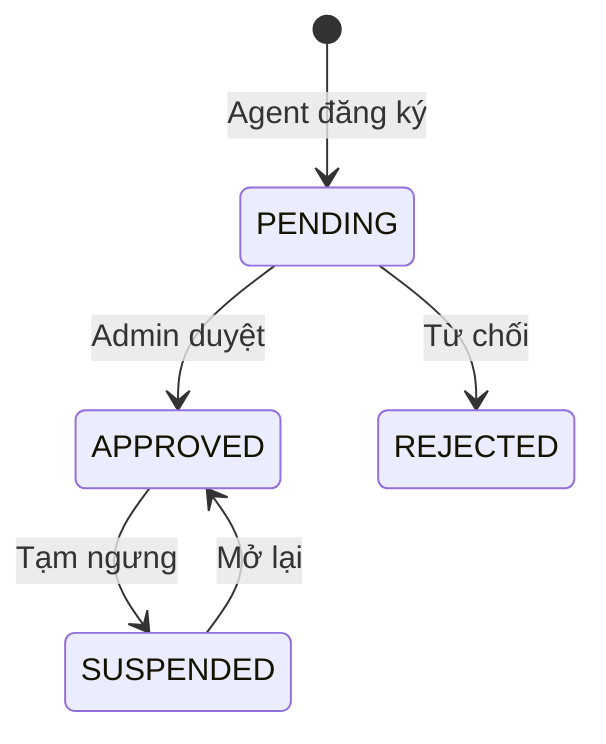

---

# 7. YÊU CẦU DỮ LIỆU

## 7.1. ERD khái niệm

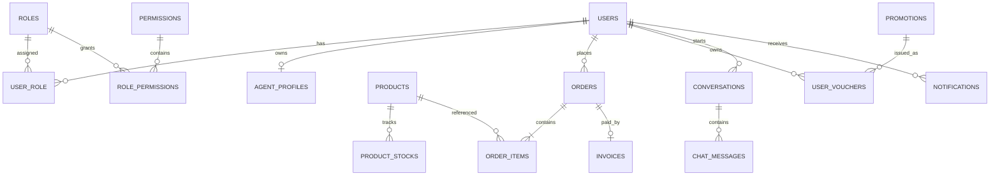

## 7.2. Thực thể

| Thực thể            | Dữ liệu chính                                            |
| --------------------- | ----------------------------------------------------------- |
| User                  | Email, password hash, profile, status, provider             |
| Role/Permission       | Vai trò và quyền thao tác                               |
| AgentProfile          | Doanh nghiệp, thuế, hạn mức, used credit, status        |
| Product               | Thông tin, màu, size, stock, trạng thái                 |
| Order/OrderItem       | User, order code, tổng, trạng thái, snapshot dòng hàng |
| Invoice               | Order, số hóa đơn, tiền, reference, payment status     |
| Promotion/UserVoucher | Mã giảm và voucher được cấp                          |
| Conversation/Message  | Hội thoại và tin nhắn realtime                          |
| Notification          | Thông báo theo user/role/entity                           |

- Entity chính có audit và xóa mềm.
- `OrderItem` lưu snapshot tên, ảnh và giá để bảo toàn lịch sử.
- Tham chiếu chéo module ưu tiên ID và Internal API.

---

# 8. GIAO DIỆN VÀ ĐIỀU HƯỚNG

## 8.1. Nguyên tắc UX

- Tiếng Việt, responsive từ 320 px.
- Có loading/skeleton, toast, validation gần trường và khóa nút khi submit.
- Dialog xác nhận cho hủy/xóa; trạng thái có màu và văn bản.
- Hỗ trợ bàn phím, label, fallback ảnh và trang 403/404.

## 8.2. Route chính

| Khu vực    | Route                                                                                                                                 |
| ----------- | ------------------------------------------------------------------------------------------------------------------------------------- |
| Public/Auth | `/`, `/login`, `/admin-login`, `/register`, `/forgot-password`, `/reset-password`                                         |
| B2C         | `/b2c`, `/b2c/orders`, `/b2c/promotions`                                                                                        |
| B2B         | `/b2b/portal`, `/b2b/history`, `/b2b/tier`, `/b2b/promotions`                                                                 |
| Admin       | `/admin/dashboard`, `/orders`, `/products`, `/users`, `/agents`, `/customers`, `/promotions`, `/inbox`, `/settings` |
| Payment     | `/payment/success`, `/payment/cancel`                                                                                             |

---

# 9. TÍCH HỢP VÀ BẢO MẬT

## 9.1. Tích hợp

- Google: server xác minh token qua userinfo.
- PayOS: secret chỉ ở server; webhook là nguồn xác nhận.
- Email: OTP, Staff mới, Agent, COD và payment success; có retry.
- Cloudinary: upload có kiểm tra type/size.
- Redis: refresh token/blacklist với TTL.

## 9.2. Luồng bảo mật

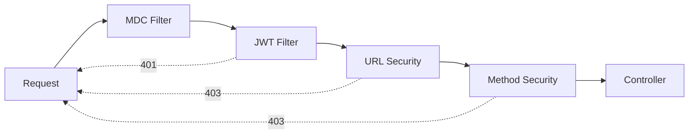

- BCrypt cho mật khẩu; access token ngắn hạn; refresh cookie HTTP-only.
- Production dùng HTTPS, Secure cookie và CORS origin cấu hình.
- Webhook public nhưng bắt buộc verify chữ ký.
- Không log password, token hoặc secret.
- Upload giới hạn định dạng/dung lượng.

---

# 10. YÊU CẦU PHI CHỨC NĂNG

| Nhóm           | Yêu cầu                                                                                       |
| --------------- | ----------------------------------------------------------------------------------------------- |
| Hiệu năng     | API thường mục tiêu dưới 2 giây; chat dưới 1 giây; danh sách lớn phân trang/cursor |
| Tin cậy        | Transaction, webhook idempotent, email retry, refresh chống request trùng                     |
| Mở rộng       | Package-by-feature, Internal API, event, feature-based client                                   |
| Bảo trì       | DTO tách entity, validation nhiều lớp, clean import, trace ID                                |
| Tương thích  | Java 21, MySQL 8+, trình duyệt hiện đại                                                    |
| Vận hành      | Backup DB, secret qua environment, monitoring và restore plan                                  |
| Tối ưu client | Lazy route và tách chunk ở giai đoạn tối ưu hiệu năng                                  |

---

# 11. DANH MỤC API

| Nhóm           | Endpoint tiêu biểu                                                                                                                                    |
| --------------- | ------------------------------------------------------------------------------------------------------------------------------------------------------- |
| Auth            | `/auth/register`, `/register/agent`, `/login`, `/google`, `/verify-2fa`, `/refresh`, `/logout`, `/forgot-password`, `/reset-password` |
| User            | `/users/me`, `/users/me/avatar`, `/admin/users/**`, `/admin/roles/**`, `/admin/agents/**`                                                     |
| Product         | `GET/POST /products`, `PUT/DELETE /products/{id}`, `/products/all`, `/products/colors`                                                          |
| Order           | `POST /orders`, `/orders/my-orders`, `/{id}/cancel`, `/orders/all`, `PATCH /orders/{id}`                                                      |
| Payment         | `POST /payment/webhook`                                                                                                                               |
| Promotion       | `/promotions/my-vouchers`, `/promotions/validate`, `/staff/promotions/**`                                                                         |
| Chat            | `/chat/start`, `/my-conversations`, `/conversations`, `/{id}/messages`, `/read`, `/bot-reply`, `/presence`                                |
| Notification    | `/notifications`, `/notifications/my`, `/notifications/read`                                                                                      |
| Dashboard/Media | `/dashboard/metrics`, `/media/upload`                                                                                                               |

---

# 12. TIÊU CHÍ NGHIỆM THU

## Authentication

- Đăng ký hợp lệ thành công; email trùng/dữ liệu sai bị từ chối.
- Agent mới chờ duyệt; user không đăng nhập sai cổng.
- Refresh phục hồi phiên; logout và đổi mật khẩu vô hiệu hóa token phù hợp.

## Product, checkout và payment

- Không đặt số lượng 0, âm hoặc vượt stock.
- Server tính lại giá; voucher sai/không thuộc user bị từ chối.
- COD tạo `PENDING`; PayOS tạo `PENDING_PAYMENT` và URL.
- Webhook sai không tạo invoice; webhook hợp lệ tạo đúng một invoice và order `PAID`.
- Trang success không báo thành công khi server chưa xác nhận.

## Order và RBAC

- Customer chỉ xem/hủy đơn của mình và chỉ hủy `PENDING`.
- Hủy đơn hoàn stock.
- Staff thiếu quyền không truy cập chức năng nội bộ.
- Admin quản lý Staff, Customer, Agent, role và permission.

## Chat

- Tin nhắn hiển thị realtime, không trùng, có read receipt và typing.
- Reconnect đồng bộ tin bị lỡ.
- User không có quyền không truy cập Inbox nội bộ.

---

# 13. PROTOTYPE VÀ HƯỚNG PHÁT TRIỂN

## 13.1. Hoàn thiện B2B

- Thay mock bằng API thật.
- Xây dựng Order B2B, snapshot tier/discount, sổ nợ và giao dịch trả nợ.
- Kiểm tra hạn mức trong transaction và bổ sung quy trình duyệt đơn.

## 13.2. Mở rộng

- Vận chuyển, hoàn tiền, review xác minh mua hàng.
- Nhập kho, nhà cung cấp, đa ngôn ngữ và mobile.
- Flyway/Liquibase, rate limit, monitoring và test tích hợp sâu hơn.

---

# 14. MA TRẬN TRUY VẾT

| Yêu cầu              | Server                            | Client                         | Nghiệm thu |
| ---------------------- | --------------------------------- | ------------------------------ | ----------- |
| AUTH/PROFILE           | auth, user, security, media       | features/auth, profile         | Mục 12     |
| PRODUCT                | product                           | features/products              | Mục 12     |
| CHECKOUT/ORDER         | order, product, promotion         | Cart/Checkout, features/orders | Mục 12     |
| PAYMENT                | payment, order listener           | features/payment               | Mục 12     |
| PROMOTION              | promotion                         | features/promotions            | Mục 12     |
| CHAT                   | chat                              | ChatWidget, features/inbox     | Mục 12     |
| NOTIFICATION/DASHBOARD | notification, dashboard           | layout, dashboard              | Mục 12     |
| RBAC/AGENT             | user, security                    | features/users                 | Mục 12     |
| B2B                    | agent và hướng mở rộng order | B2BOrderTab/History/Tier       | Mục 13     |

---

# PHỤ LỤC – SƠ ĐỒ TRIỂN KHAI

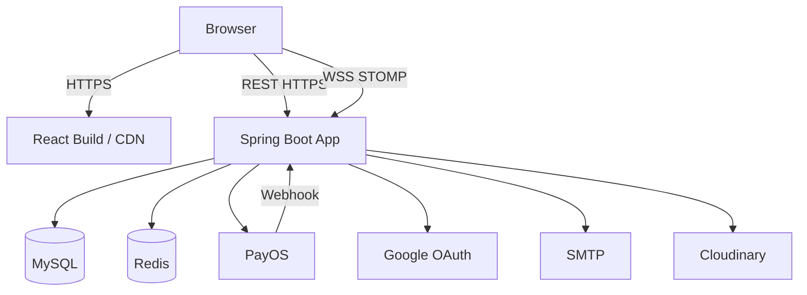

Tài liệu này là baseline nghiệp vụ theo code hiện tại. Khi chức năng B2B được nối API thật hoặc phạm vi nghiệp vụ thay đổi, SRS phải tăng phiên bản và cập nhật ma trận truy vết.
