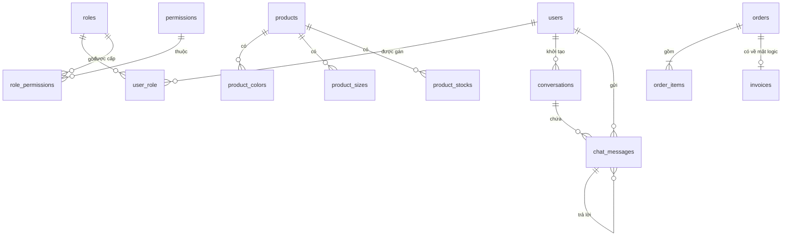

# Cơ sở dữ liệu Holiday

> Tài liệu này mô tả mô hình dữ liệu **đang được backend sử dụng** tại ngày 21/07/2026.
>
> Nguồn chuẩn: các lớp JPA Entity trong `server/src/main/java/atmin`. Nếu tài liệu và code khác nhau, entity Java là nguồn quyết định.

## 1. Tổng quan

| Thuộc tính | Giá trị |
|---|---|
| Hệ quản trị | MySQL 8+ |
| Database mặc định | `holiday_db` |
| ORM | Spring Data JPA / Hibernate |
| Cơ chế tạo schema hiện tại | `spring.jpa.hibernate.ddl-auto=update` |
| Khóa chính | UUID; phần lớn được lưu dưới dạng `VARCHAR(36)` |
| Tiền tệ | `BigDecimal` trong Java |
| Xóa mềm | Áp dụng cho `users`, `products`, `orders`, `order_items`, `invoices` |
| Audit | `created_at`, `updated_at`, `deleted_at`, `created_by`, `updated_by` qua `BaseEntity` |

### Tổng quan 15 bảng vật lý

Đọc bảng này trước để nắm nhanh database. Nhấn vào tên bảng để chuyển xuống phần mô tả chi tiết.

| Tên bảng | Nhóm | Mục đích chính |
|---|---|---|
| [`users`](#41-users) | Tài khoản | Lưu tài khoản đăng nhập và thông tin cơ bản của người dùng. |
| [`roles`](#42-roles) | Phân quyền | Lưu các vai trò như admin, nhân viên, khách hàng và đại lý. |
| [`permissions`](#43-permissions) | Phân quyền | Lưu từng quyền thao tác cụ thể trong hệ thống. |
| [`user_role`](#44-user_role) | Phân quyền | Gán một hoặc nhiều vai trò cho người dùng. |
| [`role_permissions`](#45-role_permissions) | Phân quyền | Gán các quyền được phép thực hiện cho từng vai trò. |
| [`products`](#46-products) | Sản phẩm | Lưu thông tin chính của sản phẩm như tên, giá, ảnh và danh mục. |
| [`product_colors`](#47-product_colors) | Sản phẩm | Lưu danh sách màu có sẵn của từng sản phẩm. |
| [`product_sizes`](#48-product_sizes) | Sản phẩm | Lưu danh sách kích thước có sẵn của từng sản phẩm. |
| [`product_stocks`](#49-product_stocks) | Kho hàng | Lưu số lượng tồn kho theo tổ hợp size và màu. |
| [`orders`](#410-orders) | Đơn hàng | Lưu thông tin chung, thanh toán và giao hàng của đơn hàng. |
| [`order_items`](#411-order_items) | Đơn hàng | Lưu từng sản phẩm, số lượng, giá, size và màu trong đơn hàng. |
| [`invoices`](#412-invoices) | Thanh toán | Lưu hóa đơn và mã tham chiếu thanh toán của đơn hàng. |
| [`conversations`](#413-conversations) | Trò chuyện | Lưu các cuộc trò chuyện hỗ trợ với khách hàng. |
| [`chat_messages`](#414-chat_messages) | Trò chuyện | Lưu nội dung và trạng thái của từng tin nhắn. |
| [`notifications`](#415-notifications) | Thông báo | Lưu thông báo gửi theo người dùng, vai trò hoặc đối tượng nghiệp vụ. |

Ba bảng `product_colors`, `product_sizes` và `product_stocks` không có entity độc lập. Hibernate tự tạo chúng từ các collection trong entity `Product`.

## 2. Sơ đồ quan hệ



### Quan hệ có khóa ngoại qua JPA

- `user_role.user_id` → `users.id`
- `user_role.role_id` → `roles.id`
- `role_permissions.role_id` → `roles.id`
- `role_permissions.permission_id` → `permissions.id`
- `product_colors.product_id` → `products.id`
- `product_sizes.product_id` → `products.id`
- `product_stocks.product_id` → `products.id`
- `order_items.order_id` → `orders.id`
- `conversations.customer_id` → `users.id`
- `chat_messages.conversation_id` → `conversations.id`
- `chat_messages.sender_id` → `users.id`
- `chat_messages.reply_to_id` → `chat_messages.id`

### Quan hệ logic chưa có ràng buộc JPA

- `orders.user_id` liên kết logic tới `users.id`, nhưng entity đang lưu `String`.
- `order_items.product_id` liên kết logic tới `products.id`, nhưng không dùng `@ManyToOne`.
- `invoices.order_id` liên kết logic 1–1 tới `orders.id`; cột có `UNIQUE` nhưng không dùng `@OneToOne`.
- `notifications.target_user_id` và `notifications.entity_id` là tham chiếu đa hình, không có khóa ngoại.

## 3. Cột audit dùng chung

Các entity kế thừa `BaseEntity` có:

| Cột | Kiểu Java | Bắt buộc | Ý nghĩa |
|---|---|:---:|---|
| `created_at` | `LocalDateTime` | Có | Thời điểm tạo |
| `updated_at` | `LocalDateTime` | Có | Thời điểm cập nhật gần nhất |
| `deleted_at` | `LocalDateTime` | Không | Thời điểm xóa mềm; `NULL` nghĩa là còn hoạt động |
| `created_by` | `String(36)` | Không | ID người tạo |
| `updated_by` | `String(36)` | Không | ID người cập nhật gần nhất |

`users`, `products`, `orders`, `order_items` và `invoices` có `@SQLRestriction("deleted_at IS NULL")`, nên truy vấn Hibernate mặc định không trả về bản ghi đã xóa mềm.

## 4. Chi tiết bảng

### 4.1. `users`

| Cột | Kiểu Java / SQL gợi ý | Ràng buộc |
|---|---|---|
| `id` | `String` / `VARCHAR(36)` | PK; UUID tạo ở `@PrePersist` |
| `email` | `String` / `VARCHAR(255)` | NOT NULL; unique theo `email, deleted_at` |
| `password_hash` | `String` / `VARCHAR(255)` | NOT NULL |
| `full_name` | `String` / `VARCHAR(255)` | NOT NULL |
| `phone_number` | `String` / `VARCHAR(20)` | UNIQUE, nullable |
| `address` | `String` / `VARCHAR(255)` | Nullable |
| `avatar_url` | `String` / `VARCHAR(255)` | Nullable |
| `status` | `String` / `VARCHAR(20)` | Nullable |
| `is_enabled` | `boolean` / `BIT` | Mặc định `true` ở Java |
| `reset_token` | `String` / `VARCHAR(255)` | Nullable |
| `reset_token_expiry` | `LocalDateTime` / `DATETIME(6)` | Nullable |
| `password_changed_at` | `LocalDateTime` / `DATETIME(6)` | Nullable |
| `auth_provider` | `String` / `VARCHAR(20)` | Mặc định `LOCAL` ở Java |
| `last_seen_notification_at` | `LocalDateTime` / `DATETIME(6)` | Nullable |
| audit columns | xem mục 3 | — |

Giá trị đang được code sử dụng:

- `status`: `active`, `pending`, `suspended`, `locked`.
- `auth_provider`: `LOCAL`, `GOOGLE`.
- Xóa entity cập nhật `deleted_at = NOW()` và `is_enabled = false`.

### 4.2. `roles`

| Cột | Kiểu | Ràng buộc |
|---|---|---|
| `id` | `VARCHAR(36)` | PK; UUID tạo ở `@PrePersist` |
| `name` | `VARCHAR(255)` | NOT NULL, UNIQUE |
| audit columns | xem mục 3 | — |

Role được seed: `ADMIN`, `STAFF`, `CUSTOMER`, `AGENT`.

### 4.3. `permissions`

| Cột | Kiểu | Ràng buộc |
|---|---|---|
| `id` | `VARCHAR(36)` | PK; UUID tạo ở `@PrePersist` |
| `name` | `VARCHAR(255)` | NOT NULL, UNIQUE |
| `description` | `VARCHAR(255)` | Nullable |
| audit columns | xem mục 3 | — |

Tên quyền theo mẫu `ACTION_RESOURCE`, ví dụ `VIEW_PRODUCTS`, `CREATE_ORDERS`, `UPDATE_INVENTORY`.

### 4.4. `user_role`

| Cột | Quan hệ |
|---|---|
| `user_id` | FK → `users.id` |
| `role_id` | FK → `roles.id` |

### 4.5. `role_permissions`

| Cột | Quan hệ |
|---|---|
| `role_id` | FK → `roles.id` |
| `permission_id` | FK → `permissions.id` |

### 4.6. `products`

Entity hiện tại lưu danh mục, ảnh và thông tin hiển thị trực tiếp; chưa có entity category hay variant riêng.

| Cột | Kiểu Java / SQL gợi ý | Ràng buộc |
|---|---|---|
| `id` | `String` / `VARCHAR(36)` | PK; UUID tạo ở `@PrePersist` |
| `name` | `String` / `VARCHAR(255)` | Nullable theo entity hiện tại |
| `category` | `String` / `VARCHAR(255)` | Nullable |
| `price` | `BigDecimal` / `DECIMAL` | Nullable |
| `material` | `String` / `VARCHAR(255)` | Nullable |
| `rating` | `Double` / `DOUBLE` | Nullable |
| `reviews` | `Integer` / `INT` | Nullable |
| `image` | `String` / `VARCHAR(255)` | Nullable |
| `badge` | `String` / `VARCHAR(255)` | Nullable |
| audit columns | xem mục 3 | — |

### 4.7. `product_colors`

| Cột | Kiểu | Ràng buộc |
|---|---|---|
| `product_id` | `VARCHAR(36)` | FK → `products.id`, NOT NULL |
| `color` | `VARCHAR(255)` | Giá trị màu |

### 4.8. `product_sizes`

| Cột | Kiểu | Ràng buộc |
|---|---|---|
| `product_id` | `VARCHAR(36)` | FK → `products.id`, NOT NULL |
| `size` | `VARCHAR(255)` | Giá trị kích thước |

### 4.9. `product_stocks`

Ánh xạ `Map<String, Integer>` của entity `Product`.

| Cột | Kiểu | Ràng buộc |
|---|---|---|
| `product_id` | `VARCHAR(36)` | FK → `products.id`, NOT NULL |
| `variant` | `VARCHAR(255)` | Khóa map, ví dụ `M-Trắng` |
| `quantity` | `INT` | Số lượng tồn |

### 4.10. `orders`

| Cột | Kiểu Java / SQL gợi ý | Ràng buộc |
|---|---|---|
| `id` | `String` / `VARCHAR(36)` | PK; UUID tạo ở `@PrePersist` |
| `order_code` | `Long` / `BIGINT` | NOT NULL, UNIQUE; dùng với PayOS |
| `user_id` | `String` / `VARCHAR(255)` | NOT NULL; quan hệ logic tới user |
| `total_amount` | `BigDecimal` / `DECIMAL` | NOT NULL |
| `status` | `OrderStatus` / `VARCHAR` | NOT NULL |
| `payment_method` | `PaymentMethod` / `VARCHAR` | NOT NULL |
| `shipping_address` | `String` / `VARCHAR(255)` | Nullable |
| `phone_number` | `String` / `VARCHAR(255)` | Nullable |
| `shipping_status` | `ShippingStatus` / `VARCHAR` | NOT NULL; mặc định Java `NOT_SHIPPED` |
| `estimated_delivery_date` | `LocalDate` / `DATE` | Nullable |
| `email_status` | `EmailStatus` / `VARCHAR` | Mặc định Java `PENDING` |
| `email_retry_count` | `int` / `INT` | NOT NULL; mặc định `0` |
| audit columns | xem mục 3 | — |

Enum hợp lệ:

- `status`: `PENDING`, `PENDING_PAYMENT`, `PAID`, `COMPLETED`, `CANCELLED`.
- `payment_method`: `COD`, `PAYOS`.
- `shipping_status`: `NOT_SHIPPED`, `SHIPPING`, `DELIVERED`.
- `email_status`: `PENDING`, `SENT`, `FAILED`.

### 4.11. `order_items`

Lưu snapshot sản phẩm tại thời điểm đặt hàng.

| Cột | Kiểu Java / SQL gợi ý | Ràng buộc |
|---|---|---|
| `id` | `String` / `VARCHAR(36)` | PK; UUID tạo ở `@PrePersist` |
| `order_id` | `VARCHAR(36)` | NOT NULL, FK → `orders.id` |
| `product_id` | `String` / `VARCHAR(255)` | NOT NULL; quan hệ logic tới product |
| `product_name` | `String` / `VARCHAR(255)` | Nullable |
| `product_image_url` | `String` / `VARCHAR(255)` | Nullable |
| `quantity` | `Integer` / `INT` | NOT NULL |
| `price` | `BigDecimal` / `DECIMAL` | NOT NULL |
| `selected_color` | `String` / `VARCHAR(255)` | Nullable |
| `selected_size` | `String` / `VARCHAR(255)` | Nullable |
| audit columns | xem mục 3 | — |

### 4.12. `invoices`

Mỗi đơn hàng có tối đa một hóa đơn.

| Cột | Kiểu Java / SQL gợi ý | Ràng buộc |
|---|---|---|
| `id` | `String` / `VARCHAR(36)` | PK; UUID tạo ở `@PrePersist` |
| `order_id` | `String` / `VARCHAR(255)` | NOT NULL, UNIQUE; quan hệ logic tới order |
| `invoice_number` | `String` / `VARCHAR(255)` | NOT NULL, UNIQUE |
| `issued_date` | `LocalDateTime` / `DATETIME(6)` | NOT NULL |
| `total_amount` | `BigDecimal` / `DECIMAL` | NOT NULL |
| `payment_status` | `String` / `VARCHAR(255)` | Nullable |
| `transaction_reference` | `String` / `VARCHAR(255)` | Nullable; mã tham chiếu PayOS |
| audit columns | xem mục 3 | — |

Backend hiện **không có entity hoặc bảng `transactions`**. Thông tin giao dịch duy nhất được lưu trong `invoices.transaction_reference`.

### 4.13. `conversations`

| Cột | Kiểu | Ràng buộc |
|---|---|---|
| `id` | `VARCHAR(255)` | PK; UUID do Hibernate tạo |
| `type` | `VARCHAR(255)` | Mặc định Java `DIRECT` |
| `name` | `VARCHAR(255)` | Nullable |
| `avatar_url` | `VARCHAR(255)` | Nullable |
| `customer_id` | `VARCHAR(36)` | NOT NULL, FK → `users.id` |
| `status` | `VARCHAR(255)` | Mặc định Java `OPEN` |
| `created_at` | `DATETIME(6)` | Tạo tự động |
| `updated_at` | `DATETIME(6)` | Cập nhật tự động |

### 4.14. `chat_messages`

| Cột | Kiểu | Ràng buộc |
|---|---|---|
| `id` | `VARCHAR(255)` | PK; UUID do Hibernate tạo |
| `conversation_id` | `VARCHAR(255)` | NOT NULL, FK → `conversations.id` |
| `sender_id` | `VARCHAR(36)` | NOT NULL, FK → `users.id` |
| `content` | `TEXT` | Nullable |
| `content_type` | `VARCHAR(255)` | Mặc định Java `TEXT` |
| `media_url` | `VARCHAR(255)` | Nullable |
| `reply_to_id` | `VARCHAR(255)` | Nullable, FK tự tham chiếu |
| `status` | `VARCHAR(255)` | Mặc định Java `SENT` |
| `deleted_at` | `DATETIME(6)` | Nullable |
| `created_at` | `DATETIME(6)` | Tạo tự động |

Giá trị được code gợi ý:

- `content_type`: `TEXT`, `IMAGE`, `FILE`, `SYSTEM`.
- `status`: `SENT`, `DELIVERED`, `READ`.

### 4.15. `notifications`

| Cột | Kiểu Java / SQL gợi ý | Ràng buộc |
|---|---|---|
| `id` | `UUID` / kiểu UUID theo Hibernate | PK; UUID do Hibernate tạo |
| `type` | `String` / `VARCHAR(255)` | NOT NULL |
| `entity_type` | `String` / `VARCHAR(255)` | Nullable |
| `entity_id` | `String` / `VARCHAR(255)` | Nullable |
| `title` | `String` / `VARCHAR(255)` | Nullable |
| `message` | `String` / `VARCHAR(255)` | NOT NULL |
| `severity` | `String` / `VARCHAR(255)` | Nullable |
| `target_role` | `String` / `VARCHAR(255)` | Nullable |
| `target_user_id` | `String` / `VARCHAR(255)` | Nullable |
| `action_url` | `String` / `VARCHAR(255)` | Nullable |
| `metadata` | `TEXT` | Nullable; JSON dạng chuỗi |
| `is_read` | `boolean` / `BIT` | NOT NULL; mặc định Java `false` |
| `is_resolved` | `boolean` / `BIT` | NOT NULL; mặc định Java `false` |
| `created_at` | `DATETIME(6)` | Tạo tự động |

`severity` được code gợi ý là `INFO`, `WARNING`, `CRITICAL`. `target_role` hiện là chuỗi tự do.

## 5. Seed data hiện tại

`DataSeeder` tự tạo khi ứng dụng khởi động:

- 24 permission cho sản phẩm, kho, đơn hàng, đại lý, công nợ, khuyến mãi, báo cáo và inbox.
- 4 role: `ADMIN`, `STAFF`, `CUSTOMER`, `AGENT`.
- Một tài khoản admin mặc định nếu email chưa tồn tại.
- Một số sản phẩm mẫu cùng màu, size và tồn kho.

Không đưa mật khẩu mặc định vào tài liệu database. Thông tin seed nhạy cảm cần được cấu hình bằng biến môi trường trước khi triển khai production.

## 6. Quy tắc vận hành

### Xóa mềm

Không dùng `DELETE` trực tiếp cho entity có `@SQLDelete`. Hibernate chuyển thao tác xóa thành cập nhật `deleted_at`.

```sql
UPDATE products
SET deleted_at = NOW()
WHERE id = :product_id
  AND deleted_at IS NULL;
```

### Tiền tệ

- Java phải dùng `BigDecimal`.
- Migration production nên khai báo `DECIMAL(19,2)` cho `products.price`, `orders.total_amount`, `order_items.price` và `invoices.total_amount`.
- Không dùng `DOUBLE` cho tiền.

### Migration production

`ddl-auto=update` chỉ phù hợp cho phát triển cục bộ. Khi triển khai production, nên:

1. Dùng Flyway hoặc Liquibase.
2. Chuyển `spring.jpa.hibernate.ddl-auto` sang `validate`.
3. Khai báo rõ độ dài chuỗi, precision/scale của tiền và index trong migration.
4. Thêm khóa ngoại cho các quan hệ logic nếu không có yêu cầu lưu dữ liệu mồ côi.

## 7. Bảng không tồn tại trong backend hiện tại

Các bảng từng có trong tài liệu cũ nhưng không có entity hoặc migration tương ứng:

- `agent_profiles`, `staff_permissions`
- `categories`, `product_variants`, `product_images`, `pricing_tiers`
- `promotions`, `promotion_usages`
- `order_status_history`
- `agent_debts`, `debt_transactions`
- `login_logs`, `login_attempts`
- `reviews`, `transactions`

Không tạo các bảng này chỉ dựa trên tài liệu cũ. Nếu cần bổ sung nghiệp vụ, phải tạo entity/migration và cập nhật tài liệu trong cùng một thay đổi.

## 8. Điểm cần cải thiện

1. Đồng nhất kiểu UUID: `Notification.id` dùng `UUID`, các entity khác dùng `String`.
2. Khai báo `precision` và `scale` rõ ràng cho mọi trường `BigDecimal`.
3. Thêm quan hệ hoặc khóa ngoại cho `orders.user_id`, `order_items.product_id` và `invoices.order_id`.
4. Thêm unique constraint cho `user_role` và `role_permissions` nếu schema thực tế chưa có.
5. Chuẩn hóa các trường trạng thái chuỗi thành enum hoặc constraint ở database.
6. Cân nhắc tách category và product variant thành entity khi nghiệp vụ mở rộng.
7. Thay `ddl-auto=update` bằng migration có phiên bản trước khi triển khai production.

**Khuyến nghị tốt nhất:** giữ tài liệu bám sát entity hiện tại, sau đó đưa Flyway vào dự án và dùng migration làm nguồn chuẩn lâu dài.
