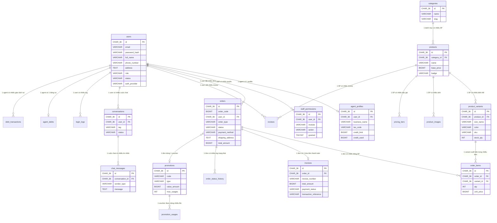

# 🗄️ CƠ SỞ DỮ LIỆU — ABC FASHION (MySQL 8+)

> **Phiên bản:** 1.0  
> **CSDL:** MySQL 8.0+  
> **Nguyên tắc cốt lõi:** Soft Delete · Audit Trail · CHAR(36) UUID Primary Key  
> **Tổng bảng:** 20

---

## 📐 MỤC LỤC

1. [Triết lý thiết kế](#1-triết-lý-thiết-kế)
2. [Sơ đồ ERD](#2-sơ-đồ-erd)
3. [Tổng quan các bảng](#3-tổng-quan-các-bảng)
4. [Chi tiết Schema](#4-chi-tiết-schema)
5. [Trigger & Stored Procedure](#5-trigger--stored-procedure)
6. [Seed Data (Dữ liệu mẫu)](#6-seed-data)
7. [Quy tắc Soft Delete](#7-quy-tắc-soft-delete)
8. [Tips Debug](#8-tips-debug)

---

## 1. TRIẾT LÝ THIẾT KẾ

### 🔑 Soft Delete (Xóa mềm)

Mọi bảng chính đều có cột `deleted_at DATETIME DEFAULT NULL`.

- **Chưa xóa** → `deleted_at IS NULL`
- **Đã xóa** → `deleted_at = '2026-07-13 10:30:00'`
- **Phục hồi** → `SET deleted_at = NULL`
- **Xóa vĩnh viễn** → `DELETE FROM ... WHERE deleted_at IS NOT NULL` *(chỉ khi cần cleanup)*

### 🕵️ Audit Trail (Dấu vết thao tác)

Mỗi bảng có 4 cột audit:

| Cột | Mô tả |
|-----|--------|
| `created_at` | Thời điểm tạo (tự động) |
| `updated_at` | Thời điểm sửa cuối (auto ON UPDATE) |
| `created_by` | UUID user đã tạo record |
| `updated_by` | UUID user sửa cuối |

### 🆔 CHAR(36) UUID Primary Key

- Không dùng auto-increment (1, 2, 3...) → Tránh conflict khi merge data, không expose thứ tự.
- Mọi PK đều là `CHAR(36) DEFAULT (UUID())` (MySQL 8.0+ hỗ trợ expression default).
- Trong code backend, nên generate UUID bằng thư viện (uuid v4) rồi truyền vào — nhanh hơn để MySQL tự generate.

### 📦 Index cho Soft Delete

MySQL không hỗ trợ Partial Index như PostgreSQL. Thay vào đó:
- Dùng **Composite Index** kết hợp `deleted_at` vào cuối index.
- Hoặc dùng **Generated Column** `is_deleted TINYINT GENERATED ALWAYS AS (IF(deleted_at IS NULL, 0, 1)) STORED` + index trên column đó.
- Trong schema này, tôi dùng cách **Composite Index** vì đơn giản hơn và đủ hiệu quả.

---

## 2. SƠ ĐỒ ERD



---


## 3. TỔNG QUAN CÁC BẢNG

| # | Bảng | Mô tả | Soft Delete |
|---|------|--------|:-----------:|
| 1 | `users` | Tất cả user (customer, admin, staff) | ✅ |
| 2 | `roles` | Vai trò (Role) trong hệ thống | ✅ |
| 3 | `user_role` | Bảng trung gian n-n (User - Role) | ❌ |
| 4 | `permissions` | Quyền hạn (Permission) cụ thể | ✅ |
| 5 | `role_permissions` | Bảng trung gian n-n (Role - Permission) | ❌ |
| 6 | `products` | Sản phẩm chính | ✅ |
| 7 | `orders` | Đơn hàng B2C | ✅ |
| 8 | `order_items` | Chi tiết dòng SP trong đơn | ❌ |
| 9 | `invoices` | Hóa đơn thanh toán (PayOS) | ✅ |
| 10| `transactions` | Lịch sử giao dịch thanh toán chi tiết | ✅ |

> **Tại sao `user_role`, `role_permissions`, `order_items` không cần soft delete?**
> → Vì chúng là bảng trung gian hoặc bảng con. Khi bảng cha bị soft-delete, query JOIN đã tự loại trừ. Bảng log/trung gian không bao giờ được xóa.

---

## 4. CHI TIẾT SCHEMA

### 4.1. Cài đặt ban đầu

```sql
-- ============================================================
-- 0. CÀI ĐẶT CHARACTER SET & COLLATION
-- ============================================================

SET NAMES utf8mb4;
SET CHARACTER SET utf8mb4;
SET collation_connection = 'utf8mb4_unicode_ci';
```

---

### 4.2. `users` — Tất cả người dùng

```sql
-- ============================================================
-- 1. USERS — Tất cả người dùng trong hệ thống
-- ============================================================
-- role: customer | agent | admin | staff
-- status: active | pending (agent chờ duyệt) | suspended (tạm khóa) | locked (brute-force)

CREATE TABLE users (
  id              CHAR(36)     NOT NULL DEFAULT (UUID()),
  email           VARCHAR(255) NOT NULL,
  password_hash   VARCHAR(255) NOT NULL,
  full_name       VARCHAR(255) NOT NULL,
  phone_number    VARCHAR(20)  DEFAULT NULL,
  address         TEXT         DEFAULT NULL,
  role            ENUM('customer','agent','admin','staff') NOT NULL,
  status          ENUM('active','pending','suspended','locked') NOT NULL DEFAULT 'active',
  avatar_url      TEXT         DEFAULT NULL,
  email_verified  TINYINT(1)   NOT NULL DEFAULT 0,
  is_enabled      TINYINT(1)   NOT NULL DEFAULT 1,
  reset_token     VARCHAR(255) DEFAULT NULL,
  reset_token_expiry DATETIME  DEFAULT NULL,
  password_changed_at DATETIME DEFAULT NULL,
  auth_provider   ENUM('LOCAL','GOOGLE','FACEBOOK') NOT NULL DEFAULT 'LOCAL',

  -- Audit + Soft Delete
  created_at      DATETIME     NOT NULL DEFAULT CURRENT_TIMESTAMP,
  updated_at      DATETIME     NOT NULL DEFAULT CURRENT_TIMESTAMP ON UPDATE CURRENT_TIMESTAMP,
  deleted_at      DATETIME     DEFAULT NULL,
  created_by      CHAR(36)     DEFAULT NULL,
  updated_by      CHAR(36)     DEFAULT NULL,

  PRIMARY KEY (id),
  -- Email unique chỉ khi chưa xóa (dùng trick: unique trên email + deleted_at placeholder)
  UNIQUE KEY uq_users_email (email, deleted_at),
  UNIQUE KEY uq_users_phone (phone_number),
  INDEX idx_users_role_status (role, status, deleted_at),
  INDEX idx_users_deleted (deleted_at)
) ENGINE=InnoDB DEFAULT CHARSET=utf8mb4 COLLATE=utf8mb4_unicode_ci;
```

**Mapping với client:**

| Mock Data (client) | DB Column |
|-----|-----------|
| `AuthRole = 'customer' \| 'agent' \| 'admin' \| 'staff'` | `role` |
| `StaffMember.status = 'Hoạt động' \| 'Tạm khóa'` | `status = 'active' \| 'suspended'` |
| Agent `status = 'Chờ duyệt'` | `status = 'pending'` |

> **Lưu ý về Unique Email + Soft Delete trong MySQL:**  
> MySQL không hỗ trợ Partial Unique Index. Thay vào đó, dùng composite unique `(email, deleted_at)`. Khi `deleted_at IS NULL`, email unique bình thường. Khi soft-delete, `deleted_at` có giá trị timestamp khác nhau nên không conflict. Nếu muốn tạo lại email đã xóa, chỉ cần đảm bảo không có 2 row cùng email + cùng deleted_at.

---

### 4.3. `agent_profiles` — Thông tin bổ sung đại lý

```sql
-- ============================================================
-- 2. AGENT PROFILES — Thông tin đại lý (B2B)
-- ============================================================
-- Mỗi user có role='agent' có 1 record ở đây
-- credit_limit/credit_used đơn vị VND

CREATE TABLE agent_profiles (
  id                CHAR(36)     NOT NULL DEFAULT (UUID()),
  user_id           CHAR(36)     NOT NULL,
  business_name     VARCHAR(255) NOT NULL,
  tax_code          VARCHAR(50)  DEFAULT NULL,
  business_address  TEXT         NOT NULL,
  credit_limit      BIGINT       NOT NULL DEFAULT 0,
  credit_used       BIGINT       NOT NULL DEFAULT 0,
  tier_label        VARCHAR(50)  DEFAULT 'Sói Đói',
  total_orders      INT          NOT NULL DEFAULT 0,
  approved_at       DATETIME     DEFAULT NULL,
  approved_by       CHAR(36)     DEFAULT NULL,

  -- Audit + Soft Delete
  created_at        DATETIME     NOT NULL DEFAULT CURRENT_TIMESTAMP,
  updated_at        DATETIME     NOT NULL DEFAULT CURRENT_TIMESTAMP ON UPDATE CURRENT_TIMESTAMP,
  deleted_at        DATETIME     DEFAULT NULL,
  created_by        CHAR(36)     DEFAULT NULL,
  updated_by        CHAR(36)     DEFAULT NULL,

  PRIMARY KEY (id),
  UNIQUE KEY uq_agent_user (user_id, deleted_at),
  CONSTRAINT fk_agent_user FOREIGN KEY (user_id) REFERENCES users(id),
  CONSTRAINT fk_agent_approved_by FOREIGN KEY (approved_by) REFERENCES users(id),
  INDEX idx_agent_deleted (deleted_at)
) ENGINE=InnoDB DEFAULT CHARSET=utf8mb4 COLLATE=utf8mb4_unicode_ci;
```

**Mapping với `AGENTS_DATA`:**

| Mock field | DB Column |
|-----|-----------|
| `name: "Cty TNHH ATMIN Fashion"` | `business_name` |
| `contact: "0901 234 567"` | `users.phone` (JOIN) |
| `credit: 50000000` | `credit_limit` |
| `used: 13500000` | `credit_used` |
| `status: "Hoạt động"` | `users.status = 'active'` |
| `status: "Chờ duyệt"` | `users.status = 'pending'` + `approved_at IS NULL` |
| `orders: 42` | `total_orders` |

---

### 4.4. `staff_permissions` — Phân quyền RBAC

```sql
-- ============================================================
-- 3. STAFF PERMISSIONS — Phân quyền động (RBAC)
-- ============================================================
-- Mapping 1:1 với PERMISSION_MODULES trong client
-- module: products | inventory | orders | agents | debts | promotions | reports | inbox
-- action: view | create | update | delete

CREATE TABLE staff_permissions (
  id          CHAR(36)    NOT NULL DEFAULT (UUID()),
  user_id     CHAR(36)    NOT NULL,
  module      VARCHAR(50) NOT NULL,
  action      VARCHAR(20) NOT NULL,
  granted     TINYINT(1)  NOT NULL DEFAULT 0,

  -- Audit
  created_at  DATETIME    NOT NULL DEFAULT CURRENT_TIMESTAMP,
  updated_at  DATETIME    NOT NULL DEFAULT CURRENT_TIMESTAMP ON UPDATE CURRENT_TIMESTAMP,
  deleted_at  DATETIME    DEFAULT NULL,
  granted_by  CHAR(36)    DEFAULT NULL,

  PRIMARY KEY (id),
  UNIQUE KEY uq_staff_perm (user_id, module, action, deleted_at),
  CONSTRAINT fk_perm_user FOREIGN KEY (user_id) REFERENCES users(id),
  CONSTRAINT fk_perm_granted_by FOREIGN KEY (granted_by) REFERENCES users(id),
  INDEX idx_perm_deleted (deleted_at)
) ENGINE=InnoDB DEFAULT CHARSET=utf8mb4 COLLATE=utf8mb4_unicode_ci;
```

**Bảng module × action đầy đủ:**

| Module | view | create | update | delete |
|--------|:----:|:------:|:------:|:------:|
| `products` | ✅ | ✅ | ✅ | ✅ |
| `inventory` | ✅ | ✅ | ✅ | — |
| `orders` | ✅ | ✅ | ✅ | ✅ |
| `agents` | ✅ | ✅ | ✅ | ✅ |
| `debts` | ✅ | — | ✅ | — |
| `promotions` | ✅ | ✅ | ✅ | ✅ |
| `reports` | ✅ | — | — | — |
| `inbox` | ✅ | ✅ | — | — |

---

### 4.5. `categories` — Danh mục sản phẩm

```sql
-- ============================================================
-- 4. CATEGORIES — Danh mục sản phẩm
-- ============================================================

CREATE TABLE categories (
  id          CHAR(36)     NOT NULL DEFAULT (UUID()),
  name        VARCHAR(100) NOT NULL,
  slug        VARCHAR(100) NOT NULL,
  sort_order  INT          DEFAULT 0,

  created_at  DATETIME     NOT NULL DEFAULT CURRENT_TIMESTAMP,
  updated_at  DATETIME     NOT NULL DEFAULT CURRENT_TIMESTAMP ON UPDATE CURRENT_TIMESTAMP,
  deleted_at  DATETIME     DEFAULT NULL,

  PRIMARY KEY (id),
  UNIQUE KEY uq_category_slug (slug, deleted_at),
  INDEX idx_category_deleted (deleted_at)
) ENGINE=InnoDB DEFAULT CHARSET=utf8mb4 COLLATE=utf8mb4_unicode_ci;
```

---

### 4.6. `products` — Sản phẩm

```sql
-- ============================================================
-- 5. PRODUCTS — Sản phẩm chính
-- ============================================================

CREATE TABLE products (
  id            CHAR(36)     NOT NULL DEFAULT (UUID()),
  category_id   CHAR(36)     DEFAULT NULL,
  name          VARCHAR(255) NOT NULL,
  slug          VARCHAR(255) NOT NULL,
  material      VARCHAR(255) DEFAULT NULL,
  base_price    BIGINT       NOT NULL,
  rating_avg    DECIMAL(2,1) DEFAULT 0.0,
  review_count  INT          DEFAULT 0,
  badge         VARCHAR(50)  DEFAULT NULL,
  is_active     TINYINT(1)   DEFAULT 1,

  -- Audit + Soft Delete
  created_at    DATETIME     NOT NULL DEFAULT CURRENT_TIMESTAMP,
  updated_at    DATETIME     NOT NULL DEFAULT CURRENT_TIMESTAMP ON UPDATE CURRENT_TIMESTAMP,
  deleted_at    DATETIME     DEFAULT NULL,
  created_by    CHAR(36)     DEFAULT NULL,
  updated_by    CHAR(36)     DEFAULT NULL,

  PRIMARY KEY (id),
  UNIQUE KEY uq_product_slug (slug, deleted_at),
  CONSTRAINT fk_product_category FOREIGN KEY (category_id) REFERENCES categories(id),
  CONSTRAINT fk_product_created_by FOREIGN KEY (created_by) REFERENCES users(id),
  INDEX idx_products_category (category_id, deleted_at),
  INDEX idx_products_deleted (deleted_at)
) ENGINE=InnoDB DEFAULT CHARSET=utf8mb4 COLLATE=utf8mb4_unicode_ci;
```

**Mapping với `PRODUCTS[]`:**

| Mock field | DB Column |
|-----|-----------|
| `name: "Áo Polo ABC Classic"` | `name` |
| `category: "Áo"` | `categories.name` (JOIN) |
| `price: 280000` | `base_price` |
| `material: "Cotton piqué 100%"` | `material` |
| `rating: 4.7` | `rating_avg` |
| `reviews: 128` | `review_count` |
| `badge: "Bán chạy"` | `badge` |
| `colors: [...]` | → `product_variants.color` (DISTINCT) |
| `sizes: [...]` | → `product_variants.size_name` (DISTINCT) |
| `stock: {"S-Trắng": 15, ...}` | → `product_variants.stock_qty` |
| `image: "https://..."` | → `product_images.url` |

---

### 4.7. `product_variants` — Biến thể Size × Màu

```sql
-- ============================================================
-- 6. PRODUCT VARIANTS — Biến thể (Size × Màu)
-- ============================================================
-- Mỗi row = 1 ô trong bảng ma trận đặt hàng B2B
-- Lưu ý: dùng `size_name` thay vì `size` vì `size` là từ khóa MySQL

CREATE TABLE product_variants (
  id          CHAR(36)    NOT NULL DEFAULT (UUID()),
  product_id  CHAR(36)    NOT NULL,
  size_name   VARCHAR(10) NOT NULL,
  color       VARCHAR(50) NOT NULL,
  sku         VARCHAR(50) NOT NULL,
  stock_qty   INT         NOT NULL DEFAULT 0,

  -- Audit + Soft Delete
  created_at  DATETIME    NOT NULL DEFAULT CURRENT_TIMESTAMP,
  updated_at  DATETIME    NOT NULL DEFAULT CURRENT_TIMESTAMP ON UPDATE CURRENT_TIMESTAMP,
  deleted_at  DATETIME    DEFAULT NULL,

  PRIMARY KEY (id),
  UNIQUE KEY uq_variant_product_size_color (product_id, size_name, color, deleted_at),
  UNIQUE KEY uq_variant_sku (sku, deleted_at),
  CONSTRAINT fk_variant_product FOREIGN KEY (product_id) REFERENCES products(id),
  INDEX idx_variants_product (product_id, deleted_at)
) ENGINE=InnoDB DEFAULT CHARSET=utf8mb4 COLLATE=utf8mb4_unicode_ci;
```

---

### 4.8. `product_images` — Ảnh sản phẩm

```sql
-- ============================================================
-- 7. PRODUCT IMAGES — Ảnh sản phẩm
-- ============================================================

CREATE TABLE product_images (
  id          CHAR(36)     NOT NULL DEFAULT (UUID()),
  product_id  CHAR(36)     NOT NULL,
  url         TEXT         NOT NULL,
  alt_text    VARCHAR(255) DEFAULT NULL,
  is_primary  TINYINT(1)   DEFAULT 0,
  sort_order  INT          DEFAULT 0,

  created_at  DATETIME     NOT NULL DEFAULT CURRENT_TIMESTAMP,
  deleted_at  DATETIME     DEFAULT NULL,

  PRIMARY KEY (id),
  CONSTRAINT fk_image_product FOREIGN KEY (product_id) REFERENCES products(id),
  INDEX idx_images_product (product_id, deleted_at)
) ENGINE=InnoDB DEFAULT CHARSET=utf8mb4 COLLATE=utf8mb4_unicode_ci;
```

---

### 4.9. `pricing_tiers` — Giá sỉ bậc thang

```sql
-- ============================================================
-- 8. PRICING TIERS — Giá sỉ bậc thang
-- ============================================================
-- product_id = NULL → áp dụng chung cho tất cả SP
-- max_qty = NULL → không giới hạn (= Infinity trong client)

CREATE TABLE pricing_tiers (
  id            CHAR(36)     NOT NULL DEFAULT (UUID()),
  product_id    CHAR(36)     DEFAULT NULL,
  tier_level    INT          NOT NULL,
  min_qty       INT          NOT NULL,
  max_qty       INT          DEFAULT NULL,
  unit_price    BIGINT       NOT NULL,
  discount_pct  DECIMAL(5,2) DEFAULT 0.00,
  label         VARCHAR(50)  DEFAULT NULL,

  created_at    DATETIME     NOT NULL DEFAULT CURRENT_TIMESTAMP,
  updated_at    DATETIME     NOT NULL DEFAULT CURRENT_TIMESTAMP ON UPDATE CURRENT_TIMESTAMP,
  deleted_at    DATETIME     DEFAULT NULL,

  PRIMARY KEY (id),
  CONSTRAINT fk_tier_product FOREIGN KEY (product_id) REFERENCES products(id),
  INDEX idx_tiers_product (product_id, deleted_at)
) ENGINE=InnoDB DEFAULT CHARSET=utf8mb4 COLLATE=utf8mb4_unicode_ci;
```

**Mapping với `PRICING_TIERS`:**

| Mock | DB |
|------|-----|
| `tier: 1, min: 1, max: 9, price: 280000, discount: 0, label: "Giá lẻ"` | `tier_level=1, min_qty=1, max_qty=9, unit_price=280000, discount_pct=0, label='Giá lẻ'` |
| `tier: 4, min: 100, max: Infinity` | `tier_level=4, min_qty=100, max_qty=NULL` |

---

### 4.10. `promotions` — Voucher (đặt trước orders vì orders tham chiếu)

```sql
-- ============================================================
-- 14. PROMOTIONS — Voucher & Mã khuyến mãi
-- ============================================================

CREATE TABLE promotions (
  id            CHAR(36)    NOT NULL DEFAULT (UUID()),
  code          VARCHAR(30) NOT NULL,
  type          ENUM('percentage','fixed_amount') NOT NULL,
  value_amount  BIGINT      NOT NULL,
  min_order     BIGINT      DEFAULT 0,
  max_usages    INT         NOT NULL DEFAULT 100,
  used_count    INT         NOT NULL DEFAULT 0,
  starts_at     DATETIME    NOT NULL,
  expires_at    DATETIME    NOT NULL,
  status        ENUM('active','paused','expired','cancelled') DEFAULT 'active',

  -- Audit + Soft Delete
  created_at    DATETIME    NOT NULL DEFAULT CURRENT_TIMESTAMP,
  updated_at    DATETIME    NOT NULL DEFAULT CURRENT_TIMESTAMP ON UPDATE CURRENT_TIMESTAMP,
  deleted_at    DATETIME    DEFAULT NULL,
  created_by    CHAR(36)    DEFAULT NULL,

  PRIMARY KEY (id),
  UNIQUE KEY uq_promo_code (code, deleted_at),
  CONSTRAINT fk_promo_created_by FOREIGN KEY (created_by) REFERENCES users(id),
  INDEX idx_promo_deleted (deleted_at)
) ENGINE=InnoDB DEFAULT CHARSET=utf8mb4 COLLATE=utf8mb4_unicode_ci;
```

**Mapping với client:**

| Mock | DB |
|------|-----|
| `code: "ABC10", type: "Giảm %", value: "10%"` | `code='ABC10', type='percentage', value_amount=10` |
| `code: "SALE50K", type: "Giảm tiền", value: "50.000₫"` | `code='SALE50K', type='fixed_amount', value_amount=50000` |

---

### 4.11. `orders` — Đơn hàng

```sql
-- ============================================================
-- 9. ORDERS — Đơn hàng (B2C lẻ + B2B sỉ)
-- ============================================================

CREATE TABLE orders (
  id              CHAR(36)    NOT NULL DEFAULT (UUID()),
  order_code      BIGINT      NOT NULL,
  user_id         CHAR(36)    NOT NULL,
  order_type      ENUM('B2C','B2B') NOT NULL DEFAULT 'B2C',
  status          ENUM('PENDING','PENDING_PAYMENT','PAID','PROCESSING','SHIPPING','DELIVERED','COMPLETED','CANCELLED')
                    NOT NULL DEFAULT 'PENDING',
  payment_method  ENUM('COD','PAYOS','CREDIT','VNPAY','BANK_TRANSFER') DEFAULT 'COD',
  shipping_address TEXT       DEFAULT NULL,
  phone_number    VARCHAR(20) DEFAULT NULL,
  total_qty       INT         NOT NULL DEFAULT 0,
  subtotal        BIGINT      NOT NULL DEFAULT 0,
  discount_amount BIGINT      DEFAULT 0,
  total_amount    BIGINT      NOT NULL DEFAULT 0,
  promotion_id    CHAR(36)    DEFAULT NULL,
  note            TEXT        DEFAULT NULL,

  -- Audit + Soft Delete
  created_at      DATETIME    NOT NULL DEFAULT CURRENT_TIMESTAMP,
  updated_at      DATETIME    NOT NULL DEFAULT CURRENT_TIMESTAMP ON UPDATE CURRENT_TIMESTAMP,
  deleted_at      DATETIME    DEFAULT NULL,
  created_by      CHAR(36)    DEFAULT NULL,
  updated_by      CHAR(36)    DEFAULT NULL,

  PRIMARY KEY (id),
  UNIQUE KEY uq_order_code (order_code, deleted_at),
  CONSTRAINT fk_order_user FOREIGN KEY (user_id) REFERENCES users(id),
  CONSTRAINT fk_order_promo FOREIGN KEY (promotion_id) REFERENCES promotions(id),
  CONSTRAINT fk_order_created_by FOREIGN KEY (created_by) REFERENCES users(id),
  INDEX idx_orders_user (user_id, deleted_at),
  INDEX idx_orders_status (status, deleted_at),
  INDEX idx_orders_type_status (order_type, status, deleted_at),
  INDEX idx_orders_deleted (deleted_at)
) ENGINE=InnoDB DEFAULT CHARSET=utf8mb4 COLLATE=utf8mb4_unicode_ci;
```

**Mapping trạng thái:**

| Client (Tiếng Việt) | DB `status` | Ghi chú |
|-----|-----|-----|
| Chờ duyệt | `pending` | Đơn mới, chưa xác nhận |
| Đang xử lý | `processing` | Admin đã duyệt, đang soạn hàng |
| Đang giao | `shipping` | Đã bàn giao vận chuyển |
| Đã giao | `delivered` | Shipper giao thành công |
| Hoàn thành | `completed` | Khách xác nhận nhận hàng |
| Đã hủy | `cancelled` | Hủy bởi khách hoặc admin |

---

### 4.11b. `invoices` — Hóa đơn thanh toán (PayOS, v.v.)

```sql
-- ============================================================
-- 9b. INVOICES — Hóa đơn thanh toán
-- ============================================================

CREATE TABLE invoices (
  id                    CHAR(36)    NOT NULL DEFAULT (UUID()),
  order_id              CHAR(36)    NOT NULL,
  invoice_number        VARCHAR(50) NOT NULL,
  issued_date           DATETIME    NOT NULL,
  total_amount          DOUBLE      NOT NULL,
  payment_status        VARCHAR(50) DEFAULT NULL,
  transaction_reference VARCHAR(255) DEFAULT NULL,

  created_at            DATETIME    NOT NULL DEFAULT CURRENT_TIMESTAMP,
  updated_at            DATETIME    NOT NULL DEFAULT CURRENT_TIMESTAMP ON UPDATE CURRENT_TIMESTAMP,
  deleted_at            DATETIME    DEFAULT NULL,
  created_by            CHAR(36)    DEFAULT NULL,
  updated_by            CHAR(36)    DEFAULT NULL,

  PRIMARY KEY (id),
  UNIQUE KEY uq_invoice_number (invoice_number, deleted_at),
  UNIQUE KEY uq_invoice_order (order_id, deleted_at),
  CONSTRAINT fk_invoice_order FOREIGN KEY (order_id) REFERENCES orders(id),
  INDEX idx_invoices_deleted (deleted_at)
) ENGINE=InnoDB DEFAULT CHARSET=utf8mb4 COLLATE=utf8mb4_unicode_ci;
```

---

### 4.12. `order_items` — Chi tiết đơn hàng

```sql
-- ============================================================
-- 10. ORDER ITEMS — Dòng sản phẩm trong đơn
-- ============================================================
-- Snapshot: lưu tên SP + giá tại thời điểm đặt (không đổi nếu SP sửa giá sau)

CREATE TABLE order_items (
  id            CHAR(36)     NOT NULL DEFAULT (UUID()),
  order_id      CHAR(36)     NOT NULL,
  variant_id    CHAR(36)     NOT NULL,
  product_name  VARCHAR(255) NOT NULL,
  size_name     VARCHAR(10)  NOT NULL,
  color         VARCHAR(50)  NOT NULL,
  qty           INT          NOT NULL,
  unit_price    BIGINT       NOT NULL,
  line_total    BIGINT       NOT NULL,

  created_at    DATETIME     NOT NULL DEFAULT CURRENT_TIMESTAMP,

  PRIMARY KEY (id),
  CONSTRAINT fk_oi_order FOREIGN KEY (order_id) REFERENCES orders(id) ON DELETE CASCADE,
  CONSTRAINT fk_oi_variant FOREIGN KEY (variant_id) REFERENCES product_variants(id),
  CONSTRAINT chk_oi_qty CHECK (qty > 0),
  INDEX idx_order_items_order (order_id)
) ENGINE=InnoDB DEFAULT CHARSET=utf8mb4 COLLATE=utf8mb4_unicode_ci;
```

---

### 4.13. `order_status_history` — Lịch sử trạng thái đơn

```sql
-- ============================================================
-- 11. ORDER STATUS HISTORY — Nhật ký chuyển trạng thái
-- ============================================================

CREATE TABLE order_status_history (
  id          CHAR(36)    NOT NULL DEFAULT (UUID()),
  order_id    CHAR(36)    NOT NULL,
  old_status  VARCHAR(30) DEFAULT NULL,
  new_status  VARCHAR(30) NOT NULL,
  changed_by  CHAR(36)    DEFAULT NULL,
  note        TEXT        DEFAULT NULL,

  created_at  DATETIME    NOT NULL DEFAULT CURRENT_TIMESTAMP,

  PRIMARY KEY (id),
  CONSTRAINT fk_osh_order FOREIGN KEY (order_id) REFERENCES orders(id) ON DELETE CASCADE,
  CONSTRAINT fk_osh_changed_by FOREIGN KEY (changed_by) REFERENCES users(id),
  INDEX idx_status_history_order (order_id, created_at DESC)
) ENGINE=InnoDB DEFAULT CHARSET=utf8mb4 COLLATE=utf8mb4_unicode_ci;
```

---

### 4.14. `agent_debts` — Tổng hợp công nợ

```sql
-- ============================================================
-- 12. AGENT DEBTS — Bảng tổng hợp công nợ đại lý
-- ============================================================

CREATE TABLE agent_debts (
  id              CHAR(36)  NOT NULL DEFAULT (UUID()),
  agent_user_id   CHAR(36)  NOT NULL,
  total_debt      BIGINT    NOT NULL DEFAULT 0,
  overdue_amount  BIGINT    NOT NULL DEFAULT 0,
  last_payment_at DATETIME  DEFAULT NULL,

  created_at      DATETIME  NOT NULL DEFAULT CURRENT_TIMESTAMP,
  updated_at      DATETIME  NOT NULL DEFAULT CURRENT_TIMESTAMP ON UPDATE CURRENT_TIMESTAMP,
  deleted_at      DATETIME  DEFAULT NULL,

  PRIMARY KEY (id),
  UNIQUE KEY uq_agent_debt (agent_user_id, deleted_at),
  CONSTRAINT fk_debt_agent FOREIGN KEY (agent_user_id) REFERENCES users(id),
  INDEX idx_debt_deleted (deleted_at)
) ENGINE=InnoDB DEFAULT CHARSET=utf8mb4 COLLATE=utf8mb4_unicode_ci;
```

---

### 4.15. `debt_transactions` — Lịch sử giao dịch nợ

```sql
-- ============================================================
-- 13. DEBT TRANSACTIONS — Chi tiết giao dịch nợ
-- ============================================================
-- type = 'debit' (tăng nợ khi ghi nợ) | 'credit' (giảm nợ khi thanh toán)

CREATE TABLE debt_transactions (
  id              CHAR(36)    NOT NULL DEFAULT (UUID()),
  agent_user_id   CHAR(36)    NOT NULL,
  order_id        CHAR(36)    DEFAULT NULL,
  type            ENUM('debit','credit') NOT NULL,
  amount          BIGINT      NOT NULL,
  balance_after   BIGINT      NOT NULL,
  description     TEXT        DEFAULT NULL,

  created_at      DATETIME    NOT NULL DEFAULT CURRENT_TIMESTAMP,
  created_by      CHAR(36)    DEFAULT NULL,

  PRIMARY KEY (id),
  CONSTRAINT fk_dtx_agent FOREIGN KEY (agent_user_id) REFERENCES users(id),
  CONSTRAINT fk_dtx_order FOREIGN KEY (order_id) REFERENCES orders(id),
  CONSTRAINT fk_dtx_created_by FOREIGN KEY (created_by) REFERENCES users(id),
  INDEX idx_debt_tx_agent (agent_user_id, created_at DESC)
) ENGINE=InnoDB DEFAULT CHARSET=utf8mb4 COLLATE=utf8mb4_unicode_ci;
```

---

### 4.16. `promotion_usages` — Lịch sử sử dụng voucher

```sql
-- ============================================================
-- 15. PROMOTION USAGES — Lịch sử dùng voucher
-- ============================================================

CREATE TABLE promotion_usages (
  id                CHAR(36) NOT NULL DEFAULT (UUID()),
  promotion_id      CHAR(36) NOT NULL,
  user_id           CHAR(36) NOT NULL,
  order_id          CHAR(36) DEFAULT NULL,
  discount_applied  BIGINT   NOT NULL,

  created_at        DATETIME NOT NULL DEFAULT CURRENT_TIMESTAMP,

  PRIMARY KEY (id),
  CONSTRAINT fk_pu_promo FOREIGN KEY (promotion_id) REFERENCES promotions(id),
  CONSTRAINT fk_pu_user FOREIGN KEY (user_id) REFERENCES users(id),
  CONSTRAINT fk_pu_order FOREIGN KEY (order_id) REFERENCES orders(id),
  INDEX idx_promo_usage_promo (promotion_id),
  INDEX idx_promo_usage_user (user_id)
) ENGINE=InnoDB DEFAULT CHARSET=utf8mb4 COLLATE=utf8mb4_unicode_ci;
```

---

### 4.17. `conversations` — Phiên chat hỗ trợ

```sql
-- ============================================================
-- 16. CONVERSATIONS — Phiên chat hỗ trợ khách hàng
-- ============================================================

CREATE TABLE conversations (
  id            CHAR(36)     NOT NULL DEFAULT (UUID()),
  user_id       CHAR(36)     DEFAULT NULL,
  guest_name    VARCHAR(100) DEFAULT NULL,
  guest_phone   VARCHAR(20)  DEFAULT NULL,
  user_role     VARCHAR(20)  DEFAULT NULL,
  tag           VARCHAR(50)  DEFAULT NULL,
  status        ENUM('open','assigned','resolved','closed') DEFAULT 'open',
  assigned_to   CHAR(36)     DEFAULT NULL,
  last_message  TEXT         DEFAULT NULL,
  last_msg_at   DATETIME     DEFAULT NULL,
  unread_count  INT          DEFAULT 0,

  -- Audit + Soft Delete
  created_at    DATETIME     NOT NULL DEFAULT CURRENT_TIMESTAMP,
  updated_at    DATETIME     NOT NULL DEFAULT CURRENT_TIMESTAMP ON UPDATE CURRENT_TIMESTAMP,
  deleted_at    DATETIME     DEFAULT NULL,

  PRIMARY KEY (id),
  CONSTRAINT fk_convo_user FOREIGN KEY (user_id) REFERENCES users(id),
  CONSTRAINT fk_convo_assigned FOREIGN KEY (assigned_to) REFERENCES users(id),
  INDEX idx_convos_status (status, deleted_at),
  INDEX idx_convos_assigned (assigned_to, deleted_at),
  INDEX idx_convos_deleted (deleted_at)
) ENGINE=InnoDB DEFAULT CHARSET=utf8mb4 COLLATE=utf8mb4_unicode_ci;
```

---

### 4.18. `chat_messages` — Tin nhắn chat

```sql
-- ============================================================
-- 17. CHAT MESSAGES — Tin nhắn trong cuộc hội thoại
-- ============================================================

CREATE TABLE chat_messages (
  id                CHAR(36)    NOT NULL DEFAULT (UUID()),
  conversation_id   CHAR(36)    NOT NULL,
  sender_type       ENUM('user','staff','bot') NOT NULL,
  sender_id         CHAR(36)    DEFAULT NULL,
  message           TEXT        NOT NULL,
  attachment_url    TEXT        DEFAULT NULL,
  is_read           TINYINT(1)  DEFAULT 0,

  created_at        DATETIME    NOT NULL DEFAULT CURRENT_TIMESTAMP,
  deleted_at        DATETIME    DEFAULT NULL,

  PRIMARY KEY (id),
  CONSTRAINT fk_msg_convo FOREIGN KEY (conversation_id) REFERENCES conversations(id) ON DELETE CASCADE,
  CONSTRAINT fk_msg_sender FOREIGN KEY (sender_id) REFERENCES users(id),
  INDEX idx_messages_convo (conversation_id, created_at, deleted_at)
) ENGINE=InnoDB DEFAULT CHARSET=utf8mb4 COLLATE=utf8mb4_unicode_ci;
```

---

### 4.19. `login_logs` — Nhật ký đăng nhập

```sql
-- ============================================================
-- 18. LOGIN LOGS — Audit Trail đăng nhập
-- ============================================================

CREATE TABLE login_logs (
  id            CHAR(36)     NOT NULL DEFAULT (UUID()),
  user_id       CHAR(36)     NOT NULL,
  ip_address    VARCHAR(45)  NOT NULL,
  user_agent    TEXT         DEFAULT NULL,
  success       TINYINT(1)   NOT NULL,
  failed_reason VARCHAR(100) DEFAULT NULL,

  created_at    DATETIME     NOT NULL DEFAULT CURRENT_TIMESTAMP,

  PRIMARY KEY (id),
  CONSTRAINT fk_loginlog_user FOREIGN KEY (user_id) REFERENCES users(id),
  INDEX idx_login_logs_user (user_id, created_at DESC),
  INDEX idx_login_logs_ip (ip_address, created_at DESC)
) ENGINE=InnoDB DEFAULT CHARSET=utf8mb4 COLLATE=utf8mb4_unicode_ci;
```

---

### 4.20. `login_attempts` — Chống dò mật khẩu

```sql
-- ============================================================
-- 19. LOGIN ATTEMPTS — Rate Limiting / Chống brute-force
-- ============================================================
-- identifier = email hoặc IP
-- Sau 5 lần sai → locked_until = NOW() + 30 phút

CREATE TABLE login_attempts (
  id               CHAR(36)     NOT NULL DEFAULT (UUID()),
  identifier       VARCHAR(255) NOT NULL,
  attempt_type     ENUM('password','otp') NOT NULL,
  attempt_count    INT          NOT NULL DEFAULT 1,
  locked_until     DATETIME     DEFAULT NULL,
  first_attempt_at DATETIME     NOT NULL DEFAULT CURRENT_TIMESTAMP,
  last_attempt_at  DATETIME     NOT NULL DEFAULT CURRENT_TIMESTAMP ON UPDATE CURRENT_TIMESTAMP,

  PRIMARY KEY (id),
  INDEX idx_attempts_ident (identifier, last_attempt_at DESC)
) ENGINE=InnoDB DEFAULT CHARSET=utf8mb4 COLLATE=utf8mb4_unicode_ci;
```

---

### 4.21. `reviews` — Đánh giá sản phẩm

```sql
-- ============================================================
-- 20. REVIEWS — Đánh giá sản phẩm
-- ============================================================

CREATE TABLE reviews (
  id          CHAR(36)  NOT NULL DEFAULT (UUID()),
  product_id  CHAR(36)  NOT NULL,
  user_id     CHAR(36)  NOT NULL,
  order_id    CHAR(36)  DEFAULT NULL,
  rating      TINYINT   NOT NULL,
  comment     TEXT      DEFAULT NULL,

  created_at  DATETIME  NOT NULL DEFAULT CURRENT_TIMESTAMP,
  updated_at  DATETIME  NOT NULL DEFAULT CURRENT_TIMESTAMP ON UPDATE CURRENT_TIMESTAMP,
  deleted_at  DATETIME  DEFAULT NULL,

  PRIMARY KEY (id),
  CONSTRAINT fk_review_product FOREIGN KEY (product_id) REFERENCES products(id),
  CONSTRAINT fk_review_user FOREIGN KEY (user_id) REFERENCES users(id),
  CONSTRAINT fk_review_order FOREIGN KEY (order_id) REFERENCES orders(id),
  CONSTRAINT chk_review_rating CHECK (rating BETWEEN 1 AND 5),
  UNIQUE KEY uq_review_user_product_order (user_id, product_id, order_id, deleted_at),
  INDEX idx_reviews_product (product_id, deleted_at)
) ENGINE=InnoDB DEFAULT CHARSET=utf8mb4 COLLATE=utf8mb4_unicode_ci;
```

---

## 5. TRIGGER & STORED PROCEDURE

### 5.1. Auto-generate `order_code`

```sql
-- ============================================================
-- TRIGGER: Tự sinh mã đơn hàng ORD-YYYY-XXX
-- ============================================================

DELIMITER //

CREATE TRIGGER trg_orders_auto_code
BEFORE INSERT ON orders
FOR EACH ROW
BEGIN
  DECLARE next_num INT;

  IF NEW.order_code IS NULL OR NEW.order_code = '' THEN
    SELECT COALESCE(MAX(
      CAST(SUBSTRING_INDEX(order_code, '-', -1) AS UNSIGNED)
    ), 0) + 1
    INTO next_num
    FROM orders
    WHERE order_code LIKE CONCAT('ORD-', DATE_FORMAT(NOW(), '%Y'), '-%');

    SET NEW.order_code = CONCAT('ORD-', DATE_FORMAT(NOW(), '%Y'), '-', LPAD(next_num, 3, '0'));
  END IF;
END //

DELIMITER ;
```

### 5.2. Auto-log trạng thái đơn hàng

```sql
-- ============================================================
-- TRIGGER: Ghi log khi đơn hàng đổi trạng thái
-- ============================================================

DELIMITER //

CREATE TRIGGER trg_orders_status_log
AFTER UPDATE ON orders
FOR EACH ROW
BEGIN
  IF OLD.status <> NEW.status THEN
    INSERT INTO order_status_history (order_id, old_status, new_status, changed_by, created_at)
    VALUES (NEW.id, OLD.status, NEW.status, NEW.updated_by, NOW());
  END IF;
END //

DELIMITER ;
```

### 5.3. Auto tăng `used_count` khi dùng voucher

```sql
-- ============================================================
-- TRIGGER: Tăng used_count khi thêm promotion_usages
-- ============================================================

DELIMITER //

CREATE TRIGGER trg_promo_usage_after_insert
AFTER INSERT ON promotion_usages
FOR EACH ROW
BEGIN
  UPDATE promotions
  SET used_count = used_count + 1
  WHERE id = NEW.promotion_id;
END //

DELIMITER ;
```

---

## 6. SEED DATA

Dữ liệu mẫu khớp 1:1 với `mockData.ts` trên client.

### 6.1. Users

```sql
-- Admin (Chủ shop)
INSERT INTO users (id, email, password_hash, full_name, phone, role, status, email_verified) VALUES
  ('a0000000-0000-0000-0000-000000000001', 'admin@abc.vn', '$2b$10$HASH_ADMIN', 'Admin ABC Fashion', '0900 000 000', 'admin', 'active', 1);

-- Staff (4 nhân viên — mapping với INITIAL_STAFF[])
INSERT INTO users (id, email, password_hash, full_name, phone, role, status, email_verified, created_by) VALUES
  ('s0000000-0000-0000-0000-000000000001', 'bich.sales@abc.vn',  '$2b$10$HASH_ST1', 'Trần Thị Bích',  '0901 111 222', 'staff', 'active',    1, 'a0000000-0000-0000-0000-000000000001'),
  ('s0000000-0000-0000-0000-000000000002', 'kho.staff@abc.vn',   '$2b$10$HASH_ST2', 'Lê Văn Kho',     '0902 333 444', 'staff', 'active',    1, 'a0000000-0000-0000-0000-000000000001'),
  ('s0000000-0000-0000-0000-000000000003', 'toan.kt@abc.vn',     '$2b$10$HASH_ST3', 'Phạm Minh Toán', '0903 555 666', 'staff', 'active',    1, 'a0000000-0000-0000-0000-000000000001'),
  ('s0000000-0000-0000-0000-000000000004', 'ha.new@abc.vn',      '$2b$10$HASH_ST4', 'Nguyễn Thị Hà',  '0904 777 888', 'staff', 'suspended', 1, 'a0000000-0000-0000-0000-000000000001');

-- Customer (2 khách lẻ)
INSERT INTO users (id, email, password_hash, full_name, phone, role, status, email_verified) VALUES
  ('c0000000-0000-0000-0000-000000000001', 'minh@gmail.com', '$2b$10$HASH_CUS1', 'Nguyễn Văn Minh', '0910 111 111', 'customer', 'active', 1),
  ('c0000000-0000-0000-0000-000000000002', 'hoa@gmail.com',  '$2b$10$HASH_CUS2', 'Trần Thị Hoa',   '0910 222 222', 'customer', 'active', 1);

-- Agent (4 đại lý — mapping với AGENTS_DATA[])
INSERT INTO users (id, email, password_hash, full_name, phone, role, status, email_verified) VALUES
  ('g0000000-0000-0000-0000-000000000001', 'atmin@business.vn',    '$2b$10$HASH_AG1', 'Đại diện Cty ATMIN',    '0901 234 567', 'agent', 'active',  1),
  ('g0000000-0000-0000-0000-000000000002', 'phuongnam@biz.vn',     '$2b$10$HASH_AG2', 'Đại lý Phương Nam',     '0912 345 678', 'agent', 'active',  1),
  ('g0000000-0000-0000-0000-000000000003', 'mientay@shop.vn',      '$2b$10$HASH_AG3', 'Shop Miền Tây Fashion', '0923 456 789', 'agent', 'active',  1),
  ('g0000000-0000-0000-0000-000000000004', 'bacgiang@fashion.vn',  '$2b$10$HASH_AG4', 'Thời Trang Bắc Giang',  '0934 567 890', 'agent', 'pending', 1);
```

### 6.2. Agent Profiles

```sql
INSERT INTO agent_profiles (user_id, business_name, tax_code, business_address, credit_limit, credit_used, total_orders, approved_at, approved_by) VALUES
  ('g0000000-0000-0000-0000-000000000001', 'Cty TNHH ATMIN Fashion',  '0123456789', '123 Nguyễn Huệ, Q.1, TP.HCM',       50000000, 13500000, 42, DATE_SUB(NOW(), INTERVAL 90 DAY), 'a0000000-0000-0000-0000-000000000001'),
  ('g0000000-0000-0000-0000-000000000002', 'Đại lý Phương Nam',       NULL,         '456 Lê Lợi, Q.5, TP.HCM',            30000000,  6000000, 28, DATE_SUB(NOW(), INTERVAL 60 DAY), 'a0000000-0000-0000-0000-000000000001'),
  ('g0000000-0000-0000-0000-000000000003', 'Shop Miền Tây Fashion',   '9876543210', '789 Trần Hưng Đạo, Cần Thơ',         20000000, 20000000, 15, DATE_SUB(NOW(), INTERVAL 45 DAY), 'a0000000-0000-0000-0000-000000000001'),
  ('g0000000-0000-0000-0000-000000000004', 'Thời Trang Bắc Giang',    NULL,         '321 Hoàng Văn Thụ, Bắc Giang',       25000000,        0,  0, NULL, NULL);
```

### 6.3. Staff Permissions (Sales preset)

```sql
-- Sales: Trần Thị Bích (ST-001) — mapping với STAFF_PRESETS["Sales"]
INSERT INTO staff_permissions (user_id, module, action, granted, granted_by) VALUES
  ('s0000000-0000-0000-0000-000000000001', 'orders',     'view',   1, 'a0000000-0000-0000-0000-000000000001'),
  ('s0000000-0000-0000-0000-000000000001', 'orders',     'create', 1, 'a0000000-0000-0000-0000-000000000001'),
  ('s0000000-0000-0000-0000-000000000001', 'orders',     'update', 1, 'a0000000-0000-0000-0000-000000000001'),
  ('s0000000-0000-0000-0000-000000000001', 'orders',     'delete', 0, 'a0000000-0000-0000-0000-000000000001'),
  ('s0000000-0000-0000-0000-000000000001', 'agents',     'view',   1, 'a0000000-0000-0000-0000-000000000001'),
  ('s0000000-0000-0000-0000-000000000001', 'agents',     'update', 1, 'a0000000-0000-0000-0000-000000000001'),
  ('s0000000-0000-0000-0000-000000000001', 'promotions', 'view',   1, 'a0000000-0000-0000-0000-000000000001'),
  ('s0000000-0000-0000-0000-000000000001', 'promotions', 'create', 1, 'a0000000-0000-0000-0000-000000000001'),
  ('s0000000-0000-0000-0000-000000000001', 'promotions', 'update', 1, 'a0000000-0000-0000-0000-000000000001'),
  ('s0000000-0000-0000-0000-000000000001', 'inbox',      'view',   1, 'a0000000-0000-0000-0000-000000000001'),
  ('s0000000-0000-0000-0000-000000000001', 'inbox',      'create', 1, 'a0000000-0000-0000-0000-000000000001');

-- Nhân viên Kho: Lê Văn Kho (ST-002) — mapping với STAFF_PRESETS["Nhân viên Kho"]
INSERT INTO staff_permissions (user_id, module, action, granted, granted_by) VALUES
  ('s0000000-0000-0000-0000-000000000002', 'inventory', 'view',   1, 'a0000000-0000-0000-0000-000000000001'),
  ('s0000000-0000-0000-0000-000000000002', 'inventory', 'create', 1, 'a0000000-0000-0000-0000-000000000001'),
  ('s0000000-0000-0000-0000-000000000002', 'inventory', 'update', 1, 'a0000000-0000-0000-0000-000000000001'),
  ('s0000000-0000-0000-0000-000000000002', 'orders',    'view',   1, 'a0000000-0000-0000-0000-000000000001'),
  ('s0000000-0000-0000-0000-000000000002', 'orders',    'update', 1, 'a0000000-0000-0000-0000-000000000001');

-- Kế toán: Phạm Minh Toán (ST-003) — mapping với STAFF_PRESETS["Kế toán"]
INSERT INTO staff_permissions (user_id, module, action, granted, granted_by) VALUES
  ('s0000000-0000-0000-0000-000000000003', 'debts',   'view',   1, 'a0000000-0000-0000-0000-000000000001'),
  ('s0000000-0000-0000-0000-000000000003', 'debts',   'update', 1, 'a0000000-0000-0000-0000-000000000001'),
  ('s0000000-0000-0000-0000-000000000003', 'reports', 'view',   1, 'a0000000-0000-0000-0000-000000000001');
```

### 6.4. Categories & Products

```sql
-- Categories
INSERT INTO categories (id, name, slug) VALUES
  ('cat00000-0000-0000-0000-000000000001', 'Áo',       'ao'),
  ('cat00000-0000-0000-0000-000000000002', 'Quần',     'quan'),
  ('cat00000-0000-0000-0000-000000000003', 'Đầm/Váy', 'dam-vay');

-- Products (6 sản phẩm — mapping với PRODUCTS[])
INSERT INTO products (id, category_id, name, slug, material, base_price, rating_avg, review_count, badge, created_by) VALUES
  ('p0000000-0000-0000-0000-000000000001', 'cat00000-0000-0000-0000-000000000001', 'Áo Polo ABC Classic',     'ao-polo-abc-classic',     'Cotton piqué 100%',                280000, 4.7, 128, 'Bán chạy', 'a0000000-0000-0000-0000-000000000001'),
  ('p0000000-0000-0000-0000-000000000002', 'cat00000-0000-0000-0000-000000000003', 'Đầm Floral Summer',       'dam-floral-summer',       'Vải lụa viscose, họa tiết hoa',    490000, 4.9,  87, 'Mới',      'a0000000-0000-0000-0000-000000000001'),
  ('p0000000-0000-0000-0000-000000000003', 'cat00000-0000-0000-0000-000000000002', 'Quần Jeans Slim Fit',     'quan-jeans-slim-fit',     'Denim cotton stretch 98%',          420000, 4.5, 203, NULL,       'a0000000-0000-0000-0000-000000000001'),
  ('p0000000-0000-0000-0000-000000000004', 'cat00000-0000-0000-0000-000000000001', 'Áo Sơ Mi Linen Premium',  'ao-so-mi-linen-premium',  'Linen tự nhiên 100%, thoáng mát',  360000, 4.6,  64, 'Premium',  'a0000000-0000-0000-0000-000000000001'),
  ('p0000000-0000-0000-0000-000000000005', 'cat00000-0000-0000-0000-000000000003', 'Váy Maxi Boho',           'vay-maxi-boho',           'Chiffon mỏng, thoáng mát',          550000, 4.8,  42, NULL,       'a0000000-0000-0000-0000-000000000001'),
  ('p0000000-0000-0000-0000-000000000006', 'cat00000-0000-0000-0000-000000000001', 'Áo Khoác Bomber Unisex',  'ao-khoac-bomber-unisex',  'Polyester cao cấp, lớp lót ấm',    680000, 4.4,  31, 'Mới',      'a0000000-0000-0000-0000-000000000001');

-- Product Images
INSERT INTO product_images (product_id, url, is_primary) VALUES
  ('p0000000-0000-0000-0000-000000000001', 'https://images.unsplash.com/photo-1586790170083-2f9ceadc732d?w=600&h=700&fit=crop&auto=format', 1),
  ('p0000000-0000-0000-0000-000000000002', 'https://images.unsplash.com/photo-1515372039744-b8f02a3ae446?w=600&h=700&fit=crop&auto=format', 1),
  ('p0000000-0000-0000-0000-000000000003', 'https://images.unsplash.com/photo-1542272604-787c3835535d?w=600&h=700&fit=crop&auto=format', 1),
  ('p0000000-0000-0000-0000-000000000004', 'https://images.unsplash.com/photo-1603252109303-2751441dd157?w=600&h=700&fit=crop&auto=format', 1),
  ('p0000000-0000-0000-0000-000000000005', 'https://images.unsplash.com/photo-1496747611176-843222e1e57c?w=600&h=700&fit=crop&auto=format', 1),
  ('p0000000-0000-0000-0000-000000000006', 'https://images.unsplash.com/photo-1591047139829-d91aecb6caea?w=600&h=700&fit=crop&auto=format', 1);

-- Product Variants (ví dụ cho sản phẩm p1 — Áo Polo ABC Classic)
INSERT INTO product_variants (product_id, size_name, color, sku, stock_qty) VALUES
  ('p0000000-0000-0000-0000-000000000001', 'S',   'Trắng',     'POLO-TR-S',     15),
  ('p0000000-0000-0000-0000-000000000001', 'M',   'Trắng',     'POLO-TR-M',     22),
  ('p0000000-0000-0000-0000-000000000001', 'L',   'Trắng',     'POLO-TR-L',     18),
  ('p0000000-0000-0000-0000-000000000001', 'XL',  'Trắng',     'POLO-TR-XL',    10),
  ('p0000000-0000-0000-0000-000000000001', 'XXL', 'Trắng',     'POLO-TR-XXL',    5),
  ('p0000000-0000-0000-0000-000000000001', 'S',   'Đen',       'POLO-DEN-S',    12),
  ('p0000000-0000-0000-0000-000000000001', 'M',   'Đen',       'POLO-DEN-M',    30),
  ('p0000000-0000-0000-0000-000000000001', 'L',   'Đen',       'POLO-DEN-L',    25),
  ('p0000000-0000-0000-0000-000000000001', 'XL',  'Đen',       'POLO-DEN-XL',   14),
  ('p0000000-0000-0000-0000-000000000001', 'XXL', 'Đen',       'POLO-DEN-XXL',   8),
  ('p0000000-0000-0000-0000-000000000001', 'S',   'Xanh Navy', 'POLO-NV-S',      8),
  ('p0000000-0000-0000-0000-000000000001', 'M',   'Xanh Navy', 'POLO-NV-M',     15),
  ('p0000000-0000-0000-0000-000000000001', 'L',   'Xanh Navy', 'POLO-NV-L',     20),
  ('p0000000-0000-0000-0000-000000000001', 'XL',  'Xanh Navy', 'POLO-NV-XL',    10),
  ('p0000000-0000-0000-0000-000000000001', 'XXL', 'Xanh Navy', 'POLO-NV-XXL',    3),
  ('p0000000-0000-0000-0000-000000000001', 'S',   'Xám',       'POLO-XAM-S',    10),
  ('p0000000-0000-0000-0000-000000000001', 'M',   'Xám',       'POLO-XAM-M',    18),
  ('p0000000-0000-0000-0000-000000000001', 'L',   'Xám',       'POLO-XAM-L',    12),
  ('p0000000-0000-0000-0000-000000000001', 'XL',  'Xám',       'POLO-XAM-XL',    7),
  ('p0000000-0000-0000-0000-000000000001', 'XXL', 'Xám',       'POLO-XAM-XXL',   2);

-- Pricing Tiers (áp dụng chung — product_id = NULL)
INSERT INTO pricing_tiers (product_id, tier_level, min_qty, max_qty, unit_price, discount_pct, label) VALUES
  (NULL, 1,   1,    9,    280000,  0.00, 'Giá lẻ'),
  (NULL, 2,  10,   49,    210000, 25.00, 'Sỉ cơ bản'),
  (NULL, 3,  50,   99,    168000, 40.00, 'Sỉ trung'),
  (NULL, 4, 100, NULL,    140000, 50.00, 'Sỉ đại');
```

### 6.5. Orders

```sql
-- Orders (mapping với ORDERS_DATA[])
INSERT INTO orders (id, order_code, user_id, order_type, status, payment_status, total_qty, total_amount, created_at) VALUES
  ('ord00000-0000-0000-0000-000000000001', 'ORD-2024-001', 'c0000000-0000-0000-0000-000000000001', 'B2C', 'delivered',  'paid',   3,    840000, '2026-07-08 10:00:00'),
  ('ord00000-0000-0000-0000-000000000002', 'ORD-2024-002', 'g0000000-0000-0000-0000-000000000001', 'B2B', 'processing', 'unpaid', 135, 13500000, '2026-07-08 11:00:00'),
  ('ord00000-0000-0000-0000-000000000003', 'ORD-2024-003', 'c0000000-0000-0000-0000-000000000002', 'B2C', 'shipping',   'paid',   1,    490000, '2026-07-07 14:00:00'),
  ('ord00000-0000-0000-0000-000000000004', 'ORD-2024-004', 'g0000000-0000-0000-0000-000000000002', 'B2B', 'pending',    'unpaid', 60,  6000000, '2026-07-07 16:00:00'),
  ('ord00000-0000-0000-0000-000000000005', 'ORD-2024-005', 'c0000000-0000-0000-0000-000000000001', 'B2C', 'completed',  'paid',   4,   1120000, '2026-07-06 09:00:00'),
  ('ord00000-0000-0000-0000-000000000006', 'ORD-2024-006', 'g0000000-0000-0000-0000-000000000003', 'B2B', 'cancelled',  'refunded', 45, 4500000, '2026-07-05 15:00:00');
```

### 6.6. Promotions

```sql
INSERT INTO promotions (id, code, type, value_amount, min_order, max_usages, used_count, starts_at, expires_at, status, created_by) VALUES
  ('promo000-0000-0000-0000-000000000001', 'ABC10',  'percentage',   10,  200000, 100, 47, '2026-06-01 00:00:00', '2026-07-31 23:59:59', 'active',    'a0000000-0000-0000-0000-000000000001'),
  ('promo000-0000-0000-0000-000000000002', 'SALE50K', 'fixed_amount', 50000, 300000, 50,  23, '2026-06-01 00:00:00', '2026-07-15 23:59:59', 'active',    'a0000000-0000-0000-0000-000000000001'),
  ('promo000-0000-0000-0000-000000000003', 'NEWCUS',  'percentage',   15, 150000,  50, 50, '2026-06-01 00:00:00', '2026-07-01 23:59:59', 'cancelled', 'a0000000-0000-0000-0000-000000000001');
```

---

## 7. QUY TẮC SOFT DELETE

### 7.1. Query thường ngày (chỉ record sống)

```sql
-- ✅ Luôn thêm WHERE deleted_at IS NULL
SELECT * FROM products WHERE deleted_at IS NULL;

-- ✅ JOIN cũng phải filter
SELECT o.order_code, u.full_name
FROM orders o
JOIN users u ON u.id = o.user_id AND u.deleted_at IS NULL
WHERE o.deleted_at IS NULL;
```

### 7.2. Xóa mềm

```sql
-- 🗑️ Xóa mềm = ghi timestamp
UPDATE products
SET deleted_at = NOW(), updated_by = 'a0000000-0000-0000-0000-000000000001'
WHERE id = 'p0000000-0000-0000-0000-000000000001'
  AND deleted_at IS NULL;
```

### 7.3. Phục hồi

```sql
-- ♻️ Restore = xóa timestamp
UPDATE products
SET deleted_at = NULL, updated_by = 'a0000000-0000-0000-0000-000000000001'
WHERE id = 'p0000000-0000-0000-0000-000000000001';
```

### 7.4. Debug — Xem tất cả (bao gồm đã xóa)

```sql
-- 🔍 Xem hết, có gắn nhãn trạng thái
SELECT *,
  IF(deleted_at IS NOT NULL,
    CONCAT('🗑️ ĐÃ XÓA lúc ', deleted_at),
    '✅ Active'
  ) AS _soft_status
FROM products
ORDER BY deleted_at IS NULL DESC, deleted_at DESC;
```

### 7.5. Xóa vĩnh viễn (cleanup)

```sql
-- ⚠️ CHỈ dùng khi cần (GDPR, cleanup data cũ > 1 năm)
DELETE FROM products
WHERE deleted_at IS NOT NULL
  AND deleted_at < DATE_SUB(NOW(), INTERVAL 1 YEAR);
```

### 7.6. Cascade Soft Delete (xóa liên tầng)

```sql
-- Xóa sản phẩm + cascade biến thể và ảnh
START TRANSACTION;
  UPDATE products         SET deleted_at = NOW() WHERE id = 'p0000000-...';
  UPDATE product_variants SET deleted_at = NOW() WHERE product_id = 'p0000000-...' AND deleted_at IS NULL;
  UPDATE product_images   SET deleted_at = NOW() WHERE product_id = 'p0000000-...' AND deleted_at IS NULL;
COMMIT;
```

---

## 8. TIPS DEBUG

### 8.1. Ai sửa record này lần cuối?

```sql
SELECT p.name, p.updated_at, u.full_name AS updated_by_name
FROM products p
LEFT JOIN users u ON u.id = p.updated_by
WHERE p.id = 'p0000000-0000-0000-0000-000000000001';
```

### 8.2. Lịch sử trạng thái đơn hàng

```sql
SELECT h.old_status, h.new_status, h.created_at, u.full_name AS changed_by
FROM order_status_history h
LEFT JOIN users u ON u.id = h.changed_by
WHERE h.order_id = 'ord00000-0000-0000-0000-000000000001'
ORDER BY h.created_at;
```

### 8.3. Ai đăng nhập thất bại gần đây?

```sql
SELECT l.created_at, u.email, l.ip_address, l.failed_reason
FROM login_logs l
JOIN users u ON u.id = l.user_id
WHERE l.success = 0
ORDER BY l.created_at DESC
LIMIT 20;
```

### 8.4. Nhân viên có quyền gì?

```sql
SELECT u.full_name, u.email,
  sp.module, sp.action, sp.granted
FROM staff_permissions sp
JOIN users u ON u.id = sp.user_id AND u.deleted_at IS NULL
WHERE sp.granted = 1 AND sp.deleted_at IS NULL
ORDER BY u.full_name, sp.module, sp.action;
```

### 8.5. Đại lý sắp vượt hạn mức?

```sql
SELECT u.full_name, ap.business_name,
  ap.credit_limit, ap.credit_used,
  ROUND((ap.credit_used / ap.credit_limit) * 100, 1) AS usage_pct
FROM agent_profiles ap
JOIN users u ON u.id = ap.user_id AND u.deleted_at IS NULL
WHERE ap.deleted_at IS NULL
  AND ap.credit_limit > 0
  AND (ap.credit_used / ap.credit_limit) >= 0.7
ORDER BY usage_pct DESC;
```

### 8.6. Có bao nhiêu record đã bị soft-delete?

```sql
SELECT 'users'      AS tbl, COUNT(*) AS deleted FROM users      WHERE deleted_at IS NOT NULL
UNION ALL
SELECT 'products',          COUNT(*)            FROM products    WHERE deleted_at IS NOT NULL
UNION ALL
SELECT 'orders',            COUNT(*)            FROM orders      WHERE deleted_at IS NOT NULL
UNION ALL
SELECT 'promotions',        COUNT(*)            FROM promotions  WHERE deleted_at IS NOT NULL;
```

### 8.7. Xem structure nhanh

```sql
-- Xem cấu trúc bảng
DESCRIBE users;
SHOW CREATE TABLE orders;

-- Xem tất cả bảng
SHOW TABLES;

-- Đếm row
SELECT TABLE_NAME, TABLE_ROWS
FROM INFORMATION_SCHEMA.TABLES
WHERE TABLE_SCHEMA = DATABASE()
ORDER BY TABLE_NAME;
```

---

### 4.18. `transactions` - Lịch sử giao dịch thanh toán
Lưu trữ toàn bộ thông tin chi tiết của mỗi lần thanh toán (đặc biệt là qua PayOS), dùng để đối soát và thống kê.

```sql
CREATE TABLE transactions (
  id CHAR(36) PRIMARY KEY,
  order_id CHAR(36),
  order_code BIGINT,
  amount DOUBLE,
  reference VARCHAR(255),
  payment_method VARCHAR(20),
  status VARCHAR(20),
  response_code VARCHAR(10),
  transaction_date DATETIME,
  description TEXT,
  raw_payload TEXT,
  
  created_at DATETIME DEFAULT CURRENT_TIMESTAMP,
  updated_at DATETIME DEFAULT CURRENT_TIMESTAMP ON UPDATE CURRENT_TIMESTAMP,
  deleted_at DATETIME NULL,
  created_by CHAR(36) DEFAULT NULL,
  updated_by CHAR(36) DEFAULT NULL,
  
  FOREIGN KEY (order_id) REFERENCES orders(id)
) ENGINE=InnoDB DEFAULT CHARSET=utf8mb4 COLLATE=utf8mb4_unicode_ci;
```

## 📋 TỔNG KẾT

| Tiêu chí | Đạt |
|----------|:---:|
| MySQL 8.0+ compatible | ✅ |
| Soft Delete toàn bộ bảng chính | ✅ |
| Audit Trail (ai làm, lúc nào) | ✅ |
| UUID PK CHAR(36) | ✅ |
| ON UPDATE CURRENT_TIMESTAMP (auto updated_at) | ✅ |
| ENUM cho các trường cố định | ✅ |
| utf8mb4 (hỗ trợ tiếng Việt + emoji) | ✅ |
| InnoDB engine (hỗ trợ FK + transaction) | ✅ |
| Auto-generate `order_code` (Trigger) | ✅ |
| Auto-log `order_status_history` (Trigger) | ✅ |
| Auto-count `promotion.used_count` (Trigger) | ✅ |
| Mapping 1:1 với mock data client | ✅ |
| Mapping 1:1 với RBAC permissions | ✅ |
| Seed data sẵn sàng | ✅ |
| Index tối ưu cho query phổ biến | ✅ |
| Hỗ trợ cả B2C, B2B, Admin, Chat | ✅ |
