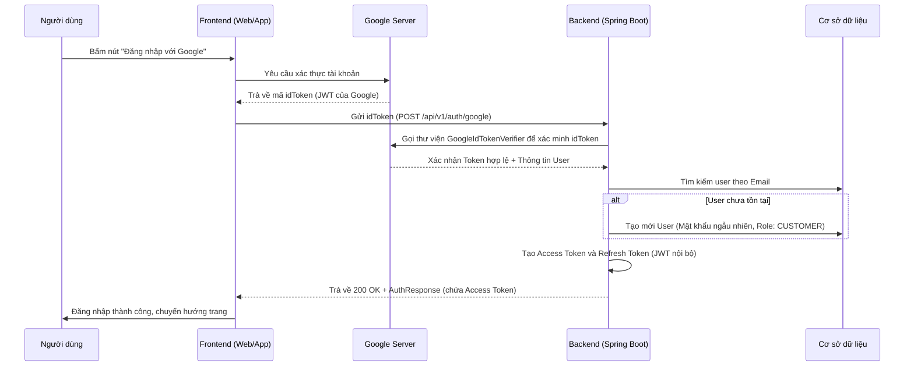

# Nghiệp vụ Đăng nhập Google (Google Login) - Kiến trúc REST API & JWT

Hệ thống **Holiday** sử dụng phương pháp xác thực tách rời hoàn toàn (Decoupled Architecture) giữa Frontend và Backend. Thay vì sử dụng Session/Cookie truyền thống, hệ thống sử dụng **JWT (JSON Web Token)** để đảm bảo tính Stateless và khả năng mở rộng (Scalability).

Dưới đây là chi tiết luồng nghiệp vụ xử lý khi một người dùng đăng nhập bằng tài khoản Google:

## 1. Sơ đồ luồng hoạt động (Workflow)

## 2. Các bước xử lý chi tiết tại Backend

Khi Frontend gửi yêu cầu `POST /api/v1/auth/google` kèm theo mã `idToken`, Backend (tại file `AuthServiceImpl.java`) sẽ thực hiện các bước nghiệp vụ sau:

### Bước 1: Kiểm định tính hợp lệ của Token (Token Verification)
- Khởi tạo `GoogleIdTokenVerifier` với `GOOGLE_CLIENT_ID` của hệ thống.
- Yêu cầu thư viện của Google giải mã và kiểm tra chữ ký của `idToken`.
- **Nghiệp vụ**: Ngăn chặn tuyệt đối hành vi giả mạo Token. Nếu Token hết hạn hoặc sai chữ ký, hệ thống lập tức ném lỗi `UnauthorizedException("Invalid ID Token")` và trả về mã lỗi 401.

### Bước 2: Trích xuất thông tin người dùng
- Nếu Token hợp lệ, hệ thống trích xuất gói dữ liệu Payload từ Google.
- Lấy ra các thông tin thiết yếu: `email` và `name` (Tên hiển thị).

### Bước 3: Tìm kiếm hoặc Đăng ký tự động (Upsert Logic)
- Truy vấn Database (`userRepository.findByEmailAndDeletedAtIsNull`) để xem địa chỉ Email này đã đăng ký tài khoản trong hệ thống Holiday chưa.
- **Trường hợp 1 (Email đã tồn tại)**: Đây là người dùng cũ. Hệ thống bỏ qua bước tạo mới và lấy luôn bản ghi User hiện tại.
- **Trường hợp 2 (Email chưa tồn tại)**: Đây là người dùng mới tinh. Hệ thống sẽ **đăng ký ngầm** một tài khoản mới:
  - Sinh một mật khẩu giả lập ngẫu nhiên (bằng `UUID`) rồi mã hóa bằng `BCryptPasswordEncoder` để đảm bảo bảo mật và người dùng không thể đăng nhập bằng mật khẩu này qua form thường.
  - Gắn trạng thái `status="active"` và `isEnabled=true`.
  - Cấp quyền mặc định là `ROLE_CUSTOMER`.
  - Lưu bản ghi mới vào Database.

### Bước 4: Cấp phát phiên làm việc (Issue JWT)
- Sau khi xác định được bản ghi User, hệ thống đưa User này vào hàm `buildAuthResponse`.
- Tại đây, Backend tự sinh ra bộ đôi quyền lực:
  - **Access Token**: Cấp quyền truy cập hệ thống (Thời hạn ngắn).
  - **Refresh Token**: Dùng để xin cấp lại Access Token mới (Thời hạn dài).
- Đóng gói toàn bộ vào đối tượng `AuthResponse` và trả về `200 OK` cho Frontend.

## 3. Ưu điểm của mô hình này
1. **Bảo mật cao**: Không lưu Session, chống lại được các tấn công giả mạo phiên (CSRF).
2. **Khả năng tái sử dụng**: API `/api/v1/auth/google` này có thể dùng chung cho cả Website (React/Vue) và Mobile App (iOS/Android) mà không cần viết lại dòng code nào.
3. **Mượt mà**: Người dùng mới không cần phải điền form đăng ký, chỉ cần 1 click là có ngay tài khoản.
