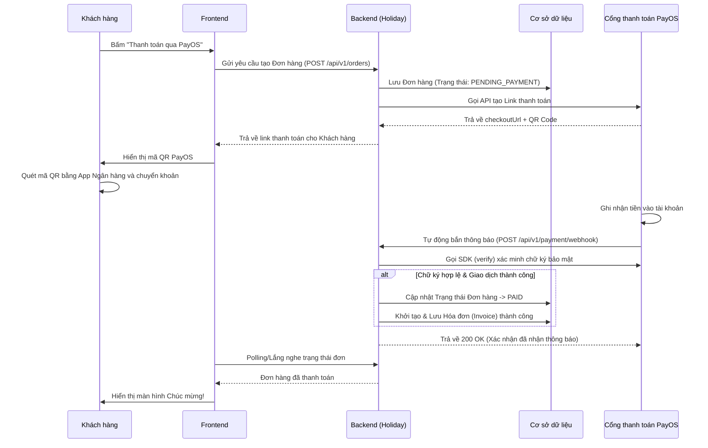

# Nghiệp vụ Thanh toán Trực tuyến (PayOS) - Xác nhận tự động qua Webhook

Hệ thống **Holiday** tích hợp cổng thanh toán **PayOS** để xử lý giao dịch nạp tiền/thanh toán hóa đơn. Hệ thống áp dụng cơ chế xác nhận thanh toán tự động hoàn toàn (Asynchronous Webhook) thay vì phải đợi nhân viên kiểm tra giao dịch thủ công.

Dưới đây là mô tả chi tiết quy trình thanh toán và tự động gạch nợ:

## 1. Sơ đồ luồng hoạt động (Workflow)

## 2. Các bước xử lý chi tiết tại Backend

Quá trình này được chia làm hai giai đoạn độc lập: Giai đoạn tạo đơn (Đồng bộ) và Giai đoạn xác nhận (Bất đồng bộ).

### Giai đoạn 1: Khởi tạo Giao dịch (Tạo mã QR)

Khi Frontend gửi yêu cầu đặt hàng tới Backend:

1. Backend khởi tạo một bản ghi `Order` với trạng thái `PENDING_PAYMENT` (Chờ thanh toán).
2. Backend gom các thông tin đơn hàng (Tổng tiền, Mã đơn, Tên sản phẩm) và gửi yêu cầu sang server PayOS thông qua thư viện `payos-java` SDK.
3. PayOS ghi nhận và trả về một đường link thanh toán (chứa mã QR chuyển khoản).
4. Backend gửi đường link này cho Frontend hiển thị. Người dùng dùng App Ngân hàng bất kỳ quét mã QR để chuyển khoản trực tiếp vào tài khoản ngân hàng của chủ shop.

### Giai đoạn 2: Xử lý Webhook & Gạch nợ tự động

Sau khi khách hàng chuyển khoản thành công, hệ thống ngân hàng báo "Ting ting" cho PayOS. PayOS lập tức gửi một luồng dữ liệu (Webhook Payload) đâm ngược lại vào API `/api/v1/payment/webhook` của hệ thống Holiday.

Tại đây, file `PaymentServiceImpl.java` sẽ thực hiện:

1. **Bảo mật và Xác minh (Verify Signature):**
   - Đọc dữ liệu JSON nhận được từ PayOS.
   - Sử dụng `PAYOS_CHECKSUM_KEY` và hàm `verify()` của SDK để tính toán lại chữ ký.
   - **Nghiệp vụ quan trọng:** Bước này giúp hệ thống Holiday miễn nhiễm hoàn toàn với các cuộc tấn công gửi Webhook giả mạo nhằm mục đích hack trạng thái đơn hàng. Nếu chữ ký không khớp, hệ thống bỏ qua và không xử lý tiếp.
2. **Kiểm tra mã trạng thái giao dịch:**
   - Đảm bảo mã trả về là `"00"` (Giao dịch thành công).
3. **Cập nhật dữ liệu & Gạch nợ:**
   - Trích xuất `orderCode` từ Webhook.
   - Truy vấn DB tìm đúng bản ghi `Order`. Nếu trạng thái đang là `PENDING_PAYMENT`, hệ thống lập tức đổi thành `PAID` (Đã thanh toán).
   - Tự động phát sinh một bản ghi `Invoice` (Hóa đơn) lưu vào DB làm bằng chứng giao dịch (chứa mã tham chiếu giao dịch của ngân hàng).
4. **Phản hồi lại PayOS:**
   - Trả về mã HTTP `200 OK` để PayOS biết hệ thống Holiday đã nhận thông báo thành công và không cần gửi lại thông báo nữa.

## 3. Lợi ích của Kiến trúc Webhook

- **Real-time (Thời gian thực):** Khách hàng vừa chuyển khoản xong là hệ thống lập tức ghi nhận, không có độ trễ.
- **Tự động hóa 100%:** Giúp chủ shop tiết kiệm hoàn toàn nhân lực ngồi dò sao kê ngân hàng thủ công.
- **Không sợ rớt mạng:** Nếu ngay lúc khách chuyển tiền mà điện thoại khách bị mất mạng hoặc tắt trình duyệt, đơn hàng vẫn được gạch nợ thành công vì máy chủ PayOS và Backend của chúng ta nói chuyện trực tiếp với nhau dưới nền.
