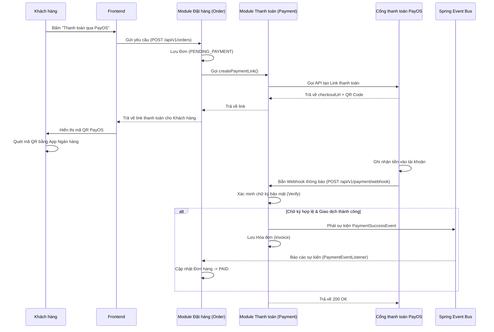

# Nghiệp vụ Thanh toán Trực tuyến (PayOS) - Xác nhận tự động qua Webhook & Hướng sự kiện (Event-Driven)

Hệ thống **Holiday** tích hợp cổng thanh toán **PayOS** để xử lý giao dịch nạp tiền/thanh toán hóa đơn. Hệ thống áp dụng cơ chế xác nhận thanh toán tự động hoàn toàn (Asynchronous Webhook) và được thiết kế chuẩn theo kiến trúc **Hướng sự kiện (Event-Driven)** giúp các phân hệ (modules) hoạt động hoàn toàn độc lập (Decoupled).

Dưới đây là mô tả chi tiết quy trình thanh toán và tự động gạch nợ:

## 1. Sơ đồ luồng hoạt động (Workflow)

## 2. Các bước xử lý chi tiết tại Backend

Quá trình này được chia làm hai giai đoạn độc lập: Giai đoạn tạo đơn (Đồng bộ) và Giai đoạn xác nhận (Bất đồng bộ).

### Giai đoạn 1: Khởi tạo Giao dịch (Tạo mã QR)

1. Backend khởi tạo một bản ghi `Order` với trạng thái `PENDING_PAYMENT` (Chờ thanh toán).
2. Module Order gọi hàm của Module Payment để lấy đường link thanh toán dựa trên mã đơn hàng (OrderCode) và tổng tiền.
3. Module Payment sử dụng thư viện `payos-java` SDK để giao tiếp với PayOS và lấy về link chứa mã QR.
4. Trả đường link về Frontend để hiển thị cho Khách hàng quét.

### Giai đoạn 2: Xử lý Webhook & Gạch nợ tự động (Event-Driven)

Sau khi khách hàng chuyển khoản, hệ thống ngân hàng báo "Ting ting" cho PayOS. PayOS lập tức gửi luồng dữ liệu Webhook đâm ngược vào `/api/v1/payment/webhook`.

Tại đây, `PaymentServiceImpl.java` thực hiện:

1. **Xác minh (Verify Signature):** Sử dụng `PAYOS_CHECKSUM_KEY` và hàm `verify()` để tính toán lại chữ ký. Nếu chữ ký không hợp lệ, hệ thống từ chối luồng xử lý để ngăn chặn hack đổi trạng thái đơn hàng.
2. **Kiểm tra và Lấy dữ liệu an toàn:**
   - Đảm bảo mã trả về là `"00"` (Giao dịch thành công).
   - Trích xuất `orderCode` từ Webhook.
   - Thay vì chọc thẳng vào Database của module Order, Module Payment gọi **`OrderInternalApi`** để lấy thông tin đơn hàng dưới dạng DTO. Tránh vi phạm quy tắc đóng gói.
3. **Phát sự kiện (Publish Event):**
   - Module Payment sử dụng `ApplicationEventPublisher` để phát ra một sự kiện `PaymentSuccessEvent` (chứa `orderCode` và mã tham chiếu giao dịch).
   - Sau đó, nó tự động lưu `Invoice` (Hóa đơn) của riêng nó.
4. **Lắng nghe sự kiện (Event Listener):**
   - Module Order có một anh lính gác (Event Listener là `PaymentEventListener.java`) luôn túc trực. 
   - Ngay khi nhận được `PaymentSuccessEvent`, module Order tự truy xuất Database của nó và chuyển trạng thái đơn hàng thành `PAID` (Đã thanh toán).

## 3. Lợi ích của Kiến trúc mới (Event-Driven & API Contract)

- **Ngăn chặn Tight Coupling:** Module Payment hoàn toàn "mù" về cách hoạt động của module Order. Nó không cần import bất kỳ `Repository` hay `Entity` nào của module Order. Nó chỉ cần phát loa thông báo (phát Event) rồi đi ngủ.
- **Khả năng mở rộng (Scalability):** Nếu sau này sếp yêu cầu "Cộng điểm thưởng cho user khi thanh toán" hoặc "Bắn thông báo SMS", chúng ta chỉ cần viết thêm các Listener mới (như `RewardEventListener`) để lắng nghe `PaymentSuccessEvent` mà không phải sửa dù chỉ một dòng code ở Module Payment.
- **Tự động hóa & Real-time:** Webhook hoạt động tức thời dưới nền, loại bỏ 100% sức người rà soát sao kê và không phụ thuộc vào tình trạng mạng (hay việc tắt màn hình web) của khách hàng.
