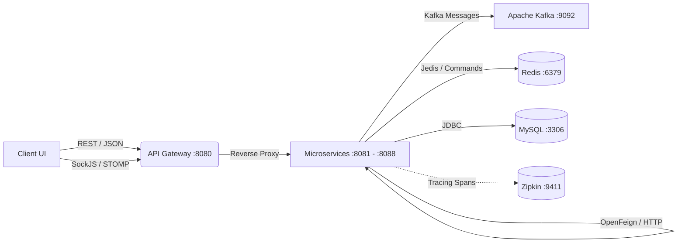

# 🏛️ TÀI LIỆU CẤU TRÚC DỰ ÁN TOÀN DIỆN - HOLIDAY SYSTEM
> **Phiên bản kiến trúc**: Microservices Phân tán & Feature-Sliced Frontend  
> **Ngày cập nhật**: 30/09/2026  
> **Tác giả / Duy trì**: Atmin  
> **Trạng thái**: Đã nghiệm thu & Hoạt động 100%

---

## 📑 MỤC LỤC
1. [Tổng quan Kiến trúc Hệ thống](#1-tổng-quan-kiến-trúc-hệ-thống)
2. [Sơ đồ Cấu trúc Cây Thư Mục (Directory Tree)](#2-sơ-đồ-cấu-trúc-cây-thư-mục-directory-tree)
3. [Chi tiết Các Phân hệ Microservices (12 Modules)](#3-chi-tiết-các-phân-hệ-microservices-12-modules)
4. [Hạ tầng Phân tán & Giao tiếp (Distributed Infrastructure)](#4-hạ-tầng-phân-tán--giao-tiếp-distributed-infrastructure)
5. [Cấu trúc Frontend Client (Feature-Sliced Architecture)](#5-cấu-trúc-frontend-client-feature-sliced-architecture)
6. [Dữ liệu Khởi tạo Ban Đầu & Tài khoản Hệ thống (Seed Data)](#6-dữ-liệu-khởi-tạo-ban-đầu--tài-khoản-hệ-thống-seed-data)
7. [Hướng dẫn Vận hành & Khởi chạy (Runbook & Deployment)](#7-hướng-dẫn-vận-hành--khởi-chạy-runbook--deployment)
8. [Các Nguyên tắc Thiết kế & Quy chuẩn Kỹ thuật (Principles & Rules)](#8-các-nguyên-tắc-thiết-kế--quy-chuẩn-kỹ-thuật-principles--rules)

---

## 1. 🌐 Tổng quan Kiến trúc Hệ thống

Dự án **Holiday** là nền tảng thương mại điện tử và quản lý phân phối đa kênh (B2C & B2B/Đại lý), được chuyển đổi từ mô hình Monolith sang **Kiến trúc Microservices phân tán (Event-Driven & Domain-Driven Design)**.

### Các Trụ Cột Công Nghệ:
- **Core Platform**: Java 21 LTS, Spring Boot 3.4.0, Spring Cloud 2024.0.0.
- **Thư viện tối ưu phản ứng**: `io.github.duongtran1702:atmin-library:2.1.0` (Reactive Exception Handler & Logging).
- **Service Discovery & Registry**: Spring Cloud Netflix Eureka Server (Port `8761`).
- **Quản lý cấu hình tập trung**: Spring Cloud Config Server (Port `8888`, Native profile).
- **Cổng kết nối duy nhất (API Gateway)**: Spring Cloud Gateway WebFlux (Port `8080`), định tuyến tĩnh (`lb://`), bảo mật CORS và chuyển tiếp WebSocket.
- **Giao tiếp đồng bộ liên service**: Spring Cloud OpenFeign (`@FeignClient`) tự động cân bằng tải.
- **Giao tiếp sự kiện bất đồng bộ**: Apache Kafka 7.5 (KRaft Mode - loại bỏ Zookeeper).
- **Giao dịch phân tán**: Saga Pattern Orchestration cho Checkout đơn hàng kèm cơ chế giao dịch bù trừ (Compensating Transactions) khi có lỗi tồn kho hoặc voucher.
- **Bộ nhớ đệm & Phân tán**: Redis 7-alpine (Distributed Lock, Blacklist token, OTP 2FA).
- **Cơ sở dữ liệu**: MySQL 8.0 theo mô hình **Database-per-Service** (7 databases độc lập).
- **Frontend**: React 18, TypeScript, Vite, TailwindCSS, WebSocket STOMP Client.

---

## 2. 📁 Sơ đồ Cấu trúc Cây Thư Mục (Directory Tree)

```text
.
├── client/                                 # Ứng dụng Frontend (React + Vite + TypeScript)
│   ├── src/
│   │   ├── core/                           # Thành phần lõi (Auth, API client, Layout, Router)
│   │   ├── features/                       # Phân chia theo từng Feature độc lập
│   │   │   ├── auth/                       # Đăng nhập, đăng ký, OTP, 2FA
│   │   │   ├── products/                   # Danh mục, chi tiết sản phẩm, lọc
│   │   │   ├── orders/                     # Giỏ hàng, checkout, lịch sử đơn
│   │   │   ├── payment/                    # Thanh toán PayOS, kết quả thanh toán
│   │   │   ├── promotions/                 # Ví voucher, kiểm tra mã giảm giá
│   │   │   ├── inbox/                      # Chat thời gian thực WebSocket STOMP
│   │   │   ├── dashboard/                  # Thống kê doanh thu, biểu đồ cho Admin
│   │   │   ├── users/                      # Quản trị nhân viên, đại lý, khách hàng
│   │   │   └── profile/                    # Hồ sơ người dùng cá nhân
│   │   ├── pages/                          # Các trang hiển thị chính (Admin / Customer)
│   │   ├── App.tsx
│   │   └── main.tsx
│   ├── package.json
│   └── vite.config.ts
│
├── docs/                                   # Tài liệu dự án
│   ├── 1_nghiep_vu_google_login.md         # Nghiệp vụ đăng nhập Google OAuth2
│   ├── 2_nghiep_vu_thanh_toan_payos.md     # Nghiệp vụ thanh toán trực tuyến PayOS
│   ├── 3_nghiệp_vụ_chat_realtime.md        # Nghiệp vụ chat WebSocket STOMP
│   ├── PROJECT_STRUCTURE.md                # Tài liệu Cấu trúc Dự án Hiện Tại (File này)
│   └── report-assets/                      # Hình vẽ kiến trúc & sơ đồ UML
│
├── microservices/                          # KHÔNG GIAN MICROSERVICES CHÍNH (Gradle Multi-module)
│   ├── settings.gradle                     # Quản lý 12 subprojects
│   ├── build.gradle                        # Cấu hình dependency chung toàn hệ thống
│   ├── gradlew.bat / gradlew               # Gradle Wrapper Java 21
│   │
│   ├── common-library/                     # [Module 1] Thư viện nền tảng, DTO, Event, Interface
│   │   └── src/main/java/atmin/
│   │       ├── common/                     # BaseEntity, AuditableEntity
│   │       ├── common/event/               # Kafka Events (Order, Payment, Saga Commands)
│   │       └── modules/*/api/              # Các DTO & Interface Internal APIs
│   │
│   ├── eureka-server/                      # [Module 2] Service Registry (Port 8761)
│   ├── config-server/                      # [Module 3] Config Server tập trung (Port 8888)
│   │   └── src/main/resources/configurations/  # Thư mục lưu shared configs
│   ├── api-gateway/                        # [Module 4] Spring Cloud Gateway (Port 8080)
│   ├── identity-service/                   # [Module 5] Auth, User, JWT, Role, Permission (Port 8081)
│   ├── product-service/                    # [Module 6] Sản phẩm, Biến thể, Tồn kho (Port 8082)
│   ├── order-service/                      # [Module 7] Đơn hàng, Dashboard, Saga Orchestrator (Port 8083)
│   ├── payment-service/                    # [Module 8] PayOS, Hóa đơn, Webhook (Port 8084)
│   ├── promotion-service/                  # [Module 9] Khuyến mãi, Ví voucher (Port 8085)
│   ├── notification-service/               # [Module 10] Thông báo in-app Admin & User (Port 8086)
│   ├── chat-service/                       # [Module 11] WebSocket STOMP Chat, Presence (Port 8087)
│   ├── media-service/                      # [Module 12] Upload Cloudinary (Port 8088)
│   │
│   ├── docker/
│   │   └── mysql/
│   │       └── init.sql                    # Script tạo tự động 7 database riêng biệt
│   └── docker-compose.yml                  # Cấu hình Docker Compose cho toàn bộ microservices
├── .env.example                            # File mẫu biến môi trường toàn dự án
├── .gitignore                              # Bộ quy tắc chặn secrets và build artifacts
└── README.md                               # Tài liệu tổng quan dự án
```

---

## 3. 🔍 Chi tiết Các Phân hệ Microservices (12 Modules)

### 3.1. `common-library`
- **Loại**: Shared Java Library (Không chạy độc lập).
- **Trách nhiệm**:
  - Cung cấp các thực thể nền tảng: `BaseEntity`, `AuditableEntity`.
  - Cung cấp các Contract DTO truyền nhận dữ liệu: `UserDto`, `ProductDto`, `OrderDto`, `PromotionDTO`, `InvoiceDto`, `StockUpdateDto`.
  - Cung cấp bản ghi sự kiện Kafka: `OrderCreatedEvent`, `PaymentSuccessEvent`, `SagaCommands` (`StockReserveCommand`, `StockReservedEvent`, `StockReservationFailedEvent`, `StockRollbackCommand`, `VoucherApplyCommand`, `VoucherAppliedEvent`, `VoucherRollbackCommand`).
  - Định nghĩa interface giao tiếp liên service: `UserInternalApi`, `ProductInternalApi`, `OrderInternalApi`, `PaymentService`, `PaymentInternalApi`, `PromotionService`, `NotificationInternalApi`.
  - Tích hợp sẵn `atmin-library:2.1.0` và Jackson 3.

---

### 3.2. `eureka-server` (Port `8761`)
- **Main Class**: `EurekaServerApplication.java`
- **Công nghệ**: `spring-cloud-starter-netflix-eureka-server`.
- **Trách nhiệm**: Đăng ký và phát hiện dịch vụ (Service Discovery). Giúp các service gọi lẫn nhau qua tên định danh (`identity-service`, `product-service`, ...) mà không cần fix cứng địa chỉ IP/Port.

---

### 3.3. `config-server` (Port `8888`)
- **Main Class**: `ConfigServerApplication.java`
- **Công nghệ**: `spring-cloud-config-server` (Native Profile).
- **Trách nhiệm**: Quản lý cấu hình tập trung. Đọc các cấu hình chung (Kafka servers, Redis host, Eureka client, Logging) từ thư mục `configurations/application.yml` và phân phối đến các microservices khi chúng khởi động.

---

### 3.4. `api-gateway` (Port `8080`)
- **Main Class**: `ApiGatewayApplication.java`
- **Công nghệ**: `spring-cloud-starter-gateway` (Spring WebFlux), `atmin-library:2.1.0`.
- **Định tuyến tĩnh (Static Routes)**:
  - `/api/v1/auth/**`, `/api/v1/users/**`, `/api/v1/staff/**` ➔ `lb://identity-service`
  - `/api/v1/products/**`, `/api/v1/categories/**`, `/api/v1/brands/**` ➔ `lb://product-service`
  - `/api/v1/orders/**`, `/api/v1/dashboard/**` ➔ `lb://order-service`
  - `/api/v1/payment/**`, `/api/v1/invoices/**` ➔ `lb://payment-service`
  - `/api/v1/promotions/**` ➔ `lb://promotion-service`
  - `/api/v1/notifications/**` ➔ `lb://notification-service`
  - `/api/v1/chat/**` & `/ws-chat/**` ➔ `lb://chat-service`
  - `/api/v1/media/**` ➔ `lb://media-service`
- **Bảo mật & Ngoại lệ**: Cấu hình CORS tĩnh cho `http://localhost:5173`, tích hợp `AtminGatewayErrorWebExceptionHandler` (order -2) trả lỗi JSON đồng bộ chuẩn REST.

---

### 3.5. `identity-service` (Port `8081`)
- **Database**: `holiday_identity`
- **Bộ nhớ đệm**: Redis 7 (lưu OTP 2FA, blacklist token, refresh token).
- **Nghiệp vụ**:
  - Đăng ký, đăng nhập Local (BCrypt) và Google OAuth2.
  - Cấp phát Access Token (JWT) và Refresh Token.
  - Xác thực 2 bước (2FA OTP) qua email.
  - Quản lý người dùng, phân quyền chi tiết (RBAC) theo Permissions và Roles (`ADMIN`, `STAFF`, `CUSTOMER`, `AGENT`).
- **Internal API**: Cung cấp `InternalUserController` (`/api/v1/internal/users/**`) cho các service khác truy vấn thông tin User/Email/Roles.
- **OpenFeign**: Dùng `OrderClient` và `MediaClient`.
- **Data Seeder**: [IdentityDataSeeder.java](file:///d:/Holiday/microservices/identity-service/src/main/java/atmin/core/config/IdentityDataSeeder.java) tự động tạo đầy đủ danh sách Permissions, Roles và khởi tạo tài khoản Admin ban đầu theo biến môi trường.

---

### 3.6. `product-service` (Port `8082`)
- **Database**: `holiday_product`
- **Nghiệp vụ**: Quản lý danh mục sản phẩm thời trang, thông tin chi tiết, biến thể (size, color), giá bán và số lượng tồn kho.
- **Internal API**: Expose `InternalProductController` (`/api/v1/internal/products/**`) cho `order-service` kiểm tra giá và tồn kho.
- **Kafka Saga Consumer**: Lắng nghe `stock-reserve-topic` để trừ kho hàng khi checkout. Lắng nghe `stock-rollback-topic` để hoàn trả tồn kho nếu đơn hàng thất bại ở bước sau.
- **Data Seeder**: [ProductDataSeeder.java](file:///d:/Holiday/microservices/product-service/src/main/java/atmin/product/config/ProductDataSeeder.java) tự động tạo 10 sản phẩm mẫu thời trang cao cấp kèm ảnh Unsplash sắc nét và tồn kho đa dạng.

---

### 3.7. `order-service` (Port `8083`)
- **Database**: `holiday_order`
- **Nghiệp vụ**:
  - Quản lý giỏ hàng, đặt hàng (Checkout), hủy đơn, cập nhật trạng thái đơn hàng (`PENDING`, `PENDING_PAYMENT`, `PROCESSING`, `SHIPPED`, `DELIVERED`, `CANCELLED`).
  - Thống kê doanh thu, biểu đồ phân tích Dashboard B2C/B2B cho quản trị viên.
- **Saga Orchestrator**: [OrderSagaOrchestrator.java](file:///d:/Holiday/microservices/order-service/src/main/java/atmin/order/saga/OrderSagaOrchestrator.java) điều phối giao dịch phân tán:
  1. Gửi lệnh trừ kho (`StockReserveCommand` qua Kafka).
  2. Áp dụng voucher (`VoucherApplyCommand` qua Kafka).
  3. Kích hoạt đơn hàng.
  4. Nếu có lỗi ở bất kỳ bước nào, tự động kích hoạt Compensating Transaction để hoàn kho và khôi phục voucher.
- **Transactional Outbox Pattern**:
  - Bảng [outbox_events](file:///d:/Holiday/microservices/order-service/src/main/java/atmin/modules/order/entity/OutboxEvent.java) lưu trữ sự kiện nghiệp vụ (`ORDER_CREATED`, `ORDER_CANCELLED`, `ORDER_STATUS_CHANGED`) trong cùng 1 Local Database Transaction với Order Entity.
  - [OutboxEventPublisher.java](file:///d:/Holiday/microservices/order-service/src/main/java/atmin/modules/order/outbox/OutboxEventPublisher.java) định kỳ quét các event tồn đọng và phát hành lên Kafka, giải quyết triệt để vấn đề Dual-Write và đảm bảo Guaranteed At-Least-Once Delivery.
- **Kafka Listener**: Lắng nghe sự kiện `PaymentSuccessEvent` từ topic `payment-success-topic` để tự động xác nhận thanh toán đơn hàng.
- **OpenFeign Clients & Circuit Breaker**: Gọi `ProductClient`, `UserClient`, `PaymentClient`, `PromotionClient`, `NotificationClient` được bảo vệ 100% bằng **Resilience4j Circuit Breaker**, TimeLimiter và Fallback Handlers chống sập dây chuyền (Cascading Failure).

---

### 3.8. `payment-service` (Port `8084`)
- **Database**: `holiday_payment`
- **Nghiệp vụ**:
  - Tích hợp cổng thanh toán trực tuyến PayOS (tạo liên kết thanh toán, QR Code chuyển khoản ngân hàng).
  - Quản lý hóa đơn điện tử (Invoices).
  - Tiếp nhận và xác minh chữ ký Webhook từ PayOS khi khách hàng thanh toán thành công.
- **Giao tiếp**:
  - Gửi Feign request tới `order-service` để cập nhật trạng thái thanh toán.
  - Phát sự kiện `PaymentSuccessEvent` lên Kafka topic `payment-success-topic` để thông báo cho toàn hệ thống.

---

### 3.9. `promotion-service` (Port `8085`)
- **Database**: `holiday_promotion`
- **Nghiệp vụ**:
  - Tạo và quản lý các chiến dịch khuyến mãi, mã giảm giá (theo số tiền cố định hoặc phần trăm).
  - Quản lý ví voucher của người dùng (`UserVoucherWallet`).
- **Internal API**: Expose `InternalPromotionController` (`/api/v1/internal/promotions/validate`, `/use`, `/rollback`).
- **Kafka Saga Consumer**: Lắng nghe `voucher-apply-topic` và `voucher-rollback-topic`.
- **OpenFeign Clients**: Gọi `UserClient` và `NotificationClient` để tự động tặng voucher cho nhóm khách hàng mục tiêu và gửi thông báo vào tài khoản.
- **Data Seeder**: [PromotionDataSeeder.java](file:///d:/Holiday/microservices/promotion-service/src/main/java/atmin/promotion/config/PromotionDataSeeder.java) tạo 4 mã voucher thông dụng (`CHAOBANMOI`, `HOLIDAY50`, `SALE10`, `VIP20`) và nạp sẵn vào ví khách hàng.

---

### 3.10. `notification-service` (Port `8086`)
- **Database**: `holiday_notification`
- **Nghiệp vụ**: Quản lý thông báo in-app (chuông thông báo) cho cả Quản trị viên (đơn hàng mới, thanh toán, sự cố tồn kho) và Khách hàng (voucher mới, trạng thái đơn hàng).
- **Server-Sent Events (SSE) Real-time Stream**:
  - Cung cấp luồng stream [NotificationSseController.java](file:///d:/Holiday/microservices/notification-service/src/main/java/atmin/modules/notification/controller/NotificationSseController.java) (`GET /api/v1/notifications/stream`) với cơ chế [SseNotificationService.java](file:///d:/Holiday/microservices/notification-service/src/main/java/atmin/modules/notification/service/SseNotificationService.java).
  - Tự động đẩy thông báo tức thì xuống Client/Admin khi có sự kiện thanh toán hoặc đơn hàng mới mà không cần Client phải Polling liên tục.
- **Kafka Consumer**: [NotificationKafkaConsumer.java](file:///d:/Holiday/microservices/notification-service/src/main/java/atmin/modules/notification/kafka/NotificationKafkaConsumer.java) tự động nhận `PaymentSuccessEvent` để tạo thông báo cho Admin.
- **OpenFeign**: Dùng `UserClient` để phân giải thông tin người dùng nhận thông báo.
- **Data Seeder**: Tạo thông báo chào mừng ban đầu cho Admin.

---

### 3.11. `chat-service` (Port `8087`)
- **Database**: `holiday_chat`
- **Nghiệp vụ**:
  - Hỗ trợ khách hàng thời gian thực qua giao thức **WebSocket STOMP** (endpoint `/ws-chat`).
  - Quản lý cuộc hội thoại, lưu trữ lịch sử tin nhắn, phản hồi tự động của Bot.
  - Phân quyền kênh chat bảo mật: Khách hàng chỉ xem được cuộc trò chuyện của mình; Nhân viên/Admin có quyền truy cập kênh hỗ trợ khách hàng.
- **Redis Pub/Sub Clustered Message Broker**:
  - Tích hợp [RedisChatPublisher.java](file:///d:/Holiday/microservices/chat-service/src/main/java/atmin/chat/redis/RedisChatPublisher.java) và [RedisChatSubscriber.java](file:///d:/Holiday/microservices/chat-service/src/main/java/atmin/chat/redis/RedisChatSubscriber.java) truyền tải tin nhắn chat xuyên suốt cụm server (Horizontal Pod Autoscaling - HPA).
  - Quản lý trạng thái hiện diện trực tuyến tập trung trên Redis Set (`holiday:presence:online_users`), loại bỏ hoàn toàn hạn chế của bộ nhớ local node.
- **Xác thực**: Kiểm tra JWT Token trực tiếp lúc thiết lập kết nối WebSocket (Handshake interceptor).

---

### 3.12. `media-service` (Port `8088`)
- **Nghiệp vụ**: Tiếp nhận và tải hình ảnh lên Cloudinary. Kiểm tra định dạng an toàn (PNG, JPG, JPEG) và giới hạn kích thước tối đa 5MB/file. Trả về URL bảo mật (`https`) phục vụ lưu trữ avatar, ảnh sản phẩm, ảnh đính kèm trong chat.

---

## 4. ⚙️ Hạ tầng Phân tán & Giao tiếp (Distributed Infrastructure)

### 4.1. Ma trận Cơ sở Dữ liệu (Database-per-Service)
Tất cả 7 cơ sở dữ liệu được khởi tạo tự động qua script [init.sql](file:///d:/Holiday/microservices/docker/mysql/init.sql):

| Tên Database | Microservice Sở hữu | Nội dung Lưu trữ |
| :--- | :--- | :--- |
| `holiday_identity` | `identity-service` | `users`, `roles`, `permissions`, `user_role`, `role_permissions` |
| `holiday_product` | `product-service` | `products`, `product_colors`, `product_sizes`, `product_stocks` |
| `holiday_order` | `order-service` | `orders`, `order_items`, `saga_transactions`, `outbox_events` |
| `holiday_payment` | `payment-service` | `invoices`, `payment_transactions` |
| `holiday_promotion` | `promotion-service` | `promotions`, `user_voucher_wallets` |
| `holiday_notification`| `notification-service` | `notifications` |
| `holiday_chat` | `chat-service` | `conversations`, `chat_messages` |

---

### 4.2. Danh sách Kafka Topics (Event-Driven & Saga Pattern)

| Tên Topic | Producer | Consumer | Ý nghĩa & Dữ liệu |
| :--- | :--- | :--- | :--- |
| `stock-reserve-topic` | `order-service` | `product-service` | Lệnh đặt giữ tồn kho (`StockReserveCommand`) |
| `stock-reserved-topic` | `product-service` | `order-service` | Thông báo đã giữ kho thành công (`StockReservedEvent`) |
| `stock-reservation-failed-topic` | `product-service` | `order-service` | Báo lỗi hết hàng/thiếu tồn kho (`StockReservationFailedEvent`) |
| `stock-rollback-topic` | `order-service` | `product-service` | Lệnh hoàn trả tồn kho (Compensating Transaction) |
| `voucher-apply-topic` | `order-service` | `promotion-service` | Lệnh áp dụng voucher cho đơn hàng |
| `voucher-applied-topic` | `promotion-service` | `order-service` | Báo áp dụng voucher thành công |
| `voucher-failed-topic` | `promotion-service` | `order-service` | Báo lỗi áp dụng voucher thất bại |
| `voucher-rollback-topic` | `order-service` | `promotion-service` | Lệnh hoàn lại voucher vào ví người dùng |
| `payment-success-topic` | `payment-service` | `order-service`, `notification-service` | Báo thanh toán PayOS thành công (`PaymentSuccessEvent`) |

---

### 4.3. Mô hình Giao thức Giao tiếp (Communication Protocols)



---

### 4.4. Giám sát Phân tán & Khả năng Chịu lỗi (Distributed Tracing & Resilience)

1. **Distributed Tracing (Micrometer Tracing & Zipkin UI)**:
   - Toàn bộ các request đi qua API Gateway, OpenFeign, Kafka Producer/Consumer đều được gắn `traceId` và `spanId` duy nhất xuyên suốt hệ thống.
   - Hạ tầng Tracing: **OpenZipkin** hoạt động tại cổng `9411` (`http://localhost:9411/zipkin/`), cung cấp bảng điều khiển trực quan giúp lập trình viên và DevOps truy vết độ trễ và phát hiện sự cố liên service trong vài giây.
2. **Resilience4j Circuit Breaker & Tự phục hồi (Self-Healing)**:
   - Bảo vệ toàn bộ các Feign Client giao tiếp đồng bộ. Khi service đích bị sự cố hoặc phản hồi chậm quá giới hạn thời gian (TimeLimiter), Circuit Breaker sẽ ngắt mạch (OPEN) để giải phóng tài nguyên.
   - Cơ chế Fallback giúp xử lý ngoại lệ duyên dáng (Graceful Degradation), giữ cho hệ thống luôn hoạt động ổn định ở chế độ chịu lỗi.

---

## 5. 💻 Cấu trúc Frontend Client (Feature-Sliced Architecture)

Thư mục `client/` được thiết kế theo cấu trúc Feature-Sliced chuẩn hóa, tách biệt hoàn toàn giữa giao diện, logic và API:

```text
client/src/
├── core/
│   ├── api/                # Cấu hình Axios instance gọi Gateway (http://localhost:8080)
│   ├── auth/               # Context lưu Token, User profile, trạng thái đăng nhập
│   ├── layout/             # Layout Admin Dashboard, Header/Footer Khách hàng
│   ├── utils/              # Phân quyền router (permissions.ts), format tiền tệ
│   └── websocket/          # STOMP Client kết nối /ws-chat
│
├── features/               # Các lát cắt nghiệp vụ (Feature Slices)
│   ├── auth/               # Components đăng nhập, đăng ký, modal OTP
│   ├── products/           # Danh sách sản phẩm, bộ lọc, thẻ sản phẩm, chi tiết
│   ├── orders/             # Giỏ hàng, trang checkout, xem tiến trình đơn
│   ├── payment/            # Cổng PayOS iframe, trang kết quả thanh toán
│   ├── promotions/         # Danh sách voucher, ô nhập mã giảm giá
│   ├── inbox/              # Cửa sổ chat tư vấn viên và bong bóng chat khách hàng
│   ├── dashboard/          # Biểu đồ doanh thu, thống kê B2C / B2B
│   └── users/              # Bảng quản lý nhân sự, tạo nhân viên mới, quản lý đại lý
│
└── pages/                  # Các trang hoàn chỉnh ghép từ các features
```

---

## 6. 👤 Cơ Chế Khởi Tạo Dữ Liệu Tự Động (Data Seeding)

Khi khởi động hệ thống lần đầu trong môi trường phát triển, các **Data Seeder** sẽ tự động nạp dữ liệu ban đầu:
- **Phân quyền & Vai trò**: Tự động cấu hình danh mục Permissions và Roles chuẩn (`ADMIN`, `STAFF`, `CUSTOMER`, `AGENT`).
- **Tài khoản Quản trị**: Khởi tạo người dùng quản trị ban đầu theo biến môi trường `APP_ADMIN_EMAIL` và `APP_ADMIN_PASSWORD`, đảm bảo an toàn tuyệt đối và không lưu cứng thông tin nhạy cảm trong mã nguồn.
- **Dữ liệu Nghiệp vụ Thử nghiệm**: Nạp sẵn danh mục sản phẩm thời trang mẫu kèm ảnh chất lượng cao, đa dạng biến thể (kích cỡ, màu sắc), tồn kho và các chính sách khuyến mãi mẫu phục vụ việc kiểm thử luồng nghiệp vụ end-to-end.

---

## 7. 🚀 Hướng dẫn Vận hành & Khởi chạy (Runbook & Deployment)

### Cách 1: Khởi chạy Trọn gói bằng Docker Desktop Local (Khuyến nghị cho kiểm thử tích hợp)
Chỉ với 1 câu lệnh duy nhất tại thư mục gốc `D:\Holiday`:
```powershell
docker compose up -d --build
```
> Hệ thống sẽ tự động khởi động MySQL, Redis, Kafka, Eureka, Config Server, Gateway và toàn bộ 8 Microservices.

#### Kiểm tra trạng thái:
- **Eureka Service Registry**: [http://localhost:8761](http://localhost:8761)
- **API Gateway (Cổng gọi API chính)**: [http://localhost:8080](http://localhost:8080)
- **Config Server**: [http://localhost:8888](http://localhost:8888)

---

### Cách 2: Khởi chạy Môi trường Phát triển Cục bộ (Local Dev - Tiết kiệm RAM)
Khi bạn cần viết code và debug trực tiếp trong IDE:

1. **Khởi động các dịch vụ hạ tầng nền qua Docker**:
   ```powershell
   docker compose up -d mysql redis kafka eureka-server config-server
   ```
2. **Khởi chạy microservice nghiệp vụ cần debug trong IDE hoặc lệnh Gradle**:
   ```powershell
   cd microservices
   .\gradlew.bat :identity-service:bootRun
   .\gradlew.bat :product-service:bootRun
   .\gradlew.bat :api-gateway:bootRun
   ```
3. **Khởi chạy Frontend Client**:
   ```powershell
   cd client
   npm install
   npm run dev
   ```
   Truy cập trình duyệt tại: [http://localhost:5173](http://localhost:5173)

---

## 8. 🛡️ Các Nguyên tắc Thiết kế & Quy chuẩn Kỹ thuật (Principles & Rules)

1. **SOLID & Clean Architecture**:
   - **SRP (Single Responsibility)**: Mỗi microservice chỉ chịu trách nhiệm duy nhất cho một Domain nghiệp vụ.
   - **OCP (Open/Closed)**: Mở rộng tính năng bằng Event/Listener và Filter/Plugin, không sửa đổi code lõi cũ.
   - **DIP (Dependency Inversion)**: Luôn phụ thuộc vào Interface (`common-library`), không phụ thuộc vào class thực thi.
2. **Zero Warning & Clean Imports Rule (OCD Level)**:
   - Tuyệt đối không để lại warning, import thừa, hoặc dead code.
   - **Cấm hoàn toàn việc dùng Fully Qualified Class Name (FQCN)** trong code body. Tất cả class bắt buộc phải được `import` ở đầu file.
3. **Database Isolation (Database-per-Service)**:
   - Tuyệt đối không cho phép Service này viết câu lệnh SQL truy vấn trực tiếp bảng của Service khác. Mọi trao đổi dữ liệu bắt buộc phải qua OpenFeign (`@FeignClient`) hoặc Kafka Event.
4. **Idempotency & Safe Retry**:
   - Mọi consumer Kafka (trừ kho, tiêu voucher) phải có tính idempotent để đảm bảo an toàn kể cả khi message bị gửi lặp lại do lỗi mạng.
5. **Changelog Tracking**:
   - Mọi thay đổi kiến trúc hoặc tính năng lớn bắt buộc phải được ghi chép tường minh bằng tiếng Việt trong file `update.md`.

---

<p align="center">
  <em>Được phát triển và hoàn thiện bởi Atmin</em>
</p>
