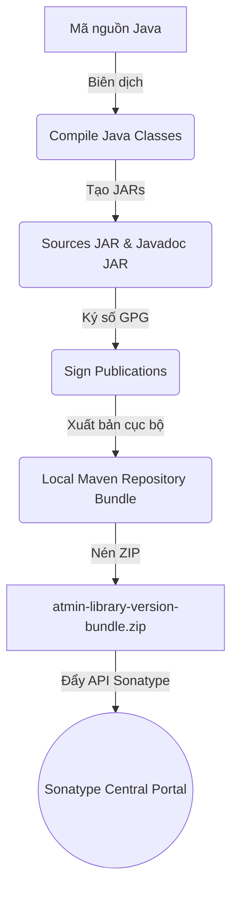

# 🛡️ atmin-library (Spring Boot Common Utility Library)

[](https://www.oracle.com/java/technologies/downloads/)
[](https://spring.io/projects/spring-boot)
[](http://www.apache.org/licenses/LICENSE-2.0.txt)
[]()

`atmin-library` là một thư viện dùng chung (Common Library) được phát triển dành riêng cho các dự án **Spring Boot 4.x** và **Java 21**. Thư viện này chuẩn hóa cấu trúc dữ liệu trả về (REST API Response Wrapper) và cung cấp cơ chế xử lý ngoại lệ tập trung (Global Exception Handling) tự động cho toàn bộ ứng dụng, giúp lập trình viên tiết kiệm thời gian phát triển và đồng bộ hóa định dạng giao tiếp giữa Backend với các Client (Frontend/Mobile/Microservices).

---

## 📖 Mục Lục

1. [Tính năng nổi bật](#-tính-năng-nổi-bật)
2. [Cài đặt và cấu hình](#-cài-đặt-và-cấu-hình)
3. [Chi tiết đầu vào &amp; đầu ra (Inputs &amp; Outputs)](#-chi-tiết-đầu-vào--đầu-ra-inputs--outputs)
   - [1. Phản hồi thành công (ApiResponse)](#1-phản-hồi-thành-công-apiresponse)
   - [2. Phân trang (PageInfo)](#2-phân-trang-pageinfo)
     - [2.1. Phân trang dạng Page (Page-based Pagination)](#21-phân-trang-dạng-page-page-based-pagination)
     - [2.2. Phân trang dạng Slice (Slice-based Pagination)](#22-phân-trang-dạng-slice-slice-based-pagination)
   - [3. Phản hồi lỗi (ApiErrorResponse)](#3-phản-hồi-lỗi-apierrorresponse)
     - [3.1. Truy vết lỗi (Trace ID / Correlation ID)](#31-truy-vết-lỗi-trace-id--correlation-id)
4. [Các lớp ngoại lệ tùy chỉnh (Custom Exceptions)](#-các-lớp-ngoại-lệ-tùy-chỉnh-custom-exceptions)
5. [Cơ chế xử lý ngoại lệ tự động (Exception Handlers)](#-cơ-chế-xử-lý-ngoại-lệ-tự-động-exception-handlers)
6. [Tùy biến cấu hình (Customization)](#-tùy-biến-cấu-hình-customization)
7. [Tích hợp bộ lọc bảo mật (Security Filter Integration)](#-tích-hợp-bọc-lọc-bảo-mật-security-filter-integration)
8. [Hướng dẫn phát triển &amp; Đóng gói phát hành (Developer Guide)](#-hướng-dẫn-phát-triển--đóng-gói-phát-hành-developer-guide)

---

## ✨ Tính năng nổi bật

* **Chuẩn hóa dữ liệu trả về**: Mọi Endpoint trong hệ thống đều sẽ trả về một cấu trúc JSON thống nhất cho cả trường hợp Thành công, Thất bại và Phân trang (hỗ trợ cả Page truyền thống và Slice tối giản).
* **Truy vết lỗi đồng bộ (Trace ID)**: Tự động đính kèm mã định danh lỗi `traceId` từ SLF4J MDC hoặc tự sinh ngẫu nhiên, kết hợp log ở server để giảm thiểu thời gian debug.
* **Xử lý lỗi tập trung tự động**: Tự động bắt giữ toàn bộ các lỗi phổ biến (Validation, Type Mismatch, Security, JWT, Multipart/File Upload, Cloud Storage...) và ánh xạ sang HTTP Status tương ứng.
* **Kiến trúc Modular**: Chia làm các Module Handlers độc lập (`Core`, `Security`, `Storage`) giúp tránh xung đột thư viện phụ thuộc (ClassNotFoudException).
* **Bảo mật thông tin hệ thống**: Lỗi hệ thống 500 (Internal Server Error) được ẩn chi tiết lỗi bên dưới nhằm tránh rò rỉ cấu trúc hệ thống, đồng thời ghi log chi tiết lỗi ở phía máy chủ.
* **Cấu hình động dễ dàng**: Hỗ trợ thay đổi toàn bộ thông điệp lỗi mặc định trực tiếp qua tệp cấu hình `application.yml` hoặc `application.properties`.

---

## 📦 Cài đặt và cấu hình

### 1. Thêm Dependency vào dự án

Để sử dụng thư viện trong dự án của bạn, hãy cấu hình file build tương ứng:

#### Gradle (Kotlin hoặc Groovy)

```groovy
repositories {
    mavenCentral()
}

dependencies {
    // Thư viện Atmin Common Library
    implementation 'io.github.duongtran1702:atmin-library:1.0.3.Beta'
  
    // Yêu cầu bắt buộc từ phía Consuming Project
    implementation 'org.springframework.boot:spring-boot-starter-web'
    compileOnly 'org.projectlombok:lombok'
    annotationProcessor 'org.projectlombok:lombok'
}
```

#### Maven (`pom.xml`)

```xml
<dependency>
    <groupId>io.github.duongtran1702</groupId>
    <artifactId>atmin-library</artifactId>
    <version>1.0.3.Beta</version>
</dependency>
```

### 2. Kích hoạt tính năng xử lý ngoại lệ

Thư viện hỗ trợ cả **Tự động cấu hình (Auto-configuration)** và **Cấu hình thủ công qua Annotation**.

#### Cách 1: Auto-configuration (Khuyên dùng)

Bạn không cần thực hiện thêm bất cứ cấu hình nào. Khi thư viện được nạp vào classpath, Spring Boot Auto-configuration sẽ tự động phát hiện và đăng ký các Exception Handler.

* `CoreExceptionHandler` và `StorageExceptionHandler` sẽ luôn hoạt động.
* `SecurityExceptionHandler` sẽ tự động kích hoạt nếu phát hiện có `spring-security` và `jjwt` trên classpath của dự án.

#### Cách 2: Sử dụng Annotation `@EnableAtminExceptionHandling`

Nếu bạn muốn chủ động bật/tắt các cấu hình xử lý ngoại lệ chi tiết cho từng môi trường hoặc tắt cấu hình tự động:

```java
@SpringBootApplication
@EnableAtminExceptionHandling(
    enableSecurityHandlers = true,  // Kích hoạt các handler bảo mật
    enableStorageHandlers = true    // Kích hoạt các handler lưu trữ, upload
)
public class MyApplication {
    public static void main(String[] args) {
        SpringApplication.run(MyApplication.class, args);
    }
}
```

*(Tùy chọn) Để tắt hoàn toàn Auto-configuration mặc định:*

```java
@SpringBootApplication(exclude = AtminExceptionAutoConfiguration.class)
@EnableAtminExceptionHandling(enableSecurityHandlers = true)
public class MyApplication { }
```

---

## 🔌 Chi tiết đầu vào & đầu ra (Inputs & Outputs)

### 1. Phản hồi thành công (ApiResponse)

Để đảm bảo tất cả các API thành công trả về chung cấu trúc, sử dụng lớp `ApiResponse<T>`.

#### Đầu vào (Input - Java Controller)

```java
// 1. Phản hồi thành công cơ bản (không kèm dữ liệu)
return ResponseEntity.ok(ApiResponse.success("Xóa sản phẩm thành công"));

// 2. Phản hồi thành công kèm đối tượng dữ liệu (Data Payload)
UserResponse user = userService.getUserById(id);
return ResponseEntity.ok(ApiResponse.success("Lấy thông tin người dùng thành công", user));

// 3. Phản hồi tạo mới tài nguyên thành công (HTTP 201 Created)
return ResponseEntity.status(HttpStatus.CREATED)
        .body(ApiResponse.created("Tạo mới tài khoản thành công", savedUser));
```

#### Đầu ra (Output - JSON Response)

```json
{
  "success": true,
  "status": 200,
  "message": "Lấy thông tin người dùng thành công",
  "data": {
    "id": 12,
    "name": "Nguyen Van A",
    "email": "vana@example.com"
  }
}
```

*Lưu ý: Nếu trường `data` hoặc `page` mang giá trị `null`, chúng sẽ tự động bị loại khỏi chuỗi JSON trả về nhờ thuộc tính cấu hình `@JsonInclude(JsonInclude.Include.NON_NULL)` để giữ cấu trúc JSON gọn gàng.*

---

### 2. Phân trang (PageInfo)

Khi trả về danh sách dữ liệu có phân trang, thư viện hỗ trợ cả hai cơ chế phân trang phổ biến của Spring Data: **Page** (phân trang truyền thống có tính tổng số phần tử) và **Slice** (phân trang tối ưu không tính tổng số phần tử).

#### 2.1. Phân trang dạng Page (Page-based Pagination)

Sử dụng khi bạn cần hiển thị thanh phân trang chi tiết cho người dùng (ví dụ: Trang 1, 2, 3... / Tổng số trang). Cơ chế này sẽ thực thi một câu lệnh `COUNT(*)` bổ sung để lấy tổng số bản ghi.

##### Đầu vào (Input - Java Controller)

```java
// Lấy dữ liệu phân trang từ Spring Data JPA Repository (trả về Page)
Page<Product> productPage = productRepository.findAll(pageable);

// Trả về dữ liệu phân trang chuẩn hóa bằng PageInfo.from(Page)
return ResponseEntity.ok(
    ApiResponse.paginated(
        "Lấy danh sách sản phẩm thành công", 
        productPage.getContent(), 
        PageInfo.from(productPage)
    )
);
```

##### Đầu ra (Output - JSON Response)

```json
{
  "success": true,
  "status": 200,
  "message": "Lấy danh sách sản phẩm thành công",
  "data": [
    { "id": 1, "name": "Bàn phím cơ", "price": 1200000 },
    { "id": 2, "name": "Chuột không dây", "price": 450000 }
  ],
  "page": {
    "pageNumber": 0,
    "pageSize": 10,
    "totalElements": 25,
    "totalPages": 3,
    "hasNext": true,
    "first": true,
    "last": false
  }
}
```

*(Chú ý: Trường `hasNext` đã được thêm vào đối tượng `page` để giúp Client kiểm tra nhanh xem còn trang kế tiếp hay không).*

#### 2.2. Phân trang dạng Slice (Slice-based Pagination)

Sử dụng khi bạn xây dựng giao diện cuộn vô hạn (Infinite Scroll) hoặc nút "Xem thêm" (Load More) giống các mạng xã hội (Facebook, TikTok). Cơ chế này **không** chạy câu lệnh `COUNT(*)` đắt đỏ, giúp cải thiện đáng kể hiệu năng truy vấn trên các bảng lớn (hàng triệu bản ghi).

Thư viện cung cấp phương thức tiện ích `ApiResponse.slicePaginated(...)` để tự động chuyển đổi đối tượng `Slice` của Spring Data thành cấu trúc tối giản:

##### Đầu vào (Input - Java Controller)

```java
// Lấy dữ liệu phân trang dạng Slice (không truy vấn count)
Slice<Product> productSlice = productRepository.findAllByCategory("electronics", pageable);

// Trả về dữ liệu phân trang tối giản bằng ApiResponse.slicePaginated
return ResponseEntity.ok(
    ApiResponse.slicePaginated(
        "Lấy danh sách sản phẩm thành công", 
        productSlice
    )
);
```

##### Đầu ra (Output - JSON Response)

Nhờ cấu hình loại bỏ trường `null` (`@JsonInclude(NON_NULL)`), các trường liên quan đến tổng số bản ghi và tổng số trang sẽ tự động biến mất khỏi chuỗi JSON. Dữ liệu trả về cực kỳ tinh gọn:

```json
{
  "success": true,
  "status": 200,
  "message": "Lấy danh sách sản phẩm thành công",
  "data": [
    { "id": 1, "name": "Bàn phím cơ", "price": 1200000 },
    { "id": 2, "name": "Chuột không dây", "price": 450000 }
  ],
  "page": {
    "pageNumber": 0,
    "pageSize": 10,
    "hasNext": true
  }
}
```

---

### 3. Phản hồi lỗi (ApiErrorResponse)

Khi có lỗi xảy ra (dù là do logic nghiệp vụ tự ném hay do lỗi hệ thống), thư viện sẽ tự động bắt giữ và trả về cấu trúc lỗi chi tiết.

#### Đầu vào (Input - Java Exception)

```java
// Ví dụ 1: Tự ném lỗi tài nguyên không tồn tại
throw new ResourceNotFoundException("Sản phẩm", "id", 99);

// Ví dụ 2: Lỗi validation dữ liệu đầu vào qua @Valid
public class RegisterDto {
    @NotBlank(message = "Tên đăng nhập không được để trống")
    private String username;
  
    @Email(message = "Định dạng Email không hợp lệ")
    private String email;
}
```

#### Đầu ra (Output - JSON Response)

**Trường hợp lỗi logic nghiệp vụ thông thường (Ví dụ: `ResourceNotFoundException`):**

```json
{
  "timestamp": "2026-06-22T13:45:10",
  "status": 404,
  "error": "Not Found",
  "message": "Sản phẩm not found with id: '99'",
  "path": "/api/products/99",
  "traceId": "fa7a4e6b-a25f-4ce9-8973-2e06cbe19e7a"
}
```

**Trường hợp lỗi Validate dữ liệu đầu vào (HTTP 400 Bad Request):**

```json
{
  "timestamp": "2026-06-22T13:45:12",
  "status": 400,
  "error": "Bad Request",
  "message": "Validation failed",
  "path": "/api/auth/register",
  "errors": {
    "username": "Tên đăng nhập không được để trống",
    "email": "Định dạng Email không hợp lệ"
  },
  "traceId": "c8b9d0e1-f2a3-4b5c-6d7e-8f9a0b1c2d3e"
}
```

*Lưu ý: Thuộc tính `errors` (map liệt kê các trường lỗi) chỉ xuất hiện trong JSON response khi thực sự có lỗi validation xảy ra (MethodArgumentNotValidException). Toàn bộ các phản hồi lỗi đều chứa mã `traceId` để đối chiếu với Log Server.*

#### 3.1. Truy vết lỗi (Trace ID / Correlation ID)

Nhằm giúp quá trình vận hành và khắc phục sự cố (debugging) diễn ra nhanh chóng, toàn bộ các phản hồi lỗi từ `atmin-library` đều được tích hợp mã truy vết **`traceId`**.

##### Cơ chế hoạt động

Khi một lỗi xảy ra:

1. Thư viện sẽ cố gắng tìm kiếm `traceId` trong SLF4J MDC (Mapped Diagnostic Context) bằng một khóa cấu hình (mặc định là `"traceId"`). Đây là khóa chuẩn được các thư viện tracing phổ biến như **Spring Cloud Sleuth** hoặc **Micrometer Tracing** sử dụng để đồng bộ hóa traceId xuyên suốt chuỗi microservices.
2. Nếu không tìm thấy (giá trị trong MDC rỗng hoặc dự án của bạn chưa tích hợp bộ truy vết), thư viện sẽ tự sinh một chuỗi ngẫu nhiên bằng `UUID.randomUUID().toString()`.
3. Mã `traceId` này được gán vào trường `traceId` của phản hồi JSON trả về cho Client. Đồng thời, đối với các lỗi nghiêm trọng (Internal Server Error - HTTP 500), thư viện sẽ ghi nhật ký (log) ở Server kèm theo mã truy vết này.

##### Tác dụng trong vận hành

Khi người dùng gặp lỗi và báo cáo: *"Anh ơi, hệ thống bị lỗi 500"*. Frontend/Client chỉ cần chụp lại tệp JSON lỗi và cung cấp mã `traceId` (ví dụ: `fa7a4e6b-a25f-4ce9-8973-2e06cbe19e7a`). Bạn chỉ cần tìm kiếm mã này trong hệ thống Log tập trung (ELK, Kibana, Grafana Loki, CloudWatch...) để tìm ra chính xác log lỗi và stack trace tương ứng tại Server:

```text
[ERROR] 2026-06-22 13:45:12.123 [http-nio-8080-exec-1] c.a.c.e.h.CoreExceptionHandler - TraceId=fa7a4e6b-a25f-4ce9-8973-2e06cbe19e7a | An unexpected error occurred at URI: /api/products/99
java.lang.NullPointerException: Cannot invoke "String.toLowerCase()" because "name" is null
    at com.example.service.ProductService.getDetail(ProductService.java:45)
    ...
```

##### Cấu hình tùy chỉnh Khóa MDC (Customize MDC Key)

Nếu hệ thống của bạn sử dụng một khóa MDC khác để lưu trữ Correlation ID (ví dụ: `correlationId`, `X-Request-Id` hoặc `request-id`), bạn có thể cấu hình lại khóa này một lần duy nhất lúc khởi chạy ứng dụng:

```java
import atmin.common.response.ApiErrorResponse;
import jakarta.annotation.PostConstruct;
import org.springframework.context.annotation.Configuration;

@Configuration
public class TracingConfig {

    @PostConstruct
    public void init() {
        // Cấu hình thư viện đọc traceId từ khóa MDC tùy chỉnh
        ApiErrorResponse.setMdcKey("correlationId");
    }
}
```

---

## 🛠️ Các lớp ngoại lệ tùy chỉnh (Custom Exceptions)

Thư viện cung cấp sẵn các lớp exception kế thừa `RuntimeException`, tự động gán nhãn `@ResponseStatus` và sẵn sàng sử dụng:

| Class Exception                 | HTTP Status                       | Mô tả nghiệp vụ                                                                         |
| ------------------------------- | --------------------------------- | ------------------------------------------------------------------------------------------- |
| `BadRequestException`         | **400 Bad Request**         | Yêu cầu không hợp lệ, dữ liệu gửi lên sai định dạng logic.                      |
| `UnauthorizedException`       | **401 Unauthorized**        | Người dùng chưa xác thực hoặc phiên đăng nhập hết hiệu lực.                   |
| `ForbiddenException`          | **403 Forbidden**           | Người dùng đã đăng nhập nhưng không có quyền thao tác trên tài nguyên này. |
| `ResourceNotFoundException`   | **404 Not Found**           | Tài nguyên được yêu cầu không tìm thấy trong hệ thống.                          |
| `DuplicateResourceException`  | **409 Conflict**            | Xảy ra khi dữ liệu bị trùng lặp (ví dụ: đăng ký tài khoản trùng Email).       |
| `ConflictException`           | **409 Conflict**            | Các xung đột trạng thái dữ liệu (ví dụ: không cho hủy đơn hàng đã giao).    |
| `ServiceUnavailableException` | **503 Service Unavailable** | Lỗi kết nối giữa các Microservice hoặc gọi API bên thứ 3 thất bại.               |
| `CloudStorageException`       | **503 Service Unavailable** | Sự cố kết nối hoặc lưu trữ tệp tin trên Amazon S3, Google Cloud Storage...         |

### Chi tiết cách khởi tạo & ném lỗi:

```java
// 1. ResourceNotFoundException (Có cấu trúc tự định dạng thông báo lỗi tiện lợi)
throw new ResourceNotFoundException("User", "email", "test@domain.com");
// -> Message tự sinh: "User not found with email: 'test@domain.com'"

// 2. ServiceUnavailableException (Với tên service không khả dụng)
throw new ServiceUnavailableException("payment-service", true);
// -> Message tự sinh: "Service 'payment-service' is currently unavailable. Please try again later."

// 3. Các exception khác có khởi tạo cơ bản
throw new BadRequestException("Mã OTP không chính xác hoặc đã hết hạn.");
throw new ConflictException("Đơn hàng đã được thanh toán, không thể thay đổi thông tin.");
```

---

## 🛡️ Cơ chế xử lý ngoại lệ tự động (Exception Handlers)

Thư viện gom nhóm xử lý ngoại lệ thành 3 nhóm xử lý độc lập tương ứng với các tầng nghiệp vụ:

### 1. CoreExceptionHandler (Luôn bật)

Xử lý các ngoại lệ hệ thống và các exception tùy chỉnh cốt lõi của Spring Web:

* `MethodArgumentNotValidException` (Lỗi validate DTO) -> Trả về danh sách chi tiết các trường lỗi.
* `MethodArgumentTypeMismatchException` (Truyền sai kiểu dữ liệu URL, ví dụ: `id=abc` thay vì số nguyên) -> Trả về chi tiết lỗi định dạng.
* `IllegalArgumentException` -> Ghi nhận cảnh báo hệ thống và trả về lỗi BAD_REQUEST.
* `HttpMediaTypeNotSupportedException` -> Trả về lỗi 415.
* `RuntimeException` (Lỗi catch-all) -> Bắt toàn bộ lỗi chưa được bắt, ghi vết chi tiết stacktrace tại server nhưng chỉ hiển thị thông điệp generic `An unexpected error occurred on the server.` về cho client để đảm bảo an toàn bảo mật.

### 2. SecurityExceptionHandler (Tự động kích hoạt)

Tự động kích hoạt khi phát hiện ứng dụng của bạn tích hợp Spring Security và thư viện JJWT.

* `io.jsonwebtoken.JwtException` -> Trả về lỗi 401 Unauthorized (kèm lý do cụ thể: Token expired, Invalid signature, v.v.).
* `org.springframework.security.core.AuthenticationException` -> Trả về lỗi 401 Unauthorized.
* `org.springframework.security.access.AccessDeniedException` -> Trả về lỗi 403 Forbidden.

### 3. StorageExceptionHandler (Luôn bật)

Xử lý các vấn đề liên quan tới dữ liệu tệp tin:

* `MaxUploadSizeExceededException` -> Tự động trả về lỗi 400 Bad Request kèm thông báo kích thước file vượt ngưỡng cho phép.
* `CloudStorageException` -> Trả về lỗi 503 Service Unavailable.

---

## ⚙️ Tùy biến cấu hình (Customization)

Bạn có thể thay đổi hoàn toàn các thông báo lỗi mặc định bằng cách cấu hình các thuộc tính tương ứng trong `application.yml` hoặc `application.properties` của dự án của bạn:

```yaml
atmin:
  exceptions:
    # Lỗi validation mặc định khi dùng @Valid (mặc định: "Validation failed")
    validation-failed: "Dữ liệu đầu vào không hợp lệ. Vui lòng kiểm tra lại!"
    # Lỗi 500 catch-all hệ thống (mặc định: "An unexpected error occurred on the server.")
    unexpected-error: "Hệ thống đang gặp sự cố. Quý khách vui lòng thử lại sau ít phút!"
    # Lỗi 403 khi dùng phân quyền (mặc định: "You do not have permission...")
    access-denied: "Tài khoản của bạn không được cấp quyền thực hiện hành động này."
    # Lỗi tải lên file quá dung lượng (mặc định: "File size exceeds...")
    file-too-large: "Kích thước tệp tin tải lên vượt quá giới hạn tối đa cho phép."
    # Lỗi 401 tầng Security Filter (mặc định: "Full authentication is required...")
    security-unauthorized: "Vui lòng đăng nhập hệ thống trước khi tiếp tục."
    # Lỗi 403 tầng Security Filter (mặc định: "Access Denied")
    security-access-denied: "Truy cập bị từ chối do không đủ thẩm quyền."
```

---

## 🔑 Tích hợp bộ lọc bảo mật (Security Filter Integration)

Thông thường, khi người dùng truy cập vào một API yêu cầu xác thực nhưng không có token hoặc token không hợp lệ, Spring Security Filter sẽ tự động phản hồi lại ở dạng mặc định hoặc HTML.

Để thống nhất định dạng lỗi ở cả tầng **Filter** (trước khi vào Controller), thư viện tự động cấu hình và cung cấp sẵn 2 bean:

1. `AuthenticationEntryPoint` (Xử lý lỗi chưa xác thực - 401)
2. `AccessDeniedHandler` (Xử lý lỗi thiếu quyền truy cập - 403)

Cả hai bean này đều trả về đúng chuẩn cấu trúc JSON của `ApiErrorResponse`.

### Cách áp dụng vào dự án sử dụng:

Trong tệp cấu hình Spring Security (`SecurityFilterChain`) của ứng dụng, hãy tiêm (Inject) 2 bean này và cấu hình cho `exceptionHandling`:

```java
@Configuration
@EnableWebSecurity
@RequiredArgsConstructor
public class SecurityConfig {

    // Tiêm các bean xử lý lỗi được cung cấp bởi atmin-library
    private final AuthenticationEntryPoint authenticationEntryPoint;
    private final AccessDeniedHandler accessDeniedHandler;

    @Bean
    public SecurityFilterChain securityFilterChain(HttpSecurity http) throws Exception {
        http
            .csrf(csrf -> csrf.disable())
            .authorizeHttpRequests(auth -> auth
                .requestMatchers("/api/public/**").permitAll()
                .anyRequest().authenticated()
            )
            // Áp dụng xử lý lỗi đồng bộ của atmin-library
            .exceptionHandling(exceptions -> exceptions
                .authenticationEntryPoint(authenticationEntryPoint)
                .accessDeniedHandler(accessDeniedHandler)
            );
          
        return http.build();
    }
}
```

---

## 🚀 Hướng dẫn phát triển & Đóng gói phát hành (Developer Guide)

Nếu bạn là nhà phát triển muốn nâng cấp, bảo trì hoặc phát hành phiên bản mới cho `atmin-library`, hãy tuân thủ hướng dẫn kỹ thuật sau đây:

### 1. Chuẩn bị môi trường & Ký số GPG

Maven Central yêu cầu tất cả các gói tải lên phải được ký số điện tử GPG để xác minh danh tính tác giả.

* **Bước 1**: Cài đặt GPG trên máy cá nhân và sinh cặp khóa mới:
  ```bash
  gpg --generate-key
  ```
* **Bước 2**: Tìm mã khóa vừa sinh (8 ký tự cuối, ví dụ: `YOUR_GPG_KEY_ID`) và đồng bộ lên keyserver công khai:
  ```bash
  gpg --keyserver keyserver.ubuntu.com --send-keys YOUR_GPG_KEY_ID
  ```
* **Bước 3**: Xuất file khóa bí mật dạng tương thích cũ (`.gpg`) để Gradle có thể đọc được:
  ```bash
  gpg --keyring secring.gpg --export-secret-keys > C:/Users/<your_username>/.gnupg/secring.gpg
  ```

### 2. Thiết lập cấu hình cá nhân bảo mật

Tuyệt đối không lưu mật khẩu khóa GPG hay token đăng nhập Sonatype trực tiếp vào mã nguồn Git. Hãy cấu hình chúng trong file `gradle.properties` toàn cục của hệ điều hành:

📂 Đường dẫn: `C:\Users\<your_username>\.gradle\gradle.properties`

```properties
# Thông tin khóa ký số GPG
signing.keyId=YOUR_GPG_KEY_ID
signing.password=MAT_KHAU_KHOA_GPG_CUA_BAN
signing.secretKeyRingFile=C:/Users/<your_username>/.gnupg/secring.gpg

# Tài khoản Token Sonatype Central Portal (Tạo tại central.sonatype.com)
username=YOUR_SONATYPE_USERNAME
password=MAT_KHAU_TOKEN_SONATYPE_CUA_BAN
```

### 3. Đóng gói và Phát hành (Publishing)

Mỗi khi cập nhật mã nguồn dự án:

1. **Cập nhật phiên bản** tại file [build.gradle](file:///d:/atmin-library/build.gradle):
   ```groovy
   version = '1.0.3.Beta'
   ```
2. **Kích hoạt quy trình triển khai tự động**:
   Mở PowerShell tại thư mục gốc dự án và chạy:
   ```powershell
   ./gradlew deploy
   ```

**Quy trình tự động của Task `deploy`**:



* Sau khi quá trình tải lên hoàn tất, bạn có thể theo dõi tiến trình phê duyệt tự động và đồng bộ hóa toàn cầu tại: [Sonatype Central Portal - Deployments](https://central.sonatype.com/).
* **Lưu ý quan trọng**: Dự án đang được cấu hình loại xuất bản là `USER_MANAGED` (trong API Upload link), do đó sau khi upload thành công và Sonatype kiểm duyệt đạt yêu cầu, bạn cần nhấn nút **Publish** thủ công trên trang giao diện điều khiển của Sonatype Central Portal để phát hành ra công chúng.

---

## 🤝 Hỗ trợ và Đóng góp ý kiến

Mọi thắc mắc hoặc báo lỗi liên quan tới thư viện, bạn vui lòng liên hệ:

* **Tác giả**: Atmin Trần
* **Email**: your-email@example.com
* **GitHub Repository**: [duongtran1702/atmin-library](https://github.com/duongtran1702/atmin-library)

---

*Bản quyền © 2026 thuộc về Atmin. Phát hành dưới giấy phép Apache License, Version 2.0.*
